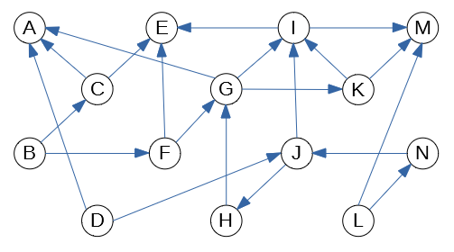

Written Assignment07
=====================

Consider the following graph:

	 
   Directed graph to run DFS and Topological Sorting

**(A)**
  Run the DFS traversal algorithm on the graph shown in the figure, mark each vertex 
  with two numbers ``d/f``, where the first number ``d`` is the 
  discovery time, and the second number ``f`` is the finishing time.
  Separate both numbers with a slash.
  All these numbers should be different and all of them belong to the 
  interval :math:`[1,28]`, where :math:`28 = 2 \cdot |V|` is 
  twice the number of vertices.
  
  If there are multiple ways how to pick a vertex to visit next in the DFS order, always
  pick the vertex with the alphabetically smallest label. 
  Namely, your DFS traversal should 
  start from the vertex :math:`A`; every time there is a choice where to go deeper -- 
  pick the alphabetically first label not visited. Whenever the DFS traversal
  runs out of vertices to visit in a given discovery tree (but some nodes are still unvisited), pick the alphabetically 
  smallest node as the root for the next DFS tree, and so on.
  
**(B)**
  In case if the graph shown in the Figure is not a DAG (directed acyclic graph), 
  explain why it is not a DAG and remove some edge so that it becomes a DAG. 
  On the other hand, if the graph in the Figure is already a DAG, explain why it is the case and do not remove any edges.

**(C)**
  Produce a topological sorting of the graph obtained in **(B)** -- list 
  the vertices in their topological sorting order. 

.. only:: Internal

  **Answer:**

  **(A)** 
    The image shows the directed graph with DFS discovery/finishing times.    

    .. image:: figs/dag-graph-solution.png
       :width: 3in
	 
       

  **(B)** 
    DFS traversal turns all edges into four groups: 
    
    **Tree edges** 
      Edges in the depth-first forest :math:`G_{DFS}`. Edge :math:`(u,v)` is a tree edge iff
      :math:`(u,v)` was first discovered when :math:`u` was gray (visited, not finished) and :math:`v` was white (not yet visited).
    
    **Back edges**
      Edges :math:`(u,v)` connecting a vertex :math:`u` to an ancestor :math:`v`
      in a depth-first tree. Edge is a back edge iff it was first discovered when :math:`u` was gray and also :math:`v` was gray 
      (in process of DFS processing, not finished).       
      Also self-loops, which may occur in directed graphs are considered to be back edges.
      
    **Forward edges**
      Edges :math:`(u,v)` that connect a vertex :math:`u` to a descendant :math:`v` in a depth-first tree (but they 
      did not become tree edges -- since :math:`v` was first discovered through another path.
      
    **Cross edges**
      All other edges -- they can go between vertices in the same DFS tree 
      as long as one vertex is not an ancestor of the other. Or they can
      go between vertices in different depth-first trees.

    The image shows the same directed graph with edges classified into 
    these four groups (tree edges are shown in bold; all the other
    edges are dashed -- all of them turn out to be cross edges: Some go 
    from one subtree to another; some others go from one tree to 
    another tree). None of these cross edges 

    .. image:: figs/dag-graph-edges.png
       :width: 3in
       
    
    **Statement:** If some graph contains a cycle, then it must contain 
    some back edge. 
    
    **Proof:** Let :math:`v_0,v_1,\ldots,v_n = v_0` be a cycle in the graph. 
    DFS traversal eventually visits some vertex in this cycle 
    (say, :math:`v_i` where :math:`i \in [0,\ldots,n]`). Since this 
    vertex is the first vertex in this cycle to be visited, it starts
    the DFS discovery -- and it will not finish processing :math:`v_i`
    until it has visited all the vertices reachable from it. 
    They include all the other  vertices in the cycle. 
    At some point (maybe, when discovering :math:`v_{i-1}` or, 
    maybe, even earlier) there will be an edge pointing back 
    to :math:`v_i`. This is a back edge by its definition 
    (as it points back from the subtree to the root
    of this subtree :math:`v_i`). 
        
    Our graph has no back edges, so it does not have any loops.
    Such graphs are called *directed acyclic graphs* (DAGs) and
    their vertices can be topologically sorted.
    
    

  **(C)**
    The topological sorting can be obtained by listing the vertices
    in the reverse order of their finishing times. 
    The largest finishing time is for the vertex :math:`L` (:math:`f = 28`), 
    the smallest one is for vertex :math:`A` (:math:`f = 2`). 
    Here is the full list topologically sorted:
    
    .. math::
      
      L, N, D, J, H, B, F, G, K, I, M, C, E, A.

  
  :math:`\square`