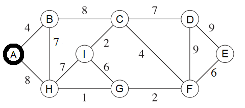

Handout 09: Minimum Spanning Trees
====================================

This handout could help to prepare for the Written Assignment 09.

Prim's Algorithm
------------------

(Goodrich2011, p.651) defines Prim's algorithm. It finds a minimum spanning 
tree in an undirected graph with given edge weights.
See also `<https://bit.ly/2VLz3DK>`_.
It is an efficient algorithm; it requires :math:`O((m+n)\log_2 n)` time, if 
we use priority queues. 
In this exercise you do not need to implement a priority queue; 
assume that you can always compute the minimums in your head and
grow the MST accordingly.

Problem
^^^^^^^^^

We start with the graph shown in Figure:

   
   Graph Diagram for Prim's Algorithm.

**(A)** 
  Vertex :math:`A` will be your source vertex. 
  It is the first vertex added to the MST vertice set :math:`S`. 
  At every step you find the lightest edge that connects
  some vertex in :math:`S` to some vertex not in :math:`S`. 
  Add this new vertex to a graph and remember the edge you added. 
  Show how the Prim's MST (Minimum Spanning Tree grows) one edge at a time. 

  .. note::
    In cases when there is a choice between multiple lightest edges of the same 
    weight, pick the edge :math:`(v,w)` with :math:`v \in S` and 
    :math:`w \not\in S` such that :math:`(v,w)` lexicographically precedes
    any other lightest edge.	

**(B)** 
  Redraw the graph, 
  highlight the edges selected for MST (make them bold or color them differently).
  Add up the total weight of the obtained MST and 
  write this in your answer (it should be the minimum value among all the
  possible spanning trees in this graph). 

Solution
^^^^^^^^^^

**(A)**
  At each step we show the current set of vertices in MST (denoted by :math:`S`) and which 
  edge is being added. 
  
  1. :math:`S = \{ A \}`, adding edge :math:`AB`
  2. :math:`S = \{ A,B \}`, adding edge :math:`BH`
  3. :math:`S = \{ A,B,H \}`, adding edge :math:`HG`
  4. :math:`S = \{ A,B,G,H \}`, adding edge :math:`GF`
  5. :math:`S = \{ A,B,F,G,H \}`, adding edge :math:`FC`
  6. :math:`S = \{ A,B,C,F,G,H \}`, adding edge :math:`CI`
  7. :math:`S = \{ A,B,C,F,G,H,I \}`, adding edge :math:`FE`
  8. :math:`S = \{ A,B,C,E,F,G,H,I \}`, adding edge :math:`CD`
  
**(B)**
  Solution shows the MST edges added in previous step colored blue:
  
  .. figure:: figs-mst/prim-solution.png
     :width: 3in
     :alt: Graph diagram
   
     MST obtained by Prim's Algorithm.
	 
  The total weight of this MST is :math:`4+7+1+2+4+2+6+7 = 33`. 
  (*In this case the MST is unique. 
  In general case there is no guarantee that there are no other MSTs of the same weight, 
  but the one we found with Prim's algorithm is among the lightest ones.*)
  
  

Kruskal's Algorithm
--------------------

Problem
^^^^^^^^^

**(A)**
  Run Kruskal's algorithm on the same graph as in the previous subsection (*Prim's algorithm*).
  After each step when there is an edge connecting two sets of vertices, 
  write that edge and show the partition where that edge connects two previously disjoined pieces 
  in the forest of trees.
  
  .. note:: 
    If there are multiple lightest edges that can be used to connect two disjoined pieces, pick edge :math:`(v,w)` 
	which lexicographically precedes any other.
  
**(B)**
  Redraw the given graph (show the order how you added the edges in parentheses).
  Also compute the total weight of this MST.
  

Solution
^^^^^^^^^^

**(A)**
  We list the steps that add edges and join two previously disconnected pieces:
  
  1. Add edge :math:`GH`, the partition becomes :math:`\{ A,B,C,D,E,F,GH,I \}`. 
  2. Add edge :math:`CI`, the partition becomes :math:`\{ A,B,CI,D,E,F,GH \}`. 
  3. Add edge :math:`FG`, the partition becomes :math:`\{ A,B,CI,D,E,FGH \}`. 
  4. Add edge :math:`AB`, the partition becomes :math:`\{ AB,CI,D,E,FGH \}`. 
  5. Add edge :math:`CF`, the partition becomes :math:`\{ AB,CFGHI,D,E\}`. 
  6. Add edge :math:`FE`, the partition becomes :math:`\{ AB,CEFGHI,D\}`. 
  7. Add edge :math:`BH`, the partition becomes :math:`\{ ABCEFGHI,D\}`. 
  8. Add edge :math:`CD`, the partition becomes :math:`\{ ABCEFGHID\}`. 
  
**(B)**
  Solution shows the MST edges added in previous step colored blue. 
  The total weight is :math:`33`.
  The order of their addition is shown in red in parentheses.
  
  .. figure:: figs-mst/kruskal-solution.png
     :width: 3in
     :alt: Graph diagram
   
     MST obtained by Kruskal's Algorithm. 

  .. note::
    In some cases Prim's and Kruskal's algorithm can yield different MSTs even for the 
    same input graph, but they are both optimal in such cases.
