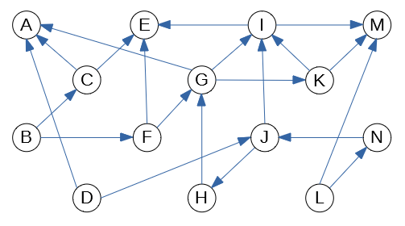

Written Assignment07
=====================

Consider the following graph:

	 
   Directed graph to run DFS and Topological Sorting

**(A)**
  Run the DFS traversal algorithm on the graph shown in the figure, mark each vertex 
  with two numbers ``d/f``, where the first number ``d`` is the 
  discovery time, and the second number ``f`` is the finishing time.
  Separate both numbers with a slash.
  All these numbers should be different and all of them belong to the 
  interval :math:`[1,28]`, where :math:`28 = 2 \cdot |V|` is 
  twice the number of vertices.
  
  If there are multiple ways how to pick a vertex to visit next in the DFS order, always
  pick the vertex with the alphabetically smallest label. 
  Namely, your DFS traversal should 
  start from the vertex :math:`A`; every time there is a choice where to go deeper -- 
  pick the alphabetically first label not visited. Whenever the DFS traversal
  runs out of vertices to visit in a given discovery tree (but some nodes are still unvisited), pick the alphabetically 
  smallest node as the root for the next DFS tree, and so on.
  
**(B)**
  In case if the graph shown in the Figure is not a DAG (directed acyclic graph), 
  explain why it is not a DAG and remove some edge so that it becomes a DAG. 
  On the other hand, if the graph in the Figure is already a DAG, explain why it is the case and do not remove any edges.

**(C)**
  Produce a topological sorting of the graph obtained in **(B)** -- list 
  the vertices in their topological sorting order. 
