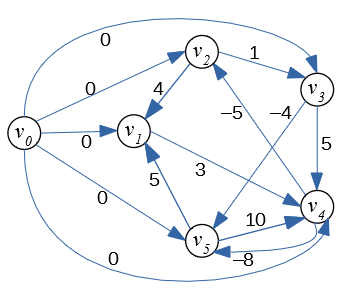

Written Assignment 08
=====================

Let :math:`G(V,E)` be a directed graph. Let :math:`w:E\rightarrow{}\mathbf{Z}` 
be a function assigning integer weights to all the graph's edges and let :math:`s \in V` be
the source vertex.
Every vertex :math:`v \in V` stores :math:`v.d` -- the current estimate of 
the distance from the source. A vertex also stores :math:`v.p` --
its "parent" (the last vertex on the shortest path before reaching :math:`v`). 
Bellman-Ford algorithm to find the minimum distance from :math:`s` to all the other 
vertices is given by the following pseudocode: 

| :math:`\text{\sc BellmanFord}(G,w,s)`:
|     **for** **each** vertex :math:`v \in V`: :math:`\;\;\;\;\;` *(initialize vertices to run shortest paths)*
|         :math:`v.d = \infty`
|         :math:`v.p = \text{\sc Null}`
|     :math:`s.d = 0` :math:`\;\;\;\;\;` *(the distance from source vertex to itself is 0)*
|     **for** :math:`i=1` **to** :math:`|V|-1` :math:`\;\;\;\;\;` *(repeat* :math:`|V|-1` *times)*
|         **for** **each** edge :math:`(u,v) \in E`
|             **if** :math:`v.d > u.d + w(u,v)`: :math:`\;\;\;\;\;` *(relax an edge, if necessary)*
|                 :math:`v.d = u.d + w(u,v)`
|                 :math:`v.p = u`

	 
   A directed graph for Bellman-Ford Algorithm

In this task the input graph is shown in Fig.1. 

**(A)**
  In your graph use the vertex :math:`s=v_0` as the *source vertex* 
  for Bellman-Ford algorithm.
  Create a table showing the changes
  to all the distances to the vertices of the given graph every time a successful edge
  relaxing happens and some distance is reduced.
  You should run :math:`n-1` phases of the Bellman-Ford algorithm
  (where :math:`n` is the number of vertices). You can also stop earlier, if 
  no further edge relaxations can happen.
  
  .. note::
    Please make sure to release the edges in the lexicographical order. 
    For example, in a single phase the edge :math:`(v_1,v_4)` is
    relaxed before the edge :math:`(v_2,v_1)`, since 
    :math:`v_1` precedes :math:`v_2`. 
	
	

**(B)**
  Summarize the result: For each vertex
  tell what is its minimum distance from the source. 
  Also tell what is the shortest path how to get there. 
  
**(C)**
  Does the input graph contain negative cycles?
  Justify your answer.

.. only:: Internal

  **Answer:**

  **(A)**    
    Phase 1:
    
    =======================  ==============  ==============  ==============  ==============  ==============  ==============  
    Vertices                    :math:`v_0`     :math:`v_1`     :math:`v_2`     :math:`v_3`     :math:`v_4`     :math:`v_5`
    Initial distances                     0  :math:`\infty`  :math:`\infty`  :math:`\infty`  :math:`\infty`  :math:`\infty`
    Relax :math:`(v_0,v_1)`               0               0  :math:`\infty`  :math:`\infty`  :math:`\infty`  :math:`\infty`
    Relax :math:`(v_0,v_2)`               0               0               0  :math:`\infty`  :math:`\infty`  :math:`\infty`
    Relax :math:`(v_0,v_3)`               0               0               0               0  :math:`\infty`  :math:`\infty`
    Relax :math:`(v_0,v_4)`               0               0               0               0               0  :math:`\infty`
    Relax :math:`(v_0,v_5)`               0               0               0               0               0               0
    Relax :math:`(v_3,v_5)`               0               0               0               0               0              -4
    Relax :math:`(v_4,v_2)`               0               0              -5               0               0              -4
    Relax :math:`(v_4,v_5)`               0               0              -5               0               0              -8
    Relax :math:`(v_5,v_1)`               0              -3              -5               0               0              -8
    =======================  ==============  ==============  ==============  ==============  ==============  ==============  

    Phase 2:

    =======================  ==============  ==============  ==============  ==============  ==============  ==============  
    Vertices                    :math:`v_0`     :math:`v_1`     :math:`v_2`     :math:`v_3`     :math:`v_4`     :math:`v_5`
    Relax :math:`(v_2,v_3)`               0              -3              -5              -4               0              -8
    =======================  ==============  ==============  ==============  ==============  ==============  ==============  

    Further phases cannot relax any new edges, so these distances are considered final.

    
  **(B)**
    We list the shortest paths from :math:`v_0` to all the vertices.
    
    * Distance :math:`d(v_0,v_0) = 0`, path :math:`(v_0)` has 0 edges and weight :math:`0`.
    * Distance :math:`d(v_0,v_1) = -3`, path :math:`(v_0 \rightarrow v_4 \rightarrow v_5 \rightarrow v_1)` has 3 edges and weight :math:`0 + (-8) + 5 = -3`. 
    * Distance :math:`d(v_0,v_2) = -5`, path :math:`(v_0 \rightarrow v_4 \rightarrow v_2)` has 2 edges and weight :math:`0 + (-5) = 5`. 
    * Distance :math:`d(v_0,v_3) = -4`, path :math:`(v_0 \rightarrow v_4 \rightarrow v_2 \rightarrow v_3)` has 3 edges and weight  :math:`0 + (-5) + 1 = -4`. 
    * Distance :math:`d(v_0,v_4) = 0`, path :math:`(v_0 \rightarrow v_4)` has 1 edge and weight  :math:`0`. 
    * Distance :math:`d(v_0,v_5) = -8`, path :math:`(v_0 \rightarrow v_4 \rightarrow v_5)` has 2 edges and weight  :math:`0 + (-8) = -8`. 
    
  **(C)**
    Graph :math:`G` does not contain negative cycles -- otherwise the edge relaxation would continue in Phases 2, 3, and so on.

  .. note::
    Just a little modification: :math:`w(v_4,v_2)=-6` (instead of -5) yields a negative loop:
    :math:`v_4 \rightarrow v_2 \rightarrow v_3 \rightarrow v_5 \rightarrow v_1 \rightarrow v_4` 
    or :math:`(-6) + (1) + (-4) + (5) + (3)`. 
    If we run Bellman-Ford algorithm on such a graph, then relaxing edges does not end after 
    :math:`|V|-1` iterations, the minimum distances decrease further and can become negative numbers
    with arbitrarily large absolute values.

  :math:`\square`

