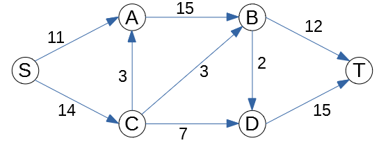

Written Assignment 10
======================

**(A)**
  Run Edmonds-Karp algorithm on the graph shown above. 
  Every edge in the picture is labeled with a number showing the *capacity* of that edge.
  
  For every phase highlight the the augmenting path (or simply list its vertices), 
  find the *residual flow* of this augmenting graph. 
  Draw a copy of the original graph where the residual flow is added.
  Namely, every age is labeled by two numbers ``f/c`` -- the actual flow ``f`` (after adding
  the residual flow obtained in this step) and also the capacity ``c`` of the edge (it never changes).
  
  During the next phase, show the next residual graph, highlight the augmenting path, find the residual flow. 
  And next to that residual graph show a new copy of the original graph with updated flow numbers. 
  Thus, every phase shows two oriented graphs: 
  
  * The current residual graph (initially -- it is simply the given graph with all flows equal to 0). 
    It only displays edge capacities and **not** flows (but it may include *reversed edges*).
    In this graph you can search (in BFS order) and highlight the augmenting path.
  * The original graph with all the flows added. In this graph you must also show the flows
    using the notation with two numbers ``f/c``.
  
  .. note:: 
    In Edmonds-Karp algorithm visiting the successors of the source vertex :math:`s` in the BFS order
    needs to know the ordering. Assume that all the vertices are arranged in alphabetical order.
  
**(B)**
  Redraw the original graph with all the maximum flows (use the same two-number labels for edges ``f/c``). 
  Show the min-cut which prevents any further augmenting paths (either highlight with 
  another color, or simply list the partition of graph's vertices into two disjoint sets that describe the cut).
  
  
.. only:: Internal

  **Answer:** 
  
  **(A)**
    Following Edmonds-Karp algorithm, we successfully select augmenting paths 
    starting from the shortest ones (and lexicographically first -- if there are multiple
    paths of the same length). 
    
    Phase 1: Push :math:`11` units of flow over the augmenting path :math:`S \rightarrow A \rightarrow B \rightarrow T` highlighted in orange.
    
    .. image:: figs-maximum-flow/ford-fulkerson-phases-1.png
       :width: 4in
    
    Phase 2: Push :math:`1` unit of flow over the augmenting path :math:`S \rightarrow C \rightarrow B \rightarrow T`. 
    
    .. image:: figs-maximum-flow/ford-fulkerson-phases-2.png
       :width: 4in
       
    Phase 3: Push :math:`7` units of flow over the augmenting path :math:`S \rightarrow C \rightarrow D \rightarrow T`.     

    .. image:: figs-maximum-flow/ford-fulkerson-phases-3.png
       :width: 4in
       
    Phase 4: Push :math:`2` units of flow over the augmenting path :math:`S \rightarrow C \rightarrow B \rightarrow D \rightarrow T`.            

    .. image:: figs-maximum-flow/ford-fulkerson-phases-4.png
       :width: 4in

    The last residual graph does not contain any augmenting path from :math:`S` to 
    :math:`T`, so the algorithm stops here.
    Overall, we have pushed :math:`11 + 1 + 7 + 2 = 21` units of flow.

    .. image:: figs-maximum-flow/ford-fulkerson-phases-5.png
       :width: 2in
    
    
  **(B)**
    We redraw the flow graph (showing actual flows and capacities for each edge). 
    The minimum cut is shown as red dashed line. 
    It splits vertices into two disjoint groups: :math:`S,A,B,C` and :math:`D,T`; 
    all the edges between them are saturated -- the flow reaches capacity. 
    As we know the capacity of a minimum cut must equal the maximum flow. 
    This maximum flow (equalling the min cut capacity) is :math:`7+2 + 12 = 21`. 

    .. image:: figs-maximum-flow/ford-fulkerson-min-cut.png
       :width: 2in

      
  :math:`\square`
