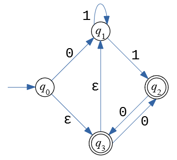

Written Assignment 14
======================

**Introduction:**	
  This task is about the equivalence of Nondeterministic Finite Acceptors (NFA)
  and regular expressions -- in this case we start with an NFA and 
  trace the sets of states reachable after reading letters of an input string. 
  As the next step we describe the language accepted by this NFA 
  as a regular expression. 

  
**(A)**
  Consider the NDA automaton shown in the above image; 
  it can input strings in alphabet :math:`\Sigma = \{ \mathtt{0}, \mathtt{1} \}`.
  Also consider the following input string: :math:`\mathtt{01100}`. 
  
  This input string is being read one letter at a time; 
  so the automaton sees the prefixes of the string :math:`\mathtt{01100}`.
  
  For each prefix find the states of NFA which 
  are reachable after receiving it (and possibly using
  also :math:`\varepsilon`-transitions anywhere in-between the input letters).
  
  
  ======================  =========================
  Input/prefix so far     Set of reachable states   
  :math:`\varepsilon`
  :math:`\mathtt{0}`
  :math:`\mathtt{01}`
  :math:`\mathtt{011}`
  :math:`\mathtt{0110}`
  :math:`\mathtt{01100}`
  ======================  =========================

**(B)**
  Describe the language :math:`L` accepted by this NFA in English
  (human-readable statement -- which strings are accepted or 
  not accepted by the NFA). 
  
**(C)** 
  Write a regular expression accepted by this NFA. 

.. TODO 
.. This task is about practical uses of regular expressions using the
.. extended syntax (with quantification ``{n}`` and ``{min,max}``, 
.. grouping of characters in square brackets, matching pairs of parentheses
.. via ``\1`` and ``\2``, etc.).

