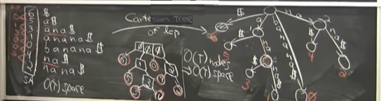
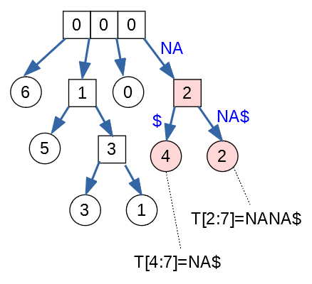

Written Assignment 15
======================

**Introduction:**	
  To understand Suffix trees and Suffix arrays, 
  you can read
  (Drozdek2013, pp. 711--718), Ch. 13.1.8 and 13.1.9.
  Also in the MIT OCW website: 
  `<https://bit.ly/3IcnUCM>`_ or `<https://bit.ly/3EgJnrV>`_.
  
  This exercise starts with building a suffix array for a short text.
  Then the suffix array (and its LCP information) 
  is converted into a Cartesian tree 
  which also serves as the suffix tree for that text. 
  Finally that Cartesian tree is used to 
  find a common substring that appears in the text multiple times.

  
  
**(A)**
  Consider a text :math:`T = \mathtt{MALAYALAM\$}`.
  Its length (including the terminating dollar) is :math:`|T| = 10`. 
  Create a suffix array for this string
  together with the LCP information (i.e. find the longest 
  common prefix of any two suffixes that are alphabetically next
  to each other). 
  
  Write out the suffix array and the related 
  LCP information as two sequences (e.g. one under another). 
  Use this alphabetical order:
  :math:`\Sigma = \{ \mathtt{\$}, \mathtt{A}, \mathtt{L}, \mathtt{M}, \mathtt{Y} \}`. 
  Please note that the suffix array has length :math:`|T| = 10` 
  (all the non-empty suffixes of the text :math:`T`), 
  and the LCP information has length :math:`|T|-1 = 9`.
  
  
  
**(B)** 
  Draw Cartesian tree from the sequence with LCP information.
  This tree should have :math:`|w|-1 = 9` internal nodes and 
  :math:`|w| = 10` leaves. Draw internal nodes as squares 
  and leaves as circles.
  
  Label each internal node with the LCP number (the longest common prefix) and each leaf
  with the prefix order number 
  (The longest prefix :math:`T[0:10] = \mathtt{MALAYALAM\$}`
  has order number :math:`0`, and the shortest non-empty prefix 
  :math:`T[9:10] = \mathtt{\$}` has order number :math:`9`.)
  

**(C)**  
  Consider leaves #6 and #2 
  in the Cartesian tree obtained in (B). 
  List the compressed edges on the path from the root node
  to these leaves. Mark the internal node that shows
  the longest common prefix of both suffixes: 
  :math:`T[6:10] = \mathtt{LAM\$}` and :math:`T[2:10] = \mathtt{LAYALAM\$}`. 
  

Banana Example
---------------

Here is an example that is similar to the above task.
Please refer to the video `<https://bit.ly/3EgJnrV>`_ (starting from 
1:10:00). 
A drawing from the video shows suffix array for text :math:`T = \mathtt{BANANA\$}`, 
and related LCP information (red numbers to the left of the suffix array). 
The central part of the drawing is
a Cartesian tree built from this suffix array and its LCP information. 
On the right is the suffix tree (with compressed edges, where
just the branching nodes and leaves are shown). The suffix tree
should have the same shape as the Cartesian tree, but its edges are labeled 
with one or more letters from alphabet :math:`\Sigma`. 

Consider two leaves with numbers #4 and #2
(the corresponding prefixes are
:math:`T[4:7] = \mathtt{NA\$}` and 
:math:`T[2:7] = \mathtt{NANA\$}`). 

The (compressed) paths to these leaves are:

.. math:: 

  \left\{ \begin{array}{ll}
  \text{Path to the leaf \#4:} & [\mathtt{"NA"}, \mathtt{"\$"}]\\
  \text{Path to the leaf \#2:} & [\mathtt{"NA"}, \mathtt{"NA\$"}]\\
  \end{array} \right.

The longest common prefix of these two 
suffixes (i.e. the nearest ancestor of the 
two leaves in the suffix tree) is shown in Fig.1.

   
   The Cartesian tree for the prefixes of text :math:`T = \mathtt{BANANA\$}`. 

The pink square (internal node labeled by "2") 
corresponds to the substring :math:`\mathtt{NA}`. 
The label for the square-shaped internal node indicates that 
the common substring :math:`\mathtt{NA}` has length 2. 

.. note::
  The Cartesian tree in Fig.1  
  shows 3 internal nodes that are drawn together and have 
  4 branches: The root of the tree (the state before receiving any input) 
  can continue with any of the four
  letters: :math:`\mathtt{\$}`, :math:`\mathtt{A}`, 
  :math:`\mathtt{B}`, :math:`\mathtt{N}` -- at this point we do not
  know which location  of :math:`\mathtt{BANANA\$}` text
  will be searched.
