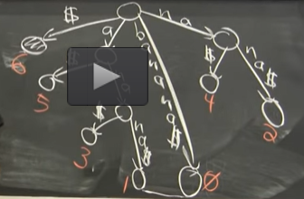

Handout 16: Suffix Trees
=========================

**Objectives:**

  1. Tries and Trays
  2. Compressed Tries 
  3. Suffix trees and arrays
  4. Document retrieval
  5. Linear-time construction

**String Matching Problem:** 
Given two strings (a text :math:`T` and a pattern :math:`P`)
over some alphabet :math:`\Sigma`. 
(Find some or all occurrences, count all of them.)
We want to find all the shifts of :math:`P` where
it coincides with :math:`T`. We even want overlapping patterns. 

(Variants - regex or other patterns, approximate match). 

We want data-structure variant - preprocess :math:`T`, 
then query :math:`P`. 
We want to spend :math:`O(|P|)` time (read pattern once). 
We want to use some :math:`O(|T|)` space. 

**Warmup:** Predecessor among strings. 
Given text strings :math:`T_1,T_2,\ldots,T_k` 
and a pattern :math:`P`, find where the string 
:math:`P` fits lexicographically. 

Could sort or build a binary tree... 
But this is inefficient as comparing two strings may take long time.

Let's build a Trie. 
(There were tries in fast sorting lecture. 
where w is at least :math:`log_2 e_n`.)

A trie is a rooted tree with branches being labeled. 
They are labeled with letters in alphabet :math:`\Sigma`. 
Here a trie is in its native setting - where 
we care about the alphabet and its letters. 
(Could also have strings in an artificial representation). 

This alphabetical sorting problem is practically useful - 
we want to type in some prefix of a string and
see a book title immediately preceding or succeeding. 

We want to represent :math:`T_i` strings as paths
from root to leaf. 
And introduce a new symbol (dollar) indicating 
the end of the example. 

**Example:** Draw a trie representation of 
the strings :math:`\{ ana, ann, anna, anne \}`. 

Can find max in one subtree and min in another 
subtree. 
Can store min/max in every node. 

If alphabet is some parameter - can get tricky: 
**Question:** How can you represent a node
in a trie?

1. Array
2. Tree
3. Hashtable

Let's answer query-time and space
in terms of text length and pattern length. 

1. Array is :math:`O(T \Sigma)` space, but 
   query time is :math:`O(P)`. 
2. For trees it is :math:`O(P \log \Sigma)`. 
   And you can have :math:`O(T)` space. 
3. Hashtable is the best of both worlds: 
   Query is :math:`O(P)` and the space is 
   :math:`O(T)`. 
4. Van Emde Boas (Ordered associative array). 

What is the problem with hashing? 
It does not solve prececessor problem. 
Hashing mixes the order - and then 

Tray (tree + array portmantau). 
Koplowitz and Lewenstein (2006). 
They achieve query :math:`O(P + \log \log \Sigma)`
and :math:`O(T)` space. 

Martin Farach-Colton, who did the LCA (least 
common ancestor?) 
Uses a weight-balanced BST. 

This achieves :math:`O(P + \log_2 k)` time, 
where :math:`k` is the 
number of texts. 

We define the weight of each node as the weight of 
all  descendent leaves. 
Make big trees closer to the root as possible. 
(Heavy pointers are children or grandchildren in the tree). 

In two steps -- either reduces the size (so that it becomes 1/3 of 
the previous size) or follows a pink edge. 

**Compressed trie:** 
Contract nonbrancing paths into a single edge. 

If you do not have all the string on the edge - you 
fall off the tree. 
You get :math:`O(k)` nodes (all nodes except the root
are branching nodes). 

In a compressed trie you can still do all the same searches.

**Suffix trees:** in fact they are compressed tries. 
We return back to a single text :math:`T`. 
We consider suffixes :math:`T[i:]`. 

We only append dollar sign once at the end of :math:`T`. 
Then it will appear at the end of all suffixes. 

.. code-block:: text

  banana$
  0123456

We do not need to store empty string 
(just the dollar sign). 

Search for "nan", "an" or even "ana"  (two overlapping
occurences). 
This data structure can search in linear time (by pattern size). 

**Applications of Suffix trees:**

* Search for P gives subtree whose leaves correspond to 
  all occurences of P in T. 
  Can count, can follow a linked list, can find 
  first 10 occurences. Can teleport from some middle
  to the bottom. 
  
How big is the structure? 
The number of leaves is :math:`|T|`, since 
all nodes are branching nodes, the total number
of nodes is also :math:`O(|T|)`. 

You could use "trays" -- :math:`O(P + \log_2 \Sigma)`. 

You can do many other things fast. 

  
**Definition:** Lowest Common Ancestor 
in a binary tree -- you can pick two internal nodes (or leaves)
and find what is the common ancestor, where they branch. 

* The problem of finding the first :math:`k` occurrences of 
  a pattern.
* Counting the number of occurrences of :math:`P` in 
  the text :math:`T`
* If T is a really long document (Merriam Webster dictionary). 
  Longest substring that occurs twice. 
  (Find the "Letter-depth" of a node; and a node with two subtrees
  underneath.)
* Assume that you have two positions in the tree
  (position "i"  and position "j" -- and you want 
  to find out for how long do they match. 
  You can find this in constant time -- 
  just find the LCA. Longest common prefix:
  
  .. math::
  
    lcp(\mathtt{T[i:]}, \mathtt{T[j:]}) = LCA.
    
* Find all occurrences of T[i:j]. Can I do this in almost
  constant time.
  LA (Level Ancestor query).
  First go down to the right leaf. Then jump up 
  to a certain level ancestor. (This can be adapted to weighted
  edges.) Can use *jump pointers* or *ladder decomposition*. 
  
  What if I know the queries ahead of time? Can preprocess them 
  by adding them to the text. 
  

Represent Multiple Documents
------------------------------

Take the first string, put a special dollar sign, etc. 

.. math::

  T = T_1\mathtt{\$}_1T_2\mathtt{\$}_2\cdots{}T_k\mathtt{\$}_k. 

Why use :math:`k` different dollars? 

How to find all documents containing one word? You could use
the suffix tree as before -- and do fast searches.
What happens, if there are two documents matching some pattern: 
In one document it appears one billion times, but in another one - 
just one time?

**Document Retrieval Problem:**
List all documents matching some pattern :math:`P` in
:math:`O(P + k')`, where :math:`k' \leq k` shows the number of 
documents containing the pattern.

**Adjustment 1:** Multiple documents are stored
in a suffix tree so that we do not append anything
after any dollar sign :math:`\mathtt{\$}_i`. 
Every dollar sign is a leaf in the suffix tree.

**Adjustment 2:** The leaves marked by the same type 
of dollar signs :math:`\mathtt{\$}_i` point to each 
other - they make a linked list. 

**Overview of a Document Retrieval Algorithm:**

1. Find the pattern :math:`P` in the  big suffix tree. 
   It is some internal node. 
   Assume that all the leaves underneath it are numbered; 
   their numbers are in the interval :math:`[\ell, n]`. 
2. Our goal is to find the first occurrence of 
   :math:`\mathtt{\$}_i` for each :math:`i`. 
   We only want to pay for the number of distinct documents. 
   There may be very many :math:`\mathtt{\$}_i` leaves
   in this interval :math:`[\ell, n]`.
3. The solution is for each leaf 
   to store the number leading to the previous leaf (as in 
   "Adjustment 2").

   

The document retrieval problem becomes 

Suffix Arrays
----------------

.. See `<https://arxiv.org/pdf/1311.1762.pdf>`_ for more explanations.

Writing out leaves in order is called *suffix arrays*. 

**Definition:** Sort all the suffixes of :math:`T`. 
Do not write them down explicitly (as it would take 
enormous :math:`O(|T|^2)` space, but just write the indices. 

**Example:** 

.. code-block::

  6: $
  5: a$
  3: ana$
  1: anana$
  0: banana$
  4: na$
  2: nana$

Can also add LCP information. 
The longest common prefix two adjacent (in their alphabetical order) suffixes: 

.. code-block::

    6: $
  0  
    5: a$
  1
    3: ana$
  3    
    1: anana$
  0
    0: banana$
  0
    4: na$
  2
    2: nana$

**Claim:** If you have the suffix array and the LCP information. 

We can use **Cartesian tree**:
Cartesian tree can be used to convert RMQ tasks into LCA tasks 
(find the minimum, put it into the root, then call itself recursively 
on both subarrays to the left and to the right of the root). 

.. https://dspace.mit.edu/bitstream/handle/1721.1/36897/6-854JFall-1999/OcwWeb/Electrical-Engineering-and-Computer-Science/6-854JAdvanced-AlgorithmsFall1999/CourseHome/index.htm

Problems
-----------

See `<https://www.litscape.com/word_tools/pattern_match.php>`_ to find

**Question 1: Longest Common Substring:**

  The longest common substring of two texts :math:`T_1` and
  :math:`T_2` is the longest 
  substring that appears in both texts.
  This is a common example for dynamic programming
  which gives an :math:`O(n_1 \cdot n_2)` time algorithm, 
  where :math:`|T_1| = n_1` and :math:`|T_2| = n_2`. 
  (See `<https://bit.ly/3rcGUev>`_ on how to build a table.)
  
  Consider two strings: :math:`T_1 = \mathtt{banana\$}_1` and 
  :math:`T_2 = \mathtt{guanabana\$}_2`. They are written in the 
  following alphabet (listed in alphabetical order):
    
  .. math:: 
    
    \Sigma = \{ \mathtt{\$}_1, \mathtt{\$}_2, \mathtt{a}, \mathtt{b}, \mathtt{g}, \mathtt{n}, \mathtt{u} \}. 
  
  We now show how an algorithm with running time :math:`O(n_1+n_2)` can find their 
  longest common substring.
  

  **(A)**
    Draw the compressed suffix tree for :math:`\mathtt{banana\$}_1`.     
  
  **(B)**
    Add to your tree the set of suffixes of :math:`\mathtt{guanabana\$}_2` -- this is slightly less messy than
    drawing the suffix tree for :math:`\mathtt{banana\$}_1\mathtt{guanabana\$}_2`. 
    
  **(C)**
    Visually determine the longest common substring of 
    :math:`\mathtt{banana}` and :math:`\mathtt{guanabana}`. 
    Mark its corresponding node in your suffix tree. What is the characteristic of the
    subtree rooted at this node? 
  
  **(D)**
    Give an :math:`O(n_1+n_2)` time algorithm for finding the longest common substring of
    two strings of lengths :math:`n_1` and :math:`n_2` respectively.

  .. note::
    In this problem do not show "null" children for the nodes (only those
    children of internal nodes that have non-empty subtrees). 
    Show the suffix tree in a compressed format (all nodes -- maybe, excepting the root 
    should be brancing nodes).
    

**Question 2: Building a Suffix Array**

  Consider the following text :math:`\mathtt{acabcabaabaabca\$}`. 
  It is written using four letters with the following alphabetical order:
  :math:`\Sigma = \{ \mathtt{\$}, \mathtt{a}, \mathtt{b}, \mathtt{c} \}`.

  **(A)**
    Build the suffix array for this text.

  **(B)**    
    Add the LCP (Longest common prefix) information to the suffix array -- 
    find the longest common prefixes of any two alphabetically adjacent suffixes. 
    
  **(C)** 
    Use the suffix array and its LCP information to build the (compressed) 
    suffix tree for the same word. 

**Solution:** 

  .. code-block:: python 

    T = 'acabcabaabaabca$'
    sorted_suffixes = sorted([T[x:] for x in range(0,len(T))])
    suf_array = list(map(lambda w: len(T) - len(w), sorted_suffixes))
    print(sorted_suffixes)
    print(suf_array)
    
    ['$', 'a$', 'aabaabca$', 'aabca$', 'abaabaabca$', 'abaabca$', 'abca$', 
     'abcabaabaabca$', 'acabcabaabaabca$', 'baabaabca$', 'baabca$', 'bca$', 
     'bcabaabaabca$', 'ca$', 'cabaabaabca$', 'cabcabaabaabca$']
    [15, 14, 7, 10, 5, 8, 11, 2, 0, 6, 9, 12, 3, 13, 4, 1]
    

  .. figure:: figs-suffix-trees/long-suffix-tree.png
     :width: 5in
     :alt: Suffix tree for acabcabaabaabca$
     
     Suffix tree for :math:`\mathtt{acabcabaabaabca\$}` with suffix array and LCP info

