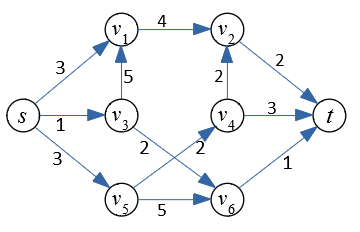

Handout 10: Ford-Fulkerson and Variants
=========================================

This handout could help to prepare for the Written Assignment 10.

(Drozdek2013, p.425) defines Ford-Fulkerson algorithm. It finds 
mazimum flow in a directed graph with edge capacities.
Ford-Fulkerson algorithm does not specify, how to pick augmenting paths.
In some cases they can be picked in a very inefficient way resulting 
in running time that is equal to the numeric integer value of the flow
(and does not depend on the size of the graph). 

So there is a popular variation of it named *Edmonds-Karp algorithm*, 
see `<https://bit.ly/2YMhkkC>`_; it picks the augmenting paths
from the source :math:`s` to the sink :math:`t` using BFS traversal 
(using the residual graph :math:`G_f` for the flow :math:`f` assigned
so far). 
It is an efficient algorithm; it requires :math:`O(n^2 m)` time, 
where :math:`n = |V|` denotes the number of vertices, but :math:`m =|E|`
denotes the number of edges.

Edmonds-Karp Algorithm
-----------------------

This is a fast version of Ford-Fulkerson; was first proposed
by Yefim Dinitz in 1970 and later independently published
by Edmonds and Karp (1972).

   
   Flow graph for the Edmonds-Karp Algorithm

Problem
^^^^^^^^^

**(A)**
  Run Edmonds-Karp algorithm on the graph shown above. 
  For every phase highlight the the augmenting path (or simply list its vertices), 
  find the *residual flow* of this augmenting graph. 
  Draw a copy of the original graph where the residual flow is added.
  Namely, every age is labeled by two numbers ``f/c`` -- the actual flow ``f`` (after adding
  the residual flow obtained in this step) and also the capacity ``c`` of the edge (it never changes).
  
  During the next phase, show the next residual graph, highlight the augmenting path, find the residual flow. 
  And next to that residual graph show a new copy of the original graph with updated flow numbers. 
  Thus, every phase shows two oriented graphs: 
  
  * The current residual graph (initially -- it is simply the given graph with all flows equal to 0). 
  * The original graph with all the flows added.
  
  .. note:: 
    In Edmonds-Karp algorithm visiting the successors of the source vertex :math:`s` in the BFS order
    needs to know the ordering. Assume that all the vertices are arranged in growing order of their indices
    (namely, :math:`v_1` is visited before :math:`v_2` and so on).
  
**(B)**
  Redraw the original graph with all the maximum flows (use the same two-number labels for edges ``f/c``). 
  Show the min-cut which prevents any further augmenting paths (either highlight with 
  another color, or simply list the partition of graph's vertices into two disjoint sets that describe the cut).
  
  

Solution
^^^^^^^^^^

**(A)**

  **Phase 1:**
    Augmenting path: :math:`p = \left\langle s,v_1,v_2,t \right\rangle`, residual flow is 
    :math:`f_p = \min(3,4,2) = 2`. 
  
    .. image:: figs-maximum-flow/edmonds-karp-solution-1.png
       :width: 4in
   
  **Phase 2:**
    Augmenting path: :math:`p = \left\langle s,v_3,v_6,t \right\rangle`, residual flow is 
    :math:`f_p = \min(1,2,1) = 1`.
  
    .. image:: figs-maximum-flow/edmonds-karp-solution-2.png
       :width: 4in
  
  **Phase 3:**
    Augmenting path: :math:`p = \left\langle s,v_5,v_4,t \right\rangle`, residual flow is 
    :math:`f_p = \min(3,2,3) = 2`.
  
    .. image:: figs-maximum-flow/edmonds-karp-solution-3.png
       :width: 4in
  
**(B)**
  The flow obtained during the previous three phases is shown in the picture below. 
  The minimum cut (that is equal to the max flow) is given by two 
  disjoints sets of vertices: 
  
  .. math::
  
    V_1 = \{ s,v_1,v_2,v_3,v_5,v_6 \}\;\;\text{and}\;\;V_2 = \{ v_4, t \}.
  
  The capacity of this min-cut is :math:`w(v_2,t) + w(v_5,v_4) + w(v_6,t) = 2 + 2 + 1 = 5`.
  It is the sum of the weights of edges connecting something in :math:`V_1` with something in :math:`V_2`. 

  .. image:: figs-maximum-flow/edmonds-karp-min-cut.png
     :width: 2.5in
	 

