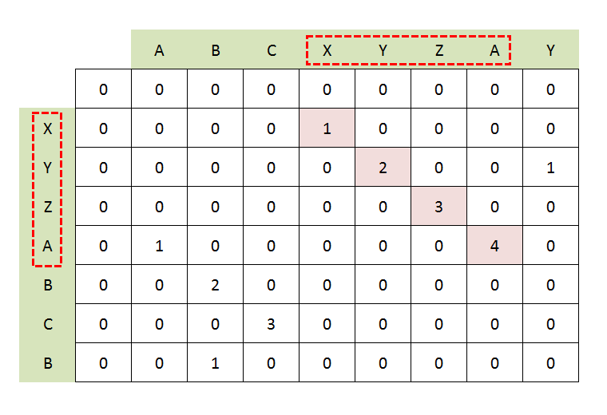
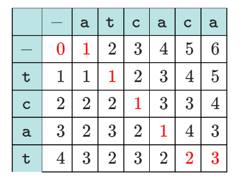
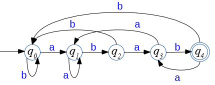
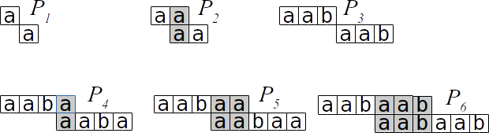
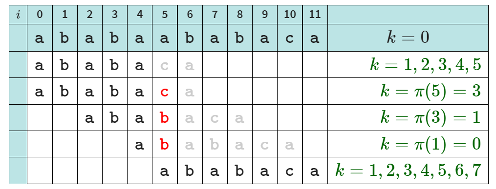
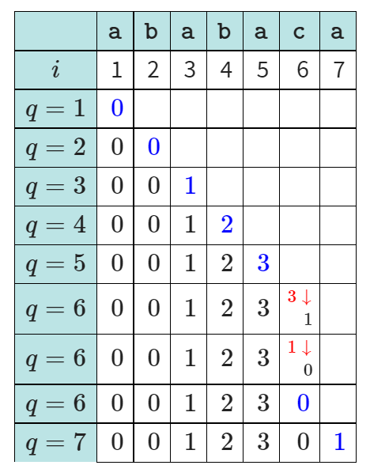

Handout 13: KMP String Search
=================================

**Objectives:**

1. Concepts of strings
2. Deterministic Finite Acceptor (DFA).
3. Prefix function
4. KMP algorithm

Concepts of Strings
---------------------

String Search (Matching) Algorithms:

**Text Editors:** 
  One text, one pattern

**Detecting Plagiarism, DLP**
  Many training documents, one testable document. 
  (DLP - Data Leak prevention.) 
  May be interested in pattern search, 
  "longest commmon substring", finding matches with sliding window, 
  detecting approximate matches (Copy-Paste and edit a little).
  
**Document Retrieval**
  Very many documents can be indexed and preprocessed. 
  Pattern search should be fast (linear in pattern size, not in 
  the total size of Internet). 
  

String Matching Problem
^^^^^^^^^^^^^^^^^^^^^^^^

1. Let us have a *finite alphabet* :math:`\Sigma` (may be very large; 
   think of Unicode with its :math:`65536` symbols). 

2. Let us have a text of length :math:`n` -- :math:`T = T[0], \ldots, T[n-1]`. 

3. Let us have a pattern of length :math:`m` -- :math:`P = P[0], \ldots, P[m-1]`

**Question:** Is there a pattern :math:`P` in the text :math:`T`. 
(Usually we want to have the first occurrence, the first :math:`c` occurrences or 
all occurrences.) One occurrence is named a *shift* (offset of the pattern in the text).

Substring not same as Subsequence
^^^^^^^^^^^^^^^^^^^^^^^^^^^^^^^^^^^

**Definition:** Given a string :math:`T[0],T[1],\ldots,T[n-1]`, its *substring* 
is a string :math:`T[i],T[i+1],\ldots,T[i+m-1]` -- it has some nonnegative length :math:`m \leq n`. 
An empty string (:math:`\varepsilon`) is a substring of every string.

**Definition:** Given a string :math:`T[0],T[1],\ldots,T[n-1]`, its *subsequence* 
is a string :math:`T[i_0],T[i_1],\ldots,T[i_{m-1}]` of some symbols from the original string
in increasing order (:math:`i_0 < i_1 < \ldots < i_{m-1}`), but not necessarily a contiguous piece
of the original string. 

Compare these two algorithms: 

1. `Longest common substring <https://en.wikipedia.org/wiki/Longest_common_substring_problem>`_.
2. `Longest common subsequence <https://en.wikipedia.org/wiki/Longest_common_subsequence_problem>`_.

**Example:** Consider the string of five letters -- :math:`\mathtt{APPLE}`. It has many substrings: 

.. math:: 

  \varepsilon=\mathtt{""}, \mathtt{"A"}, \mathtt{"E"}, \mathtt{"L"}, \mathtt{"P"}, \mathtt{"AP"}, \mathtt{"LE"}, \mathtt{"PL"}, \mathtt{"PP"}, 
  \mathtt{"APP"}, \mathtt{"PLE"}, \mathtt{"PPL"}, \mathtt{"APPL"}, \mathtt{"PPLE"}, \mathtt{"APPLE"}.
  

There are also :math:`24` subsequences of :math:`\mathtt{APPLE}`. (In general, their number does not exceed :math:`2^m`, 
if all characters are different.)

Longest Common Substring - Matrix Algorithm
^^^^^^^^^^^^^^^^^^^^^^^^^^^^^^^^^^^^^^^^^^^^^^^

Consider two strings :math:`A = A[0]\ldots{}A[m-1]` and :math:`B = B[0]\ldots{}B[n-1]`, 
of lengths :math:`m` and :math:`n` respectively.

Define the function :math:`\text{\sc LongestCommonSuffix}(i,j)`
to be the longest common suffix of :math:`A[i:]` and :math:`B[j:]`
respectively. 

Define :math:`(m+1) \times (n+1)` size matrix :math:`M[i,j]` recurrently:

.. math::
  \left\{ \begin{array}{l}
  M[0,0]=0\\
  M[i,0]=0,\;1 \leq i \leq m\\
  M[0,j]=0,\;1 \leq j \leq n\\
  M[i,j]= M[i-1,j-i] + 1\;\text{if}\;A[i] = B[j]\\
  M[i,j]= 0\;\text{otherwise}\\
  \end{array} \right. 

Levenstein Distance
^^^^^^^^^^^^^^^^^^^^

Consider two strings :math:`A = A[0]\ldots{}A[m-1]` and :math:`B = B[0]\ldots{}B[n-1]`, 
of lengths :math:`m` and :math:`n` respectively. These operations (*edits*) are permitted: 

* Replacing one symbol with another (cost is 1). 
* Erasing any symbol  (cost is 1).
* Inserting symbol in any location  (cost is 1).

**Variants:** 

* What if only erasing and inserting are allowed (and replacing a symbol needs two steps).
* What happens, if you need to transform a string into a subsequence/substring of another? 
* What if edit costs depend on the symbol? 
* What if replacing multiple symbols at the same location is cheaper than multiple single-symbol edits?

**Motivation:** This problem can become *approximate sequence alignment*; also 
in biology -- how many mutations are needed to transform one sequence into another one.

Algorithm for Levenstein's Distance
^^^^^^^^^^^^^^^^^^^^^^^^^^^^^^^^^^^^^

Given two strings :math:`A=A[0]\ldots{}A[m-1]` and :math:`B=B[0]\ldots{}B[n-1]`, 
define :math:`(m+1) \times (n+1)` size matrix :math:`M[i,j]` with recurrences: 

.. math::
  \begin{array}{l}
  M[0,0]=0\\
  M[i,0]=i,\;1 \leq i \leq m\\
  M[0,j]=j,\;1 \leq j \leq n\\
  M[i,j]=\min \left\{ \begin{array}{l}
  M[i-1,j-1] + 0,\;\text{if}\;A[i] = B[j]\\
  M[i-1,j-1] + 1,\;\text{(replacing letter)}\\
  M[i,j-1] + 1,\;\text{(inserting letter)}\\
  M[i-1,j] + 1,\;\text{(erasing letter)}
  \end{array} \right. 
  \end{array}
  

Prove by induction that for all 
:math:`i \in [1,m]` and :math:`j \in [1,n]`, the bottom-right element 
:math:`M[i,j]` is the Levenstein's distance between :math:`A[0:i]` and
:math:`B[0:j]`.

See `Levenshtein Distanz <https://de.wikipedia.org/wiki/Levenshtein-Distanz>`_.

**Example:** 

   
Find the edits (from the bottom right corner): 

.. math::
  
  \mathtt{tcat} \rightarrow \mathtt{atcat} \rightarrow \mathtt{atcac} \rightarrow \mathtt{atcaca}.

Introducing Knuth-Morris-Pratt
-------------------------------

Let us recap:

**String Matching Problem:** Is there a pattern :math:`P` in the text :math:`T`. 
(Usually we want to have the first occurrence, the first :math:`c` occurrences or 
all occurrences.) One occurrence is named a *shift* (offset of the pattern in the text).

Rewrite the naive algorithm (unlike the previous lecture, we show detailed
steps as :math:`j` goes through the pattern:

| :math:`\text{\sc NaiveStringMatching}(T,P)`:
|     :math:`n = len(T)`
|     :math:`m = len(P)`
|     **for** :math:`i = 0` **to** :math:`\text{\sc Range}(0,n-m+1)`:
|         :math:`j` ``:=`` 0
|         **while** :math:`j < m-1` **and** :math:`P[j]` ``!=`` :math:`T[i+j]`:
|             :math:`j` ``:=`` :math:`j+1` 
|         **if** :math:`j` ``==`` :math:`m`:
|             **output** "Pattern found at offset", :math:`i`

**Initial idea:** What happens, if we use 
the naive algorithm and the current shift is :math:`i`, but 
comparison in the pattern has been done up to the position :math:`j`. 

If we have that
:math:`T[i] = P[0], \ldots, T[i + j - 1] = P[j - 1]`, but 
:math:`T[i + j] \neq P[j]`, then we choose  :math:`(i^{\ast},j^{\ast})` optimally
(and we want to read every character in the text :math:`T` just once). 

We do not **need** to choose :math:`(i^{\ast},j^{\ast}) = (i+1,0)` as in the naive algorithm.

Deterministic Finite Acceptor (DFA)
^^^^^^^^^^^^^^^^^^^^^^^^^^^^^^^^^^^^^

Consider a directed graph, every node has exactly :math:`|\Sigma|` outgoing 
edges marked with the symbols from the alphabet :math:`\Sigma`. 

1. One state is the initial state; some states (in our case -- just one state) are accepting states.
2. At every stage read symbol :math:`c=T[i]` from the text :math:`T`
3. Use an edge labeled with symbol :math:`c` to find the next state. 
4. If we reach an accepting state, output the location (in fact, 
   the shift is :math:`s = i-(m -1)`). 
   

This is also named *finite state machine* or *deterministic finite automaton* (also DFA). 
(Acceptors are a subclass of such automata -- they only react with changing their state; 
real automata may also produce output or do something useful.)

Denote the states of this DFA by :math:`q_0, q_1, \ldots, q_{m}`. 

**Guideline for the acceptor:** We want to be in the state :math:`q_i` iff
the last :math:`i` characters of the text :math:`T` matched the 
initial :math:`i` characters from the pattern :math:`P`. 

**Example:** Here is an acceptor to search for :math:`P = \mathtt{abab}`:

   
.. note:: 
  After we find :math:`P = \mathtt{abab}`, upon the symbol "a" go to 
  :math:`q_3` (not :math:`q_1`).
  

**Time complexity for the DFA automaton:**

After the DFA is built, we only read text once, so it adds :math:`O(n)` -- one operation per letter. 

**Pattern preprocessing:** An automaton needs to know the next state :math:`q’` for each 
combination of the current state :math:`q` and the input character. 

We get :math:`O(n + m \cdot |\Sigma|)`, where :math:`\Sigma` is the alphabet being used. 
Preprocessing here is unpleasantly large (and KMP algorithm will fix that). 
We can typically assume that  :math:`n >> m`, but  :math:`m \cdot |\Sigma|` may be large.

Prefix Function
----------------

* To fix these issues, we define a *prefix function* :math:`\pi` in a table.
* Prefix function only depends on the pattern :math:`P=P[0]\ldots{}P[m-1]`. (It does not need the text). 
* This function includes knowledge how the pattern :math:`P` partially overlaps with itself. 

In this case we do not need a full automaton with an arrow for every possible 
input symbol :math:`c \in \Sigma`. 

The preprocessing time (to compute the prefix function :math:`P` will take
just the time :math:`O(m)`). 

**Definition:** For each :math:`j = 1,\ldots,m` find the maximum :math:`k` (:math:`k<j`) which satisfies: 

.. math:: 

  \left\{ \begin{array}{l}
  P[0] = P[j - k]\\
  P[1] = P[j - k + 1]\\
  \ldots\\
  P[k - 1] = P[j - 1]
  \end{array} \right.
  
  
Prefix function takes value :math:`\pi[j]=k`. If there is no such :math:`k` (:math:`k<j`), then :math:`\pi[j]=0`.

**Alternative definition:**
With :math:`P[0:s]` denote the prefix of sequence :math:`P` of length :math:`s`. 
Then :math:`\pi(j)=k` equals to the longest suffix of :math:`P[0:j]` that is shorter than the :math:`j` itself. 

.. math::

  \pi(j) = \max \left\{ k\,:\,k<j\;\text{and}\;P[0:k]\;\text{is the suffix of}\;P[0:j] \right\}.

**Example 1:** Find the prefix function for a pattern :math:`P = \mathtt{abab}`. 

.. image:: figs-kmp-string-search/prefix-functions1.png
   :width: 3in

==============  ====  ====  ====  ====
:math:`j`        1     2     3     4
:math:`\pi(j)`   0     0     1     2
==============  ====  ====  ====  ====

**Maximum Telescopic Sliding:**

**Example 2:** Find the prefix function for a pattern
:math:`P = \mathtt{aabaab}`. 

==============  ====  ====  ====  ====  ====  ====
:math:`j`        1     2     3     4     5     6
:math:`\pi(j)`   0     1     0     1     2     3
==============  ====  ====  ====  ====  ====  ====

KMP Algorithm
--------------------------------

| :math:`\text{\sc KMPMatcher}(T, P)`:
|     :math:`n = len(T)`
|     :math:`m = len(T)`
|     :math:`\pi =\text{\sc ComputePrefixFunction}(P)`
|     :math:`k=0`
|     **for** :math:`i` **in** :math:`\text{\sc range}(0,n)`:
|         **while** :math:`k>0` **and** :math:`P[k] \neq T[i]`:
|             :math:`k = \pi(k)`
|         **if** :math:`P[k]` ``==`` :math:`T[i]`
|             :math:`k = k+1`
|         **if** :math:`k` ``==`` :math:`m`
|             **output** "Pattern found at offset", :math:`i-m`
|             :math:`k = \pi(k)`

**Correctness of KMP:**

Let the *shift* be some number :math:`(i-k) \in \{ 0,\ldots,n-m-1 \}`: 
We hoped to find the pattern :math:`P` in :math:`T` starting with the shift/offset :math:`s`. 

But it turned out that the current symbol in :math:`T` (:math:`T[i]`) does not match :math:`P[k]` 
(where :math:`k \in \{ 0,\ldots,m-1\}`). Then we must have these equalities:

.. math::
  \left\{ \begin{array}{lll}
  T[i] & =P[j-k] & =P[0]\\
  T[i+1] & =P[j-k+1] & =P[1]\\
  \ldots & \ldots & \ldots\\
  T[i+k+1] & =P[j-1] & =P[k-1]
  \end{array} \right.
  

The next position in :math:`T` where the pattern :math:`P` can start -- it is 
starting at the last :math:`k` letters from the :math:`T` fragment already received. 

**Example of KMP Execution:**

Search for pattern :math:`P=\mathtt{ababaca}` in the text :math:`T = \mathtt{ababaababaca}`. 

**Solution:** 

Find the prefix function for :math:`P=\mathtt{ababaca}`: 

==============  ====  ====  ====  ====  ====  ====  ====
:math:`j`        1     2     3     4     5     6     7
:math:`\pi(j)`   0     0     1     2     3     0     1
==============  ====  ====  ====  ====  ====  ====  ====

See also `<http://whocouldthat.be/visualizing-string-matching/>`_ 
containing a visualization (it uses a different variant of the prefix 
function and finds only the first match). 

**Time Complexity of KMP String Matching:** 

Assume that :math:`\pi(j)` is already given. 
Note that for every comparison of :math:`P` with the text :math:`T` 
one of the following two statements hold: 

* if :math:`P[k] == T[i]`, then increment :math:`i`, but do not change :math:`i-k`.
* if :math:`P[k] \neq T[i]`, then increment :math:`i-k`, but do not change :math:`i`.

Since both :math:`i` and :math:`i-k` are integers that are initially :math:`0`, but cannot
exceed :math:`n`, then there should be no more than :math:`2n` comparisons. 
Therefore, the speed of KMP is :math:`O(n)`.

Pseudocode for the Prefix Function
^^^^^^^^^^^^^^^^^^^^^^^^^^^^^^^^^^^

| :math:`\text{\sc ComputePrefixFunction}(P)`
| :math:`m` ``:=`` :math:`len(P)`
| Initialize the table :math:`\pi(1)\ldots{}\pi(m)`
| :math:`\pi(1)=0`
| :math:`k=0`
| **for** :math:`q=2` **to** :math:`m`
|     **while** :math:`k>0` **and** :math:`P[k]\neq{}P[q-1]`
|         :math:`k` ``:=`` :math:`\pi(k)`
|     **if** :math:`P[k]` ``==`` :math:`P[q-1]`
|         :math:`k` ``:=`` :math:`k+1`
|     :math:`\pi(q)=k`
| **return** :math:`\pi`

**Example:** Find the prefix function for aa pattern :math:`P = \mathtt{ababaca}`.

**Time Complexity of the Prefix Function:**

* The outer loop runs :math:`m-1` times.
* In every iteration of the inner loop the value :math:`\pi[i+1]` is reduced.
* This value can be incremented by 1 as the outer loop runs; so it cannot exceed :math:`m`. 
* As it never becomes negative, it can only be reduced :math:`m` times. 

So, the prefix function algorithm is :math:`O(m)`. 

Problems
---------------

**Question 1:** 
  Use the dynamic programming algorithm (matrix) to find 
  the longest common substring of two strings: 
  :math:`T_1 = \mathtt{banana}` and :math:`\mathtt{cabana}`. 

**Question 2:** 
  Create a deterministic finite acceptor 
  to create the string :math:`\mathtt{aabab}` in the text input. 
  

**Question 3:** 
  In the string :math:`T = \mathtt{947892879487}` find the pattern :math:`P = \mathtt{9487}`. 
  Find the KMP prefix function :math:`\pi(i)`, and draw the shifts of the pattern which are compared.
  (These shifts and looking at specific symbols can be shown in a table: columns are the positions in text; 
  rows are the possible shifts. Write in the pattern at the shifts that were ever 
  active and circle those symbols in "P" that were compared with the text "T". 

**Question 4:**

  **(A)**
    Build the KMP data structures if 
    we need to match the pattern :math:`\mathtt{abababc}`. 

  **(B)** 
    Show how this works on the following text: 
    :math:`T = abcababacabababc`. 
    
  **(C)** 
    Draw a finite state acceptor (FSA) for the pattern.     

  
**Question 5:** 
  Find the prefix function for the pattern :math:`P =\mathtt{abcbcab}`. 
  Demonstrate how it works on the text
  :math:`T = \mathtt{abcabbcabcbcababababcbcab}`.

