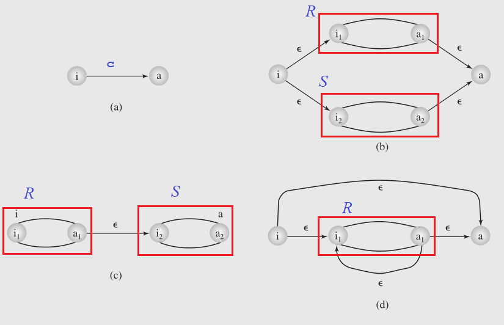
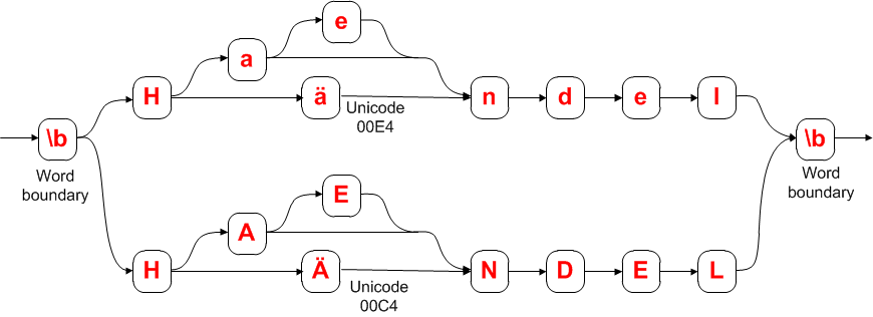

Handout 14: Regular Expressions
=====================================

**Objectives:**

1. Alphabets, strings, languages.
2. Regular Expressions syntax for programming.
3. Regex equivalence with nondeterministic finite automata.
4. Extended syntax and use for match, search and substitute.
5. Uses in data validation, screen scraping, examples. 

Alphabets, strings, languages
--------------------------------

**Definition:** We denote alphabet by :math:`\Sigma`; it contains
finitely many letters. 
Next, we denote all the finite-length *strings* or *words*
written in this alphabet by :math:`\Sigma^{\ast}`. 
The shortest string is empty string :math:`\varepsilon`
of zero characters. 
Any subset :math:`L \subseteq \Sigma^{\ast}` is called a *language* in 
the alphabet :math:`\Sigma`. 

All the strings in the given alphabet
(the entire set :math:`\Sigma^{\ast}` 
can be ordered either
*lexicographically*, *inverse lexicographically* 
or in *shortlex order*.

**(1) Lexicographic order.** 
  Define that word :math:`w_1` *lexicographically precedes* :math:`w_2` 
  (write :math:`w_1 \prec_{\text{lex}} w_2`), 
  if :math:`w_1` is a prefix of :math:`w_2`. 
  For example 
  :math:`\textcolor{blue}{\mathtt{AB}} \prec_{\text{lex}} \textcolor{blue}{\mathtt{ABA}}`. 
  Also define that :math:`w_1 \prec_{\text{lex}} w_2`, 
  if neither is a prefix of another, but in the first position where they differ, 
  the symbol in :math:`w_1` precedes the symbol in :math:`w_2`. 
  For example, 
  :math:`\textcolor{blue}{\mathtt{ABBD}} \prec \textcolor{blue}{\mathtt{ABC}}`
  (the 3rd letter from the start differs:
  :math:`\textcolor{blue}{\mathtt{AB}}\textcolor{red}{\mathtt{B}}\textcolor{blue}{\mathtt{D}}`
  and :math:`\textcolor{blue}{\mathtt{AB}}\textcolor{red}{\mathtt{C}}`).

**(2) Shortlex order.**  
  Shorter words precede longer words in the shortlex order; words of the 
  same length are compared lexicographically. Namely, 
  :math:`w_1 \prec_{\text{shortlex}} w_2` is true if and only if either 
  :math:`|w_1| < |w_2|` (the length of :math:`w_1` is smaller; it contains
  fewer letters than :math:`w_2`) or :math:`|w_1| = |w_2|` 
  and at the same time :math:`w_1 \prec_{\text{lex}} w_2`. 

**(3) Colexicographic order.** 
  Define that word :math:`w_1` colexicographically precedes :math:`w_2` 
  (:math:`w_1 \prec_{\text{colex}} w_2`), 
  if :math:`w_1` is a suffix of :math:`w_2`. 
  For example 
  :math:`\textcolor{blue}{\mathtt{CDE}} \prec_{\text{colex}} \textcolor{blue}{\mathtt{BCDE}}`. 
  Also define that :math:`w_1 \prec_{\text{colex}} w_2`, 
  if neither is a suffix of another, but in the first position 
  (counting from the end) where they differ, letter in :math:`w_1` 
  precedes the letter in :math:`w_2`. 
  For example, 
  :math:`\textcolor{blue}{\mathtt{ZVYZ}} \prec_{\text{colex}} \textcolor{blue}{\mathtt{XYZ}}`
  (the 3rd letter from the end differs:
  :math:`\textcolor{blue}{\mathtt{Z}}\textcolor{red}{\mathtt{V}}\textcolor{blue}{\mathtt{YZ}}` 
  and 
  :math:`\textcolor{red}{\mathtt{X}}\textcolor{blue}{\mathtt{YZ}}`).

 

**Definition:**
  A relation :math:`R` on set :math:`S` (:math:`R \subseteq S \times S`) is named 
  a *total order relation*, iff it satisfies four properties:
  
  1. :math:`a \leq a` (*Reflexive relation*).
  2. If :math:`a \leq b` and :math:`b \leq c` then :math:`a \leq c` (*Transitive relation*).
  3. If :math:`a \leq b` and :math:`b \leq a` then :math:`a = b` (*Antisymmetric relation*).
  4. For any two elements :math:`a \leq b` or :math:`b \leq a` (*Connected/Total relation*).

**Definition:**
  An order a well-order (or well-ordering or well-order relation) on a set S is a total order on S with the property that every non-empty subset of S has the least element in this ordering.

**Question:**
  Given the set of all strings :math:`\Sigma^{\ast}`, which of the orderings (lexicographic, 
  colexicographic or shortlex) are total order relations? Which ones are well-order relations?
  
  

Regular Expressions
---------------------

There are different kinds of languages (depending on how hard
it is to decide membership). Some languages require just a 
one-time read of the input string and some finite memory. 
Other languages require more complex computations. 

Assume that the alphabet consists of all digits: 
:math:`\Sigma = \{ \mathtt{0}, \mathtt{1}, \ldots, \mathtt{9} \}`

**Easy Languages:**

* :math:`L := \{ w \in \Sigma^{\ast}\,:\,|w|\ \text{is odd} \}`
* :math:`L := \{ w \in \Sigma^{\ast}\,:\,\text{number of "1" chars is odd} \}`
* :math:`L := \{ w \in \Sigma^{\ast}\,:\,w\ \text{is divisible by}\ 3 \}`

**More Complex Languages:**

* All palindromes (e.g. ``1331``)
* Strings with equal number of 0s and 1s
* All prime numbers 

All the easy languages require just constant memory 
(while the more complex languages need to build longer numbers 
or other data structures). 

Basic Regex Syntax
^^^^^^^^^^^^^^^^^^^^

It turns out that all the "easy languages" can be described
with some simple syntax.
The following rules define regular 
expressions. 

There are three atomic regular expressions: 

* :math:`\varnothing` denotes the *empty language* without any strings. 
* :math:`\varepsilon` denotes the language containing just the *empty string*: :math:`L=\{ \varepsilon \}`
* :math:`\mathtt{a}` denotes the language of just one single-symbol word :math:`L=\{ \mathtt{a} \}`.

There are also three operations to build more complex regular expressions recursively: 

* *Concatenation:* Given two regular languages :math:`L_1` and :math:`L_2`, 
  denote the concatenation of them as :math:`L_1L_2` (no operator between them -- 
  just write one regex after another). Concatenation lists all the strings
  where some string from :math:`L_1` is concatenated with some string from :math:`L_2`.
  (It concatenates all pairs from the Cartesian product :math:`L_1 \times L_2`).
    
* *Alternation:* Given two regular languages :math:`L_1` and :math:`L_2`, 
  denote their alternation as :math:`L_1\mid{}L_2`. It is the set union of 
  both languages. 

* *Kleene star:* Given a language :math:`L`, its Kleene-closure :math:`L^{\ast}` contains 
  the empty string :math:`\varepsilon`, every string from the language :math:`L` itself, 
  and is closed against concatenation (namely, if some words belong to :math:`L^{\ast}`, 
  then their concatenation must also belong to  :math:`L^{\ast}`).
  

  For example, if :math:`L_1 = \{ \mathtt{ab}, \mathtt{c} \}` and 
  :math:`L_2 = \{ \mathtt{x}, \mathtt{yz} \}`, then 
    
  .. math::
  
    \begin{array}{l}
    L_1L_2 = \{ \mathtt{abx}, \mathtt{abyz}, \mathtt{cx}, \mathtt{cyz} \},\\
    L_1\mid{}L_2 = \{ \mathtt{ab}, \mathtt{c}, \mathtt{x}, \mathtt{yz} \},\\
    L_1^{\ast} = \{ \varepsilon, \mathtt{c}, \mathtt{ab}, \mathtt{cc}, \mathtt{abc}, \mathtt{ccc}, \mathtt{abab}, \mathtt{abcc}, \mathtt{cabc}, \mathtt{ccab}, \mathtt{cccc}, \ldots \}.\\
    \end{array}

Regex and Nondeterministic Finite Automata
-------------------------------------------

Regular expressions are a generalization of strings (any string can be 
interpreted as a regular expression -- a long concatenation of symbols). 

They can be found using new type of automata -- nondeterministic finite acceptors (NFA). 

**Definition:** 
  A *nondeterministic finite acceptor* is constructed from the 
  following five things: 
  
  1. A set of *states* :math:`Q = \{ q_0, \ldots, q_{k-1} \}`
  2. An input alphabet :math:`\Sigma = \{ c_0, \ldots, c_{m-1} \}`
  3. A single *initial state*. For example :math:`q_0 \in Q`. 
  4. A subset of *accepting states*: :math:`Q_A \subseteq Q`. 
  5. A set of *edges* or *transitions*. Any edge goes from a state :math:`q_i`
     to a state :math:`q_j` (possibly :math:`q_i = q_j`), and it 
     is labeled by some character :math:`c_k \in \Sigma` or 
     by :math:`\varepsilon`. 
     
**Definition:** 
  An NFA *recognizes* a language :math:`L \subseteq \Sigma^{\ast}` iff
  for any word :math:`w \in L` consisting of :math:`n` characters
  :math:`c_0,\ldots,c_{n-1}` there exists a sequence of 
  edges that lead from the initial state to some accepting state
  (and an edge in this sequence either is marked with :math:`\varepsilon`
  or it reads some character :math:`c_i` from the input word :math:`w \in L`). 
  
  
Some "features" of nondeterministic finite acceptors (NFAs) compared to DFAs:

**Ambiguous outbound edges:**   
   In NFA there may be multiple outbound edges with the same character. 
   If there are multiple edges, we can use any of these 
   edges while reading that character.
   (In DFA every state has exactly :math:`|\Sigma|` outbound edges; for every 
   character in the alphabet there is exactly one edge.)

**Missing outbound edges:**
   In NFA there may be non-existent edges for some pairs of states and characters. 
   If we encounter such dead end, the path breaks down -- it cannot be used to reach the 
   accepting state on the word :math:`w \in L`. That word could still be 
   accepted, if we use another path. 
   
**Epsilon-edges:** 
   In NFA there may be edges marked with :math:`\varepsilon` -- they 
   can be followed optionally, and no input character is read in such cases. 
   (In DFA there are no epsilon edges -- every transition between two states consumes 
   one character from the input.) 
   
Generally, the non-deterministic mode of operation assumes that 
the algorithm running this automaton can guess correctly, which edge 
to follow in case of ambiguities (multiple edges or epsilon edges). 

**Theorem:** 
  NFAs and DFAs are equivalent in terms of what languages they recognize. 
  A language :math:`L \subseteq \Sigma^{\ast}` is recognized by a DFA (or NFA) 
  iff it can be described with a regular expression. 
 

**Example:**
  Consider the alphabet of two characters (0 and 1), and 
  build all the strings that represent numbers divisible by 3. 
  This language is expressed by the following set:
  
  .. math:: 
  
    L = \{ \varepsilon, "0", "00", "11", "000", "011", "110", "0000", "0011", "0110", "1001", "1100", "1111", "00000", \ldots \}
    
  
  The DFA automaton recognizing this language:  

  .. image:: figs-regular-expressions/multipliers-of-3.png
     :width: 2in

  The regular expression for the same language is ``(0|(1(01*0)*1))*``. 
  
  .. image:: figs-regular-expressions/nfa-multipliers-of-3.png
     :width: 3in

  To see the "toy train diagram" that can be redrawn as an NFA, 
  visit the site `<https://www.debuggex.com/>`_ and enter the 
  regular expression.
  
  
  Typically, a DFA is much larger than the NFA that does
  the same thing (our example is unusual in the sense 
  that the DFA recognizing divisibility by 3 is smaller). 
  

NFA Automata to Languages
^^^^^^^^^^^^^^^^^^^^^^^^^^^

Consider the following five NFA automata; all of them 
have the same input alphabet :math:`\Sigma = \{ \mathtt{0}, \mathtt{1} \}`. 
For each of them write the language accepted by it as a 
regular expression. Also describe the language using sentences in 
English. 

**(A)**

  .. image:: figs-regular-expressions/automaton01.png
     :width: 2in
  
**(B)**

  .. image:: figs-regular-expressions/automaton02.png
     :width: 4in

**(C)**

  .. image:: figs-regular-expressions/automaton03.png
     :width: 3in

**(D)**

  .. image:: figs-regular-expressions/automaton04.png
     :width: 1in

**(E)**

  .. image:: figs-regular-expressions/automaton05.png
     :width: 2in

Equivalence of Regex and NFAs
^^^^^^^^^^^^^^^^^^^^^^^^^^^^^^^

   
The picture shows how to build regular expressions for a
single character ``c`` (image (a)), for the alternation (image (b)), 
for the concatenation (image (c)), for the Kleene star (image (d)). 

In each picture "i" denotes the initial state and "a" denotes 
the accepting state (in all these examples every 
automaton has a single accepting state). 

**Theorem**
  There exists an algorithm to decide, if some word is 
  accepted by the given NFA. 
  

Extended Syntax and Using in Code
-----------------------------------

Here we discuss regular expressions for programming and other practical uses. 
Mathematical definitions (with explicitly written "ORs" and Kleene stars) 
can define every regular expression, but there are some inconveniences: 

* What happens, if some expression is optional (repeats 0 or 1 time)? 
* What happens, if some expression can repeat 1 or more times (empty strings not allowed)? 
* What happens, if some expression repeats at least :math:`m` times (or no more 
  than :math:`n` times, or between :math:`m` and :math:`n` times). 
* What happens if there is a large choice between different symbols 
  (for example any uppercase or lowercase letter)?
* What happens, if we want to allow every symbol *except* certain symbols? 
* How do we match word boundaries -- locations in a word, where
  alphanumeric characters (letters, digits, underscores) 
  switch to non-alphanumeric characters (whitespace or special symbols)?

**Groups of Characters:**

===============================  ================================================================================================
``.``                            Matches any character, except CR (carriage return) and LF (line feed)
``\r``, ``\r``                   Matches newline characters CR and LF
``\w``                           Any word character -- letter, digit or underscore (_)
``\W``                           Any non-word character, e.g. whitespace or punctuation character
``\s``                           Any whitespace character – space, tabulation or form feed (newline characters are not matched)
``\S``                           Any character that is not a space
``[a-z]``, ``[A-Z]``, ``[0-9]``  Lowercase, uppercase letters and digits
``[0-9A-Fa-f]``                  Any hexadecimal digit
===============================  ================================================================================================

**Quantification operators:**

=========================   ===============================================================================
:math:`\mathtt{a?}`         Shorthand for :math:`\varepsilon\mathtt{|a}`
:math:`\mathtt{a+}`         Shorthand for :math:`\mathtt{aa*}`
:math:`\mathtt{a\{3\}}`     Shorthand for :math:`\mathtt{aaa}`
:math:`\mathtt{a\{3,5\}}`   Shorthand for :math:`\mathtt{aaa|aaaa|aaaaa}`
:math:`\mathtt{a\{,3\}}`    Shorthand for :math:`\varepsilon\mathtt{|a|aa|aaa}`
:math:`\mathtt{a\{3,\}}`    Shorthand for :math:`\mathtt{(aaa)(a*)} = \mathtt{aaaa*}`
=========================   ===============================================================================

Regex in C++ Code and Python 
^^^^^^^^^^^^^^^^^^^^^^^^^^^^^

Regular expressions can be tested from interactive Python console. 
See the official documentation of package ``re``: `<https://bit.ly/3D1Rzuw>`_. 

**Verify, if the given regex is found in the string:**

.. code-block:: python
  
  import re
  # search for digits [0-9]+ at the beginning of the string
  bool(re.match(r'[0-9]+', '2021, and 2022, and 2023'))
  # check, if the string exactly matches the given expression
  bool(re.fullmatch(r'[0-9]+', '2021, and 2022, and 2023'))

**Find the match and the offset of a regular expression:**

.. code-block:: python

  import re
  m = re.search(r'[0-9]+', '2021, and 2022, and 2023')
  m.group()
  m.start()
  
  m = re.search(r'', ' and also ')
  m.group()
  m.start()

In the latter example, the question mark enforces non-greedy matching. 
  

**Find all instances:**

.. code-block:: python

  import re
  re.findall(r'([0-9]{4})', '202121, and 2022, and 2023')
  [x.group() for x in re.finditer(r'[0-9]{4}', '202121, and 2022, and 2023')]
  
**Code snippet to read file and print only matching lines:**

.. code-block:: python

  import re
  for line in open("file.txt"):
      for match in re.finditer(r'^\d{4}(-\d{4}){3}$', line):
          print(line)

**Code snippet for space-normalization:** 

.. code-block:: python

  import re
  for line in open("file.txt"):
      line = re.sub('^\s+', '', line)
      line = re.sub('\s+$', '', line)
      line = re.sub('\s+', ' ', line)
      print(line)

**Unicode Examples** 

     

``\b(H(ä|ae?)ndel|H(Ä|AE?)NDEL)\b`` -- this 
regular expression matches various spellings of Haendel: 
  
.. code-block:: text
  
  Handel
  Haendel
  Händel
  HANDEL
  HAENDEL
  HÄNDEL
    
The last name of the German composer Haendel has multiple spellings; 
can be summarized with a regular expression. 
Also -- inflected forms in various languages with more complex morphology
(tens of verb forms in Latvian, 14 noun cases in Finnish, etc.) 

Regular Expression Performance
^^^^^^^^^^^^^^^^^^^^^^^^^^^^^^^

See `<https://www.regular-expressions.info/catastrophic.html>`_ for 
examples of regular expressions which may lead to unnecessarily 
long "backtracking" -- probing different variants of Kleene-star
expressions. Usually it is possible to rewrite them in 
a more efficient way -- for example, selecting 
appropriate sets of characters one can reduce ambiguity. 

Problems
---------

**Question 1:**
  Consider a Nondeterministic Finite Acceptor (NFA) defined as follows:
  
  * The set of all states: :math:`Q = \{ q_0, q_1, q_2 \}`. 
  * Input alphabet: :math:`\Sigma = \{ \mathtt{a}, \mathtt{b}, \mathtt{c} \}`. 
  * Starting state: :math:`q_0`. 
  * Accepting state(s): :math:`q_2`. 
  * Transitions: :math:`(q_0, \mathtt{a}, q_0)`, :math:`(q_0, \varepsilon, q_1)`, 
    :math:`(q_1, \mathtt{b}, q_1)`, :math:`(q_1, \varepsilon, q_2)`, 
    :math:`(q_2, \mathtt{c}, q_2)`.

  **(A)**
    Draw the diagram of this NFA. 
  
  **(B)** 
    Write a regular expression that describes the same language as 
    is recognized by this NFA. 
    
  **(C)**
    Describe the language in English -- which words are contained there; 
    list the words in :math:`L` having length up to :math:`3` characters. 

**Question 2:**
  Consider a Nondeterministic Finite Acceptor (NFA) defined as follows:
  
  * The set of all states: :math:`Q = \{ q_0, q_1, q_2 \}`. 
  * Input alphabet: :math:`\Sigma = \{ \mathtt{0}, \mathtt{1}, \mathtt{2} \}`. 
  * Starting state: :math:`q_0`. 
  * Accepting state(s): :math:`q_2`. 
  * Transitions: :math:`(q_0, \varepsilon, q_1)`, :math:`(q_1, \varepsilon, q_0)`, 
    :math:`(q_0, \mathtt{0}, q_0)`, :math:`(q_1, \mathtt{1}, q_1)`, 
    :math:`(q_1, \mathtt{2}, q_2)`, :math:`(q_2, \mathtt{2}, q_1)`.

  **(A)**
    Draw the diagram of this NFA. 
  
  **(B)** 
    Write a regular expression that describes the same language :math:`L` as 
    is recognized by this NFA. 
    
  **(C)**
    Describe the language in English -- which words are contained there; 
    list the words in :math:`L` having length up to :math:`3` characters. 

**Question 3:**
  In the problems below, create deterministic or nondeterministic
  finite acceptors for the languages over the "binary alphabet" 
  :math:`\Sigma = \{ \mathtt{0}, \mathtt{1} \}`  given below: 
  
  **(A)** 
    The language of all those sequences of binary digits that are 
    divisible by :math:`4`: 
    
    .. math::
    
      L := \{ w \in \Sigma^{\ast}\,\mid\, 4\ \text{divides}\ w \}
      
  **(B)** 
    The language of all those sequences of binary digits that are 
    divisible by :math:`5`: 
    
    .. math::
    
      L := \{ w \in \Sigma^{\ast}\,\mid\, 5\ \text{divides}\ w \}
      
  **(C)**
    The language of all those sequences of binary digits that 
    do not contain two consecutive digits :math:`\mathtt{1}`:

    .. math::
    
      L := \{ w \in \Sigma^{\ast}\,\mid\, \mathtt{11}\ \text{not a substring of}\ w \}
    

**Question 4:** 
  Somebody does a Web development assignment and wants to create a 
  form with field validation (see `<https://bit.ly/3l5jrI1>`_ for 
  actual JavaScript examples). 
  Show how to create a valid regular expression for each example.

  **(A)**
    Any valid Latvian Zip-code (anything like ``LV-****``), where
    the asterisks represent digits.
    
  **(B)** 
    Any phone number with Lithuania country code in format ``+370 ********``. 
    Namely, the phone should start with a "plus" symbol, followed by digits 
    ``370``, then a single space, then eight more digits which can be arbitrary.

  **(C)**
    Any decimal value of a single byte (strings "0", "1", and so on, up to "255").

  **(D)** 
    Any ISO-8601 formatted date (such as ``YYYY-MM-DD``) during 
    the 21st century that is on a leap year and February. 
    (Namely, all ``20**-02-**`` strings are good strings 
    as long as they represent valid dates during a leap year.)
    

**Question 5:** 
  Solve the following crossword puzzle.
  Every cell in this :math:`5 \times 6` table 
  should contain one symbol and the words written horizontally or vertically 
  should match the regular expression of the corresponding row or column.
  
  .. image:: figs-regular-expressions/crossword.png
     :width: 3.5in
  
  There may be several solutions to the puzzle (instructors think that the
  total number of solutions is 4). Show them for extra credit. 
  
  **Horizontally:** 
  
    1. ``^[ABCD]*$``
    2. ``^[^ABCD]*$``
    3. ``^(.)(..)\2\1$``
    4. ``^(AAA|BBB)(CCC|EEE)$``
    5. ``^[DEF]*$``
    
  **Vertically:**

    1. ``^([AE][BF])[CD]\1$``
    2. ``^(.)(.)\2\1\2$``
    3. ``^A?A?B?B?E?A?A?D?D$``
    4. ``^A*B+C*D*E*F*$``
    5. ``^(.*)\1[FG]*$``    
    6. ``^[DE]*(.).\1$``
  
  
.. A  A  AB B  A  D
.. F  E  E  E  E  E
.. D  E  A  E  A  D
.. A  A  A  E  E  E
.. F  E  D  EF F  D

  
