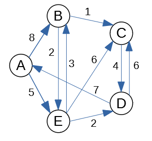
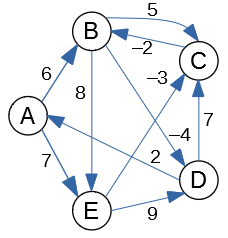

Handout 08: Shortest Paths
============================

This handout could help to prepare for the Written Assignment 08.

Dijkstra's Algorithm
---------------------

(Drozdek2013, p.400) and
(Goodrich2011, p.640) both define Dijkstra's algorithm. 
See also `<https://bit.ly/2JSXqMU>`_.
It is an efficient algorithm; it requires :math:`O((m+n)\log_2 n)` time, if 
we use priority queues; here :math:`m = |E|` is the number of edges and :math:`n = |V|` is the number 
of vertices in a graph.
 
In this exercise you do not need to implement a priority queue; 
assume that you can always pick the vertex with the smallest distance and 
add it to the set :math:`S` of visited vertexes (those having distances already computed). 

Problem
^^^^^^^^^

We start with the graph shown in Figure below:

   
   Graph Diagram for Dijkstra's Algorithm

Vertex :math:`A` will be your source vertex. (You can assume that the distance 
from :math:`A` to itself is :math:`0`; initially all the other distances are infinite, but 
then Dijkstra's algorithm relaxes them). 

**(A)**
  Run the Dijkstra's algorithm: 
  At every phase write the current vertex :math:`v`; the set of finished vertices
  and also a table showing the new distances to all :math:`A,B,C,D,E` (and their parents)
  after the relaxations from :math:`v` are performed.
  At the end of every phase highlight which vertex (among those not yet finished) 
  has the minimum distance. This will become the current vertex in the next phase.
	
**(B)**	
  After the algorithm finishes, summarize the answer: 
  For each of the five vertices 
  tell what is its minimum distance from the source.
  Also show what is the shortest path how to achieve that minimum distance.

Solution 
^^^^^^^^^^

**(A)**
  At every phase we select the minimum-distance vertex in the priority queue of vertices
  (not yet added to the set of finished vertices :math:`S`). This becomes the
  current vertex :math:`v`. After that we relax all the edges that go out from the
  current vertex :math:`v` (if some distance decreases, we change the parent of this new vertex
  to become :math:`v`). 

  .. figure:: figs-shortest-paths/dijkstra-solution.png
     :width: 4in
     :alt: 5 Phases of Dijkstra's Algorithm
   
     **(A)** -- Five Phases of Dijkstra's Algorithm

**(B)** 
  The result of Dijkstra's algorithm can be summarized as shown below. For each vertex 
  we specify the distance from :math:`A` to that vertex (and also what is the shortest path to achieve it).
  
  ==============  =================  ======================================
  Vertex          Distance           Path
  :math:`A`       :math:`d(A,A)=0`   :math:`A`
  :math:`B`       :math:`d(A,B)=8`   :math:`A\rightarrow{}B`
  :math:`C`       :math:`d(A,C)=9`   :math:`A\rightarrow{}B\rightarrow{}C`	
  :math:`D`       :math:`d(A,D)=7`   :math:`A\rightarrow{}E\rightarrow{}D`		
  :math:`E`       :math:`d(A,E)=5`   :math:`A\rightarrow{}E`	
  ==============  =================  ======================================
  

Bellman-Ford Algorithm
-----------------------

The Bellman-Ford algorithm solves the single source shortest paths problem in
the case in which edge weights may be negative. It can work with directed graphs
(and also undirected graphs; not discussed in this exercise).  
The algorithm initializes the distances to all the vertices 
:math:`u` by :math:`u.d = +\infty`. 
The only exception is the *source vertex*) which 
gets distance :math:`s.d = 0` (the distance to itself is :math:`0`). 

After this initialization 
in a graph with :math:`n` vertices it will perform :math:`n-1` identical iterations. 
In every iteration it considers all the edges in some order, 
and "relaxes" all the edges. See (Drozdek2013, p.402) and (Goodrich2011, p.640), where
the edge relaxation procedure is described. 

After that you can perform one last iteration with Bellman-Ford algorithm:
If there are still relaxations that reduce distances even after :math:`n` steps, 
this means that there is a negative loop in the original graph 
(and the shortest paths are not possible to compute as the distances can 
be reduced infinitely). 

Problem
^^^^^^^^^^

Consider the graph in Figure:

   
   Graph Diagram for Bellman Ford Algorithm

Let us pick vertex :math:`B` as the *source vertex* 
for Bellman-Ford algorithm. (You could pick the source vertex
differently, but then all the distance computations would 
be different as well.)

**(A)**
  Create a table showing all the changes
  to all the distances to :math:`A,B,C,D,E` as the relaxations are performed. 
  In a single iteration the same distance can be relaxed/improved multiple times
  (and you can use distances computed in the current phase to relax further edges).
  The table should display all :math:`n-1` iterations (where :math:`n=5` is the number of vertices). 
  (*Sometimes it is worth running one more iteration to find possible
  negative loops*).

  .. note::
    Please make sure to release the edges in the alphabetical/lexicographical order: 
    Regardless of which is your source, in every iteration the edges are always relaxed in this order: 
  
    .. math::

      AB, AE, BD, BE, CB, DA, DC, EC, ED.
	
    In fact, any order can work; the only thing that matters is that you consider 
    all the edges. But alphabetical ordering of edges makes the solution 
    deterministic.

**(B)**
  Summarize the result: For each of the :math:`5` vertices 
  tell what is its minimum distance from the source. 
  Also tell what is the shortest path how to get there. 
  For example, if your source is :math:`E` then you
  could claim that the shortest path :math:`E \leadsto B` is 
  of length :math:`-5` and it consists of two edges :math:`(E,C), (C,B)`. 

Solution
^^^^^^^^^

**(A)**
  In this case we only need to run three phases (not :math:`n-1=4` phases), 
  since all the distances become stable and do not change anymore 
  after Phase 3. 
  The tables show only those relaxed edges that lead to decreased
  distances.

  .. figure:: figs-shortest-paths/bellman-ford-solution.png
     :width: 4in
     :alt: Phases of Bellman-Ford's Algorithm
   
     **(A)** -- Phases of Bellman-Ford's Algorithm

**(B)**
  The result of Bellman-Ford's algorithm can be summarized as shown below. For each vertex 
  we specify the distance from :math:`A` to that vertex (and also what is the shortest path to achieve it).
  
  ==============  =================  ==================================================================
  Vertex          Distance           Path
  :math:`A`       :math:`d(A,A)=0`   :math:`A`
  :math:`B`       :math:`d(A,B)=2`   :math:`A\rightarrow{}E\rightarrow{}C\rightarrow{}B`
  :math:`C`       :math:`d(A,C)=4`   :math:`A\rightarrow{}E\rightarrow{}C`	
  :math:`D`       :math:`d(A,D)=-2`  :math:`A\rightarrow{}E\rightarrow{}C\rightarrow{}B\rightarrow{}D`
  :math:`E`       :math:`d(A,E)=7`   :math:`A\rightarrow{}E`
  ==============  =================  ==================================================================
  

