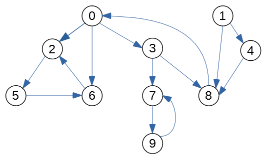

Worksheet, Week08: Graph Traversals
====================================

Strongly Connected Components
--------------------------------

One of the multiple practical applications of a DFS traversal of a directed graph
is finding strongly connected components (strongly connected graphs are defined
in (Goodrich2011, p.626)), the relevant algorithm is
known as Kosaraju's algorithm.
`<https://bit.ly/3lI20ec>`_, `<https://bit.ly/3mNU2la>`_.

Definition:
  A subset of vertices in a directed graph :math:`S \subseteq G.V` makes a strongly
  connected component, iff for any two distinct vertices :math:`u,v` there is
  a path :math:`u \leadsto v` (one or more  and also another path :math:`v \leadsto u` that goes
  back from :math:`v` to :math:`u`.

If you can travel only in one direction (say, from :math:`u` to :math:`v`), but cannot return,
then :math:`u,v` should be in different strongly connected components.
(Same thing, if :math:`u` and :math:`v` are mutually unreachable.) Moreover, every
vertex is strongly connected to itself -- so even in the worst case
a graph with :math:`n` vertices would have at most :math:`n` strongly connected components
(containing one vertex each).

Figure shows an example of a graph with :math:`n=5` vertices
having :math:`3` strongly connected components. Next to that graph is the
*transposed graph* :math:`G^T`
where all the edges are reversed.

Kosaraju's algorithm
--------------------------

There is a way to find strongly connected components in an
arbitrary graph by
running DFS twice (i.e. it works in linear time :math:`O(n+m)`).

.. math::

  \begin{array}{rl}
    & \text{\sc Strongly\textunderscore{}Connected}(G)\\
    & \textcolor{teal}{\text{\em (compute all finishing times $u.f$)}}\\
  1 & \text{call}\;\text{\sc DFS}(G)\\
    & \textcolor{teal}{\text{\em ($G^T$ is transposed $G$, all edges reversed)}}\\
  2 & \text{compute}\;G^{T}\\
    & \textcolor{teal}{\text{\em (visit vertices in decreasing $u.f$ order)}}\\
  3 & \text{call}\;\text{\sc DFS}(G^T)\\
  4 & \text{\bf for each}\;\text{tree $T$ in the forest}\;\text{\sc DFS}(G^T)\\
  5 & \hspace{0.5cm} \text{Output $T$ as a component}\\
  \end{array}

To see how this works, we can run it on the example graph shown earlier.
After the DFS on graph :math:`G` is run, we get the finishing times
for the vertices :math:`0,1,2,3,4` (all shown in red on the left side
of Figure below).
After that we replace :math:`G` by :math:`G^T` (to the right side of
the same figure), and assign priorities in the decreasing sequence
of :math:`u.f` (the finishing times when running :math:`\text{\sc DFS}(G)`).

.. image:: figs-graph-traversals/strongly-connected-dfs.png
   :width: 3in

To make this reverse order obvious, we assign new priorities to
the vertices in :math:`G^T`. The new priorities in :math:`G^T` are the following:

* Vertex ``0`` has priority :math:`11 - 10 = 1`.
* Vertex ``1`` has priority :math:`11 - 4 = 7`.
* Vertex ``2`` has priority :math:`11 - 5 = 6`.
* Vertex ``3`` has priority :math:`11 - 9 = 2`.
* Vertex ``4`` has priority :math:`11 - 8 = 3`.

Now run :math:`\text{\sc DFS}(G^T)`. It turns out that the DFS algorithm starts
in the vertex ``"0"`` once again (since it was finished last in :math:`\text{\sc DFS}(G)`).
But unlike the DFS algorithm in :math:`G` itself (it produced just one DFS tree),
we get a DFS forest with 3 components (tree/discovery edges shown bold and black in
the previous Figure).

* :math:`\{ 0,1,2 \}` (DFS tree has root :math:`\mathtt{"0"}`).
* :math:`\{ 3 \}` (DFS tree has root :math:`\mathtt{"3"}`).
* :math:`\{ 4 \}` (DFS tree has root :math:`\mathtt{"4"}`).

They represent the strongly connected components in :math:`G` (they are also
strongly connected in :math:`G^T`).

Problem
----------

We start with the graph shown in Figure below.

**(A)**
  Run the DFS traversal algorithm on the graph :math:`G`.
  Mark each vertex
  with the pair of numbers ``d/f``, where the first number ``d`` is the
  discovery time, and the second number ``f`` is the finishing time.

**(B)**
  Draw the transposed directed graph (same vertices, but each arrow points
  in the opposite direction).
  Run the DFS traversal algorithm on :math:`G^T`. Make sure that the DFS
  outer loop visits the vertices in the reverse order by :math:`u.f`
  (the finishing time for the DFS algorithm in step **(A)**).
  In this case you do not produce the discovery/finishing times once again,
  just draw the discovery edges used by the DFS on :math:`G^T` --
  you can highlight them (show them in bold or use a different color).

**(C)**
  List all the strongly connected components (they are
  the separate pieces in the forest obtained by running DFS
  on :math:`G^T`).
