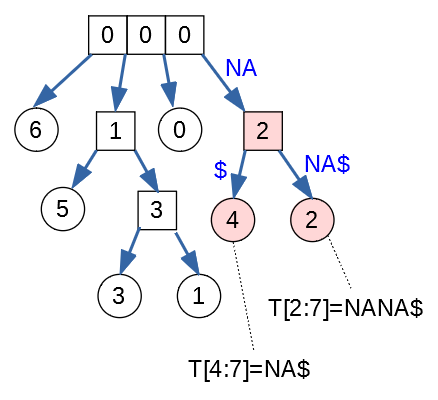

Final (Sample Questions)
==========================

The actual Final exam will take place on May 13, 2022. It is held at 10:00. 
See `<https://bit.ly/3KxuMdV>`_ for the official information.

Below are some sample questions that might assist you as you prepare for the final 
and see the topics and ideas that are typically covered in a final.
We cannot guarantee that the final exam questions will closely match these samples; 
but these samples may be useful as you prepare. 

**Topics**

  * Time complexity of various algorithms. 
  * Regular hashing and building hashtables (chaining or open addressing).
  * Naive string search algorithm.
  * Rolling hashes and Rabin-Karp algorithm (to search one or several patterns in a text).
  * KMP algorithm and prefix function.
  * Suffix trees.

**Question 1:** 
  (Some pseudocode of an algorithm is given. The algorithm may be recursive 
  or it may contain nested loops or calls to other functions, if their time
  complexity is known.) 
  The task is tho determine the overall time complexity of a single algorithm call, 
  if the input length (or similar input-related parameters) are known. 

**Question 2:** 
  In this task you will draw a hashtable with open-address hashing. 

  To run the Python environment on Linux like this (tested on Ubuntu command-line): 

  .. code-block:: text

    export PYTHONHASHSEED=0
    python
  
  On Windows Powershell (such as Anaconda terminal) run Python environment like this:

  .. code-block:: text

    $Env:PYTHONHASHSEED=0
    python

  On Windows regular terminal run Python environment like this:
  
  .. code-block:: text

    set PYTHONHASHSEED=0
    python

  **(A)**
    Draw a hashtable with exactly :math:`11` slots (enumerated as ``T[0]``, 
    ``T[1]``, and so on, up to ``T[10]``). 
    Insert the following items into this hashtable (keys are names for countries and lands, 
    but values are float numbers showing their population in million): 
  
    .. code-block:: text
  
      ('Macedonia',1.8), ('Malta',0.5), ('Mecklenburg-Vorpommern',1.6), 
      ('Moldova',2.6), ('Montenegro',0.6), ('Croatia',4.0), 
      ('Nordrhein-Westfalen',17.9), ('Norway',5.4)
	
    If there are any collisions between the hash values, add the additional hash values to a linked list using 
    *chaining*. Each item in the linked list contains a key-value pair and also a link to the next item.

  **(B)**
    What is the expected lookup time, if we randomly search any of the 8 lands 
    to look up its population. Finding an item in a hash table takes 1 time unit; 
    slipping by one slot ahead also takes 1 time unit.

**Question 3:** 
  Consider :math:`16` Latin letters with randomly assigned 4-bit codes (i.e. :math:`L=4`): 
  
  ==========  ====  ====  ====  ====  ====  ====  ====  ====  ====  ====  ====  ====  ====  ====  ====  ====  
  Letter         A     B     C     D     E     F     G     H     I     J     K     L     M     N     O     P
  h(x)        1100  0100  0010  0110  0111  0000  1001  1111  0101  1101  1110  1011  0011  1010  1000  0001
  ==========  ====  ====  ====  ====  ====  ====  ====  ====  ====  ====  ====  ====  ====  ====  ====  ====  
  
  **(A)**
    Find the hash value for :math:`ABIDE` and then rotate it over to :math:`BIDEN`.
    Please recall that the rolling hash uses the following formula:  
  
    .. math::

      H = s^{k-1}(h( c_1 )) \oplus s^{k-2}( h(c_2) )  \oplus \ldots \oplus  s( h(c_{k-1}) ) \oplus   h(c_k),

  **(B)**
    Write a formula to compute ``skip(c,v)`` to  skip a character from the front of the string. 
    For example, if :math:`\mathtt{v1} = H("ABIDE")` is the hash value 
    for ``ABIDE``, and :math:`\mathtt{v2} = H("BIDE")` is the hash value for ``BIDE``, 
    then :math:`\mathtt{v2} = skip("A", v1)`. 
    
    Namely, show a time-efficient way to drop the first letter of the hash function argument
    (without recomputing the hash function value from the scratch). 
    
  **(C)**
    Write a formula to compute ``append(c,v)`` to append a new character at the end of the string. 
    For example, if :math:`\mathtt{v2} = H("BIDE")` and :math:`\mathtt{v3} = H("BIDEN")`. then 
    :math:`\mathtt{v3} = H("N",v2)`. 
    
    Namely, show a time-efficient way to add one more letter at the end of the hash function argument, 
    (without recomputing the hash function value from the scratch). 
    
  .. note:: 
    See full discussion on Cyclic Polynomial rolling hash here: `<https://bit.ly/3F5phlA>`_. 
    
    
**Question 4:** 
  In the string :math:`T = \mathtt{879487}` find the pattern :math:`P = \mathtt{9487}`. 
  Run the Rabin-Karp algorithm (see pseudocode below). 
  Use the values :math:`a = 10`, :math:`q = 13`. 
  
  | :math:`\text{\sc RabinKarpStringMatching}(T,P,a,q)`
  |     :math:`rP = \text{\sc RollingHash}(\mathtt{[]})`
  |     :math:`rT = \text{\sc RollingHash}(\mathtt{[]})`
  |     **for** :math:`i` **in** :math:`\text{\sc range}(0,len(P))`:
  |         :math:`rP.\text{\sc append}(P[i])`
  |         :math:`rT.\text{\sc append}(T[i])`
  |     **for** :math:`i` **in** :math:`\text{\sc range}(len(P),len(T))`:
  |         **if** :math:`rP.\text{\sc hash}()` ``==`` :math:`rT.\text{\sc hash}()`:
  |             (*Here we need to double-check as collisions are possible*)
  |             **if** :math:`P` ``==`` :math:`T[i - len(P) + 1: i+1]`
  |                 **output** "Pattern found at offset", :math:`i - len(P)+1`
  |         :math:`rT.\text{\sc skip}(T[i - len(P)])`
  |         :math:`\textcolor{red}{\text{\sc print}(rT.\text{\sc hash}())}`
  |         :math:`rT.\text{\sc append}(T[i])`
  |         :math:`\textcolor{red}{\text{\sc print}(rT.\text{\sc hash}())}`
  
  
  In your answer specify the hash values that would be printed as you run this algorithm. 
  The hash function that is used is remainder when divided by :math:`q = 13`. 
  
  .. note:: 
    See full discussion on Rabin-Karp algorithm here: `<https://bit.ly/3LyBnpz>`_.

**Question 5:**

  **(A)**
    Build the KMP (Knuth-Morris-Pratt) data structures if 
    we need to match the pattern :math:`\mathtt{abababc}`. 

  **(B)** 
    Show how this works on the following text: 
    :math:`T = abcababacabababc`. 
    
  **(C)** 
    Draw a finite state acceptor (FSA) for the pattern.     

  
**Question 6:** 
  Find the prefix function for the pattern :math:`P =\mathtt{abcbcab}`. 
  Demonstrate how it works on the text
  :math:`T = \mathtt{abcabbcabcbcababababcbcab}`.

**Question 7:** 
  This exercise starts with building a suffix array for a short text.
  Then the suffix array (and its LCP information) 
  is converted into a Cartesian tree 
  which also serves as the suffix tree for that text. 
  Finally that Cartesian tree is used to 
  find a common substring that appears in the text multiple times.

  .. note::
    To understand Suffix trees and Suffix arrays, 
    you can read the MIT OCW website: 
    `<https://bit.ly/3IcnUCM>`_ or `<https://bit.ly/3EgJnrV>`_.
  
  
  **(A)**
    Consider a text :math:`T = \mathtt{MALAYALAM\$}`.
    Its length (including the terminating dollar) is :math:`|T| = 10`. 
    Create a suffix array for this string
    together with the LCP information (i.e. find the longest 
    common prefix of any two suffixes that are alphabetically next
    to each other). 
  
    Write out the suffix array and the related 
    LCP information as two sequences (e.g. one under another). 
    Use this alphabetical order:
    :math:`\Sigma = \{ \mathtt{\$}, \mathtt{A}, \mathtt{L}, \mathtt{M}, \mathtt{Y} \}`. 
    Please note that the suffix array has length :math:`|T| = 10` 
    (all the non-empty suffixes of the text :math:`T`), 
    and the LCP information has length :math:`|T|-1 = 9`.
  
  
  
  **(B)** 
    Draw Cartesian tree from the sequence with LCP information.
    This tree should have :math:`|w|-1 = 9` internal nodes and 
    :math:`|w| = 10` leaves. Draw internal nodes as squares 
    and leaves as circles.
  
    Label each internal node with the LCP number (the longest common prefix) and each leaf
    with the prefix order number 
    (The longest prefix :math:`T[0:10] = \mathtt{MALAYALAM\$}`
    has order number :math:`0`, and the shortest non-empty prefix 
    :math:`T[9:10] = \mathtt{\$}` has order number :math:`9`.)
  

  **(C)**  
    Consider leaves #6 and #2 
    in the Cartesian tree obtained in (B). 
    List the compressed edges on the path from the root node
    to these leaves. Mark the internal node that shows
    the longest common prefix of both suffixes: 
    :math:`T[6:10] = \mathtt{LAM\$}` and :math:`T[2:10] = \mathtt{LAYALAM\$}`. 
  

Appendix: Banana Example
---------------------------

Here is an example that is similar to the above task.
Please refer to the video `<https://bit.ly/3EgJnrV>`_ (starting from 
1:10:00). 
A drawing from the video shows suffix array for text :math:`T = \mathtt{BANANA\$}`, 
and related LCP information (red numbers to the left of the suffix array). 
The central part of the drawing is
a Cartesian tree built from this suffix array and its LCP information. 
On the right is the suffix tree (with compressed edges, where
just the branching nodes and leaves are shown). The suffix tree
should have the same shape as the Cartesian tree, but its edges are labeled 
with one or more letters from alphabet :math:`\Sigma`. 

.. image:: figs-ds-2022-spring-final-sample/banana-example.png
   :width: 4.5in

Consider two leaves with numbers #4 and #2
(the corresponding prefixes are
:math:`T[4:7] = \mathtt{NA\$}` and 
:math:`T[2:7] = \mathtt{NANA\$}`). 

The (compressed) paths to these leaves are:

.. math:: 

  \left\{ \begin{array}{ll}
  \text{Path to the leaf \#4:} & [\mathtt{"NA"}, \mathtt{"\$"}]\\
  \text{Path to the leaf \#2:} & [\mathtt{"NA"}, \mathtt{"NA\$"}]\\
  \end{array} \right.

The longest common prefix of these two 
suffixes (i.e. the nearest ancestor of the 
two leaves in the suffix tree) is shown in Fig.1.

   
   The Cartesian tree for the prefixes of text :math:`T = \mathtt{BANANA\$}`. 

The pink square (internal node labeled by "2") 
corresponds to the substring :math:`\mathtt{NA}`. 
The label for the square-shaped internal node indicates that 
the common substring :math:`\mathtt{NA}` has length 2. 

.. note::
  The Cartesian tree in Fig.1  
  shows 3 internal nodes that are drawn together and have 
  4 branches: The root of the tree (the state before receiving any input) 
  can continue with any of the four
  letters: :math:`\mathtt{\$}`, :math:`\mathtt{A}`, 
  :math:`\mathtt{B}`, :math:`\mathtt{N}` -- at this point we do not
  know which location  of :math:`\mathtt{BANANA\$}` text
  will be searched.

  