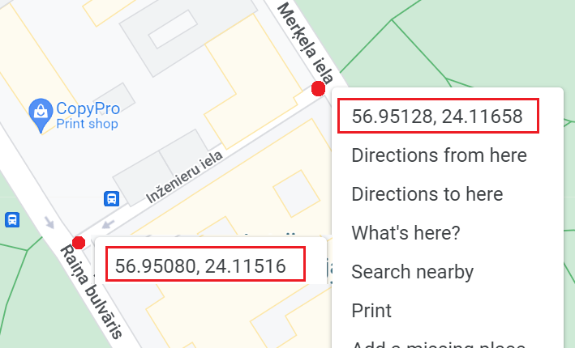

Programming Task 3
============================

Place your files in the directory ``ds-workspace-YourName/task3``, push it to your GitHub repository.
Implement all data structures and algorithms on your own; do not use STL, Boost or similar
predefined data structures. 

The only "include" directives in your code would be "iostream", "fstream", "sstream", "string", "iomanip" 
and similar I/O libraries to ensure reading and writing formatted text to files. 

Description
-------------

The task is to implement the Dijkstra’s algoritm on a "network" of geolocated data. 
You have a set of nodes located on the surface of a mathematical sphere which has 
the radius similar to the actual Earth (:math:`R = 6371` kilometers). 
It has the equator and the 0-meridian defined, and the nodes
have string labels and also their latitude and longitude specified. 

The latitude of a node is a number in the interval :math:`[-90;90]`, and the longitude
is a number in the interval :math:`[-180;180]`. The latitude and the longitude 
numbers are specified with 5-digits after the decimal point. 
In actual life you can get these coordinates for any point on the Earth 
by right-clicking a location on a Google map: 

Your algorithm should receive the input as the set of nodes (along with the source and the destination), 
and it should return the length of the shortest path (or the lexicographically first shortest path, if 
there are several shortest paths), 
the list of node labels (including the source and the destination) used in this path 
and also the number of nodes that you visited during the execution of the algorithm. 
A node counts as "visited", if the shortest path from the source to it has been computed. 
You should stop the search as soon as the shortest path to the destination is found.

Implementation Details
-----------------------

Please follow the following guidelines to make your code readable and reusable: 

* Create a C++ class (or struct or similar) named ``Node`` which stores three attributes -- the string label, 
  the latitude and the longitude of a node. 
* Create a C++ class (or struct or similar) named ``NodeDistance`` which stores the node 
  along with its current distance (will serve as a key in the priority queue). 
* Create a C++ class (or struct or similar) named ``MinPriorityQueue`` which 
  is a heap-based priority queue that can store ``NodeDistance`` using the current distance number 
  as its key. 
* Use a function ``dist(Node n1, Node n2)`` (a member function in your class ``Node`` or similar) 
  which returns the distance between the two nodes. 
  Implement this method using Pythagorean theorem for the two coordinates
  (for now assume that the Earth is flat, there is no longitude compression as we 
  move closer to the poles, there is no "wrapping around" of your coordinates as you 
  cross the meridian with longitude :math:`180 = -180`).
* All your computations with latitudes, longitudes and distances can use "double" type
  (your answers can differ from the official ones by a reasonable rounding error -- the length 
  of the path found multiplied by :math:`10^{-5}`. 

**Input representation:** 
  Each node is represented as a label followed by its geographical latitude and longitude. 
  
  .. code-block:: text

    <SourceLabel> <DestinationLabel>
    <NumberOfNodes> 
    <Label1> <Latitude1> <Longitude1>
    ...
    <LabelN> <LatitudeN> <LongitudeN>
    <Label1> <AdjacentLabel1> <AdjacentLabel2> ...  <AdjacentLabelK1>
    <Label2> <AdjacentLabel1> <AdjacentLabel2> ...  <AdjacentLabelK2>
    ... 
    <LabelN> <AdjacentLabel1> <AdjacentLabel2> ...  <AdjacentLabelKN>
    
    
  * ``<SourceLabel>, <DestinationLabel>`` labels for the source and destination nodes. 
    All labels are nonempty strings up to :math:`30` characters long. They can use 
    all uppercase and lowercase letters and the underscore character. (No need to check this condition, 
    You can assume that bad characters will not be used in the labels.)
  * ``<NumberOfNodes>`` does not exceed :math:`10000`. 
  * ``<Latitude>`` is a number in :math:`[-90;90]` (precision up to :math:`10^{-5}`). 
  * ``<Latitude>`` is a number in :math:`[-180;180]` (precision up to :math:`10^{-5}`). 
  * ``<Label1> <AdjacentLabel1> <AdjacentLabel2> ...`` -- this shows the adjacent nodes to the 
    given node. Your graph is undirected; each edge appears in two adacency lists 
    (one for each endpoint). 
  

**Output representation:** 
  According to the input file, show the length found, the shortest path itself and the number of nodes visited.

  .. code-block:: text
  
    <PathLength> 
    <SourceLabel> <Label1> ... <LabelNextToLast> <DestinationLabel>
    <NumVisited>
	
  * ``<PathLength>`` This shows the path length found (the total distance regardless of the number of nodes used). 
    Should be rounded to :math:`10^{-5}`
  * ``<SourceLabel> <Label1> ... <LabelNextToLast> <DestinationLabel>`` -- all the vertices in this path. 
  * ``<NumVisited>`` -- how many nodes were taken off the priority queue (including the source and the destination). 
    

Input Data Samples
--------------------

**Sample input** ``task3.in``:

.. code-block:: text
   
  A D
  5
  A 0.00000 0.00000
  B 1.00000 0.00000
  C 0.00000 1.00000
  D 1.00000 1.00000
  E 5.00000 1.00000
  A B C
  B A D
  C A D
  D B C E
  E D

**Expected output** ``task3.out``:
  
.. code-block:: text
  
  2.00000
  A B D
  4

  

