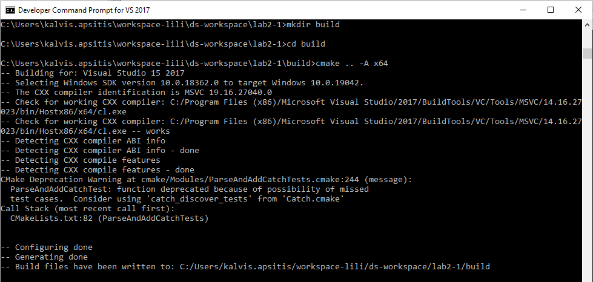
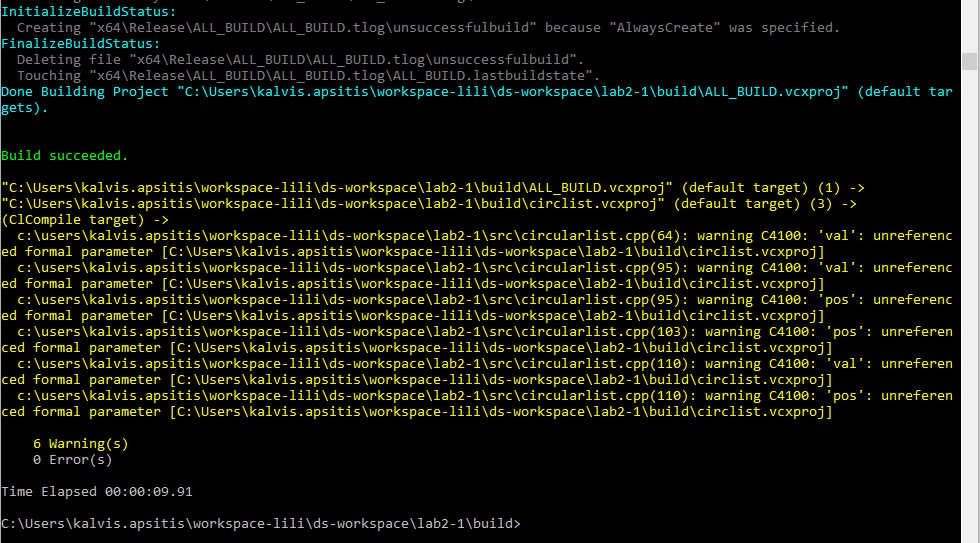
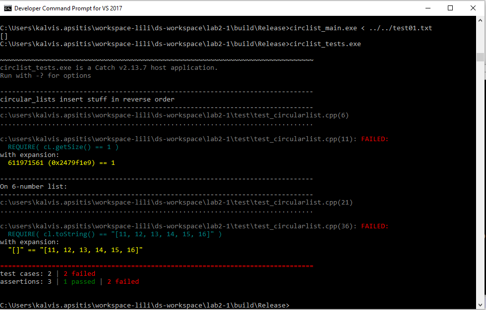
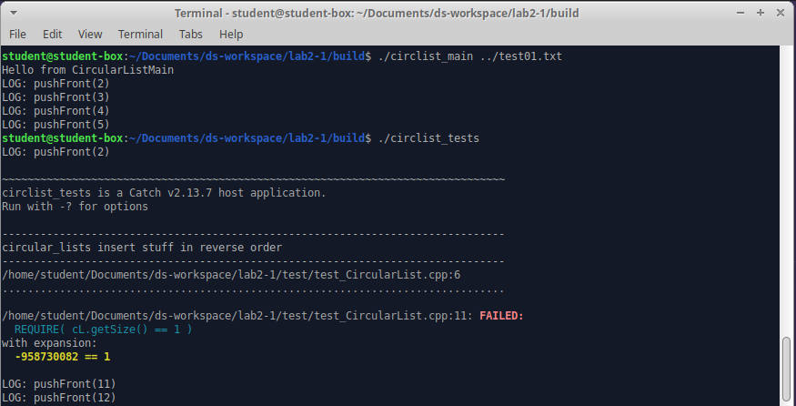

Walk-Through: Test-Driven Development and Catch2
====================================================

In this walk-through we have a class definition using an UML diagram
and requirements for its methods. We create method stubs and testcases 
using the Catch2 framework. After that the methods are completed to satisfy 
the testcases. We also use CMake to compile the project on Windows as well as Linux.

Objective
---------

UML diagrams are a common way to represent class design graphically. 
To ensure an orderly object-oriented coding we can stick to the design closely and
do testcases before the code itself is written. This approach is named 
test-driven development; it uses the encapsulation of objects in object-oriented 
programming.

Overview of Steps
^^^^^^^^^^^^^^^^^

**Step 1** 
  Convert a UML diagram into method stubs: Use the given UML diagram in order to create class prototype with 
  method stubs. 
  
**Step 2**
  Use Catch2 as a unit testing framework: Code testcases with requirements on behavior of class objects.
  
**Step 3**
  Use CMake on Windows: Run CMake and build 2 executables -- the main executable and the unit test executable.

**Step 4**
  Use CMake on Linux: Run CMake and build the same 2 executables.

.. **Step 3**  
..   Use Catch2 to test exception behavior: Test user-defined exceptions and behaviors intended to cause them. 
..   
.. **Step 4**
..   Use Catch2 to do initialization steps shared by multiple testcases.
..   
.. **Step 5** 
..   Run testing reports: Inspect reports as plaintext or HTML files.
..   
.. **Step 6**
..   Run time-limited system test (kill the process after 1 second or similar). 
  

Steps in Detail
----------------

You can read Steps 1 and 2 (information on how to set up the file structure for Lab 2-1).

To demonstrate how the build process works, you can clone (or just refresh with ``pull``) 
the GitHub project `<https://github.com/kapsitis/ds-workspace.git>`_ and 
start from Step 3. 

Step 1: Convert a UML Diagram into Method Stubs
^^^^^^^^^^^^^^^^^^^^^^^^^^^^^^^^^^^^^^^^^^^^^^^

Read an existing UML diagram (such as Lab2-1 description). 
Create three files: 

1. ``ds-workspace-yourname\lab2-1\src\CircularList.h``
2. ``ds-workspace-yourname\lab2-1\src\CircularList.cpp``
3. ``ds-workspace-yourname\lab2-1\src\CircularListMain.cpp``

The header file only contains declarations of two classes ``CLNode`` and ``CircularList``. 
Both of them would need to be in their namespace ``ds_course`` (just to avoid clashing with another
``CircularList`` of the same name implemented elsewhere). 

.. code-block cpp 

  #ifndef DS_CIRCULARLIST_H
  #define DS_CIRCULARLIST_H

  #include <string>

  namespace ds_course {

    class CLNode {
      private:
        int info;
        CLNode *prev;
        CLNode *next;
      // Now "friend" class CircularList can access private members of CLNode
      friend class CircularList;
    };

    class CircularList {
      private:
        CLNode* tail_;
        int size;
      public:
        // List all the public methods of CircularList
	};
	
Fill in all the constructors and functions from the UML class diagram (Page 2, Lab2-1 description). 
If the method is preceded by "+" sign, it should be public. 
Please note that ``CLNode`` declares ``CircularList`` as a "friend" (because ``CircularList`` needs
to be able to write ``info``, ``prev``, ``next`` fields. 

Step 2: Use Catch2 as a unit testing framework: 
^^^^^^^^^^^^^^^^^^^^^^^^^^^^^^^^^^^^^^^^^^^^^^^^

Catch2 is a unit testing framework (to automate testing the behavior of 
your classes and methods). 
Visit Catch2 project's homepage `<https://github.com/catchorg/Catch2>`_. 
You need to have the following four files for testing: 

1. ``test\catch.hpp`` -- can be downloaded as the most recent `Catch2 <https://github.com/catchorg/Catch2>`_ release.
2. ``test\main.cpp`` -- a tiny file which serves as the entry point for unit testing. 
3. ``test\test_CircularList.cpp`` -- testcases for the class ``CircularList`` (provided by instructor, 
   see `test\test_circularList.cpp <https://github.com/kapsitis/ds-workspace/blob/main/lab2-1/test/test_CircularList.cpp>`_.
4. ``cmake\Modules\ParseAndAddCatchTests.cmake`` -- can be downloaded from `Catch2 <https://github.com/catchorg/Catch2>`_
   (under subdirectory ``extras``).

Step 3: Use CMake on Windows
^^^^^^^^^^^^^^^^^^^^^^^^^^^^^

Clone `<https://github.com/kapsitis/ds-workspace.git>`_ from GitHub
(or do Steps 1 and 2 above to create your own files.)

.. code-block:: text

  # Change to lab2-1 directory
  cd "c:\Users\Username\ds-workspace\lab2-1"
  
  # Create an empty "build" subdirectory (to hold compilation results)
  mkdir build
  
  # Go to that empty directory
  cd build
  
  # Create build scripts specific for the x64 architecture:
  cmake .. -A x64
  
  # Compile and link both executables:
  cmake --build . --config Release
  

   
   

   

This builds two projects at the same time: 

* ``build\Release\circlist_main.exe`` (or ``circlist_main`` on Linux). This is used to read plaintext
  files and write to output. 
* ``build\Release\circlist_tests.exe``. This is used to run Catch2 testcases.

You can run both of them from the Windows terminal: 

.. code-block:: text
  
  cd Release
  circlist_main.exe < ../../test01.txt

  circlist_tests.exe
  

Step 4: Use CMake on Linux
^^^^^^^^^^^^^^^^^^^^^^^^^^^

Install ``cmake`` tool: 

.. code-block:: text

  sudo apt-get install cmake
  

Clone `<https://github.com/kapsitis/ds-workspace.git>`_ from GitHub

Run the following commands: 

.. code-block:: text

  cd ~\Documents\ds-workspace\lab2-1
  mkdir build
  cd build
  cmake -G "Unix Makefiles" -DCMAKE_BUILD_TYPE=Debug ..
  cmake --build . --config Release

Run both executables ``circlist-main`` and ``circlist-tests``:

.. code-block:: text

  ./circlist_main < ../test01.txt
  ./circlist_tests

You should see messages like this:

Currently ``circlist_main`` is only printing a greeting (plus redundant 
log messages). And ``circlist_tests`` is failing all the tests. 
This is expected: Both executables built successfully, but the
unit testing failed, since nothing meaningful has been implemented and the 
actual outputs from the class ``CircularList`` methods do not match the expected results.

