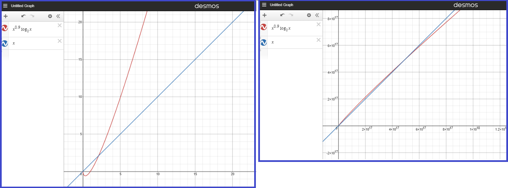

Worksheet Week 01: Asymptotic Bounds
======================================

Introduction
--------------

Goals of this Course
^^^^^^^^^^^^^^^^^^^^^^

**Goal:**  
  The focus of this course is efficiency -- creating algorithms that can work on
  large input data and handle complex structures sufficiently fast.

**Why use Big-O Notation?** 
  It is convenient to measure speed of algorithms -- for example, to find the best algorithms for 
  a given problem. Or to find out which problems are easy (have fast algorithms) and which ones are hard 
  (have only slow or unfeasible algorithms). 
  
  * Measuring the speed should not depend on the speed of the computing hardware -- do not care about constant factors. 
  * Measuring the speed should not depend on how fast it works on very short inputs. (One can "cheat" for short inputs -- 
    just remember a large lookup table containing values for inputs of length :math:`n < n_0` with precomputed correct answers.
    Clearly, this does not tell us anything about the performance of this algorithm for arbitrary inputs.)
  * Measuring the speed should be conceptually easy, it should not take into account insignificant optimizations or count too many extra factors. 
    
**Example:** 
  Energy needed to lift a stone of mass :math:`m` to the height :math:`h` is :math:`mgh`. (Is this 
  the best-case estimate? The worst-case estimate? The exact value?)

Other topics are also sometimes mentioned, but they are not the 
main goal: 

* Various features of C++ or other programming languages. 
* Practical aspects of running data structures with C++ libraries 
  such as STL or Boost, other built-in data structures or 
  large database systems. 
* Object Oriented Programming and design, creating UML diagrams and Design patterns
  to solve problems. 
* Software engineering process to ensure the quality and the testability of 
  the software. 
* Building and Debugging your code efficiently. 

How to Determine Algorithm Efficiency?
----------------------------------------

**Example:**
  In order to multiply two :math:`n \times n` matrices using the "school algorithm", we spend :math:`n` multiplications 
  and :math:`n-1` additions to calculate one entry in the result matrix. For example: 

  .. math::

    c_{ij} = a_{i1} \cdot b_{1j} + a_{i2} \cdot b_{12} + \ldots + a_{in} \cdot b_{nj}  = \sum_{k=1}^{n}  {ik} \cdot b_{kj}.

  That is :math:`O(n)` time. To complete the calculation for the entire matrix :math:`C = A\cdot B` we 
  should compute :math:`n^2` such entries (for each pair :math:`i,j \in \{ 1, \ldots, n`). 
  So the total running time for matrix multiplication is :math:`O(n^3)`. 

**Note 1:**
  In strong accordance to the definition of the runtime, we should take into account that the lengh of input 
  for a matrix muliplication task is :math:`2n^2` -- you need to input two matrices of size :math:`n \times n`. 
  If we denote this input length by :math:`m = 2n^2`, then the running time becomes
  :math:`O(n^3) = O(m^{1.5}) = O(m \sqrt{m})`, so it no longer looks as terrible. 
  In theory books people still express the running time for matrix multiplication in terms of 
  matrix size (not the square of the matrix size) -- just because it is a more convenient parameter. 

**Note 2:** 
  There exist faster algorithms than the "school algorithm". For example,
  `Strassen algorithm <https://en.wikipedia.org/wiki/Strassen_algorithm>`_. 
  It has runtime :math:`O(n^{\log_2 7}) \approx O(n^{2.807})` where :math:`n` is the size of the matrices being multiplied. 
  The exponent :math:`\log_2 7` is smaller/better than :math:`\log_2 8 = 3`. 
  To see actual performance gains (where Strassen algorithm is faster than the "school algorithm"), 
  the matrices should be huge -- the size of matrix :math:`n` is multiple thousand. 

  In 2022 the fastest bound for matrix multiplication was discovered. It is :math:`O(n^{2.37188})`; 
  see `Matrix Multiplication Algorithm <https://en.wikipedia.org/wiki/Matrix_multiplication_algorithm>`_.

**Note 3:** 
  Matrix multiplication is of large practical importance (computer graphics, neural networks, etc). 
  The theory of Big-O notation disregards constant factors -- runtime of  :math:`T(n) = n^3` or 
  :math:`T(n) = 1000n^3` or :math:`T(n) = 0.001n^3` is considered to be of the same "cubic complexity". 
  But in practice it is common to use 
  GPU (massive parallel computations) to multiply matrices. Parallelism can  
  only speed up an algorithm by a constant factor, but sometimes even constant factors matter.

All these concepts (Big-O, Big-Omega, Big-Theta) are related to calculus (real analysis); it is functional behavior as :math:`n \rightarrow \infty`.
Predicting the speed of an algorithm for short input lengths :math:`n`, the dependence on :math:`n` is typically
quite complex (and we cannot ignore "lower order"  terms). As :math:`n` becomes very large,
only the "dominant parts" in the expression :math:`f(n)` matter.

Recursion 
---------------

Structural Recursion 
^^^^^^^^^^^^^^^^^^^^^^^^^^

Recursion in mathematics is not necessarily adding :math:`1` to a parameter :math:`n`. 
It is possible to define valid mathematical expressions recursively using a grammar: 

* Any number is a mathematical expression, 
* Any variable :math:`x,y,\ldots` is a mathematical expression, 
* If :math:`E` is a mathematical expression, then :math:`(E)` is also a mathematical expression, 
* If :math:`E_1` and :math:`E_2` are mathematical expressions, then also :math:`E_1 + E_2`, 
  :math:`E_1 - E_2`, :math:`E_1 \cdot E_2`, and :math:`E_1 / E_2` are mathematical expressions. 

To compute mathematical expressions, one can proceed recursively: Find which is the "outermost"
production to make the expression; break it down to one of the above cases, evaluate the subexpressions 
and finally compute the answer. 

Even fancier recursive expressions (language statements) can be obtained defining programming languages 
with `Context-free grammars <https://en.wikipedia.org/wiki/Context-free_grammar>`_.
*Parsers* are responsible for breaking down such recursively built expressions (or 
programming language constructs) and converting them to some representation that can be executed. 

Run-time stack
^^^^^^^^^^^^^^^^

Every time one function calls another (in most imperative languages -- both compiled or interpreted), 
a new activation record is created and pushed to the *run-time stack*. It consists of the following elements: 

**Activation Record:** 

  * Parameters and local variables (everything passed to the function call or defined therein), 
  * Dynamic link (a pointer to the activation record of the caller), 
  * Access link (used by the function to access non-local data), 
  * Return value (will contain the value needed by the caller). 

Activation records are quite large data structures, but programmer does not need to create them -- 
they are maintained automatically as the functions call each other. 

If a function is defined recursively, the run-time stack can contain multiple activation records of the
same function (but with different parameters). 

Situations when run-time stacks should be avoided?
^^^^^^^^^^^^^^^^^^^^^^^^^^^^^^^^^^^^^^^^^^^^^^^^^^^^

Sometimes user can choose to implement recursion without explicit function calls (user-defined data structures). 
Here are some downsides to the run-time stacks:

**Stack Overflow:** 
  The runtime stack has a limited amount of space, and if the recursion goes too deep, it can result in a stack overflow error. 
  Explicit stack can be more efficient, as you can control the size of the stack and avoid the overflow error.

**Performance:** 
  When using the runtime stack, there is overhead involved in pushing and popping function calls, as well as managing the stack pointers. 
  For a large number of recursive calls, this overhead can be significant.

**Memory:** 
  The runtime stack is typically stored in the memory with limited access time, so accessing it can be slow. 
  In contrast, an explicit stack can be implemented as an array or a linked list, which can be stored in the heap with better access time.

**Debugging:** 
  When using the runtime stack, it can be difficult to debug the recursive algorithm, as you have limited visibility into the stack. 

Lindenmayer Systems
^^^^^^^^^^^^^^^^^^^^^^

Define Koch snowflake or Hanoi tower in terms of Lindenmayer systems. 

Backtracking
----------------

**N-Queens Problem:** 
  The task is to place :math:`N`` queens on an :math:`N \times N` chessboard such that no two queens threaten each other. 
  This is the best known example of backtracking; you can place queens one by one and backtrack if a placement 
  causes a conflict. 

  *Input:* Parameter :math:`N`; *Output:* Any chess-board of size :math:`N \times N` with all :math:`N` queens placed.
  (In fact, N-Queens is solvable for all :math:`N \geq 4`, and for any such :math:`N` 
  some solutions are easy to get without any backtracking.)

  **Related decision Problem:** 
    Completion problem is a variant, in which some queens are already placed
    and the solver is asked, if it is possible to place the rest (the output of the decision problems is Yes/No). 
    This problem is NP-complete.
    See `I.P.Gent Complexity of n-Queens Completion. <https://www.ijcai.org/proceedings/2018/0794.pdf>`_.

**The Traveling salesman problem (TSP):**
  There exists a connected graph of cities, some cities are connected with roads of known lengths. 
  It asks for the shortest possible "tour" that visits every city from a given set of cities
  exactly once and returns to the origin city.
  For small input sizes, TSP can be solved using a brute-force backtracking, 
  where all possible paths are generated and their lengths are compared to find the shortest one.

  **Input:** The input graph :math:`G(V,E)`
  
  **Related decision problem:** 
    Given the length, find, if there exists a route less or equal than the given length. 
    This problem is NP-complete.

**The Subset Sum Problem:** 
  It asks if a given set of numbers can be divided into two subsets such that the sum of numbers in one subset is 
  equal to a given target. This problem can be solved using backtracking by generating all possible subsets and 
  checking if any of them have the desired sum.

**Sudoku Solver:** 
  The task is to fill in a :math:`9 \times 9`` grid with digits so that each column, each row, and each of the nine 
  :math:`3 \times 3` sub-grids contains all of the digits from :math:`1`` to :math:`9`. 
  Backtracking can be used to solve this problem by trying each possible digit in a cell and backtracking 
  if it leads to an invalid solution.

  *Input:* Partially filled in array of size :math:`9 \times 9`; *Output:* Completed array of size :math:`9 \times 9`. 
  (It is often assumed that the input array is such that there exists exactly one solution. For backtracking it does not matter -- 
  it is possible to find any feasible solution, or all feasible solutions, or find out that there is no solution.)

**Generating Permutations:** 
  The task is to generate all possible permutations of a given set of elements. 
  Backtracking can be used to generate permutations by fixing elements one by one and swapping them to generate new permutations.

**Maze Generation:** 
  The task is to generate a random maze using backtracking. In this problem, you can start at a random cell 
  and move to unvisited cells, marking them as visited, until you have visited all cells. 
  If you reach a dead end, you backtrack to the previous cell.

**Cryptarithmetic Puzzles:** 
  The task is to solve puzzles where a mathematical expression is written using words and each letter represents 
  a unique digit. Backtracking can be used to solve these puzzles by trying different values for each letter 
  and backtracking if a solution leads to a conflict.

Backtracking algorithms are not hard to implement -- they do not do much more besides an exhaustive search 
in a large tree representing the space of potential solutions (potentially very inefficient). 
Nevertheless, it is desirable to 

Solving Asymptotic Bounds Exercises
-------------------------------------

In C++ the computer program is easy to imagine being run on real hardware (measure the runtime with 
the calls to system time). For Python or pseudocode it is more complicated.
For example, package `numpy` offers different integers (4 byte long) compared to Python's default 
integer numbers (unlimited size). All this can get complicated. 

Model of computation
^^^^^^^^^^^^^^^^^^^^^^^

We often cannot list all the assumptions regarding the runtime, 
therefore we can state, how Python code can be analyzed: 

* Start with the Word-RAM model. Machine word: block of :math:`w` bits. 
* Operations can be performed in :math:`O(1)` time -- operations on words: 
  Integer arithmetic: (``+``, ``-``, ``*``, ``//``, ``%``), logical operators, bitwise arithmetic, input/output.
* Memory address must be able to access every place in memory
  32-bit words can address 4 GiB memory, 64-bit words can address :math:`16` exabytes of memory. 
  (One exabyte is :math:`10^{18}` or one quintillion bytes.)

C++, Python and other languages commonly use external calls (if we know the complexity of some library call such as "sort", we can apply it).
There are some predefined data structures in Python (and STL data structures in C++): 

* Arrays, Lists, Sets, Dictionaries are used to store non-constant data. Each data structure 
  supports a set of operations. A collection of operations is called an *interface* (for well-known data structures 
  also ADT - *Abstract Data Type*). 
* Example data structure: Static Array -- fixed width slots, fixed length of the array itself. 
  Its functions supported in pseudocode:

  * :math:`A = \text{\sc Array}(n)`: allocate static array of size :math:`n` in :math:`\Theta(n)` time
  * :math:`\text{\sc Array}.get(i)`: return word stored at array index :math:`i`` in :math:`\Theta(1)` time
  * :math:`\text{\sc Array}.set(i,x)`: write value :math:`x` to array index :math:`i` in :math:`\Theta(1)` time

  In many languages it is common to write "get" and "set" commmands with array notation :math:`A[i]`.

* Example data structure: List -- same as above, but no longer fixed length. 
  If it is implemented as a physical array, the operation times do not change. 
  But occasionally need to reallocate memory, if the number of elements exceeds the size of the current array. 

Looking Up an Item in a List
^^^^^^^^^^^^^^^^^^^^^^^^^^^^^^

**Problem:**
  There is a dictionary (the traditional printed book variety) with :math:`50\,000` words written in the
  English alphabet (26 letters; assume that all of them are lowercase).
  The words in the dictionary are sorted alphabetically.
  The task is to find a given word :math:`w` (such as :math:`w = \mathtt{efficiency}`) in this
  dictionary or to report that there is no such word.

.. note::
  There is also a data structure named *dictionary* (storing keys and values);
  here we use the everyday notion of a dictionary -- an alphabetically arranged
  list of words.

**Linear (Brute Force) Solution:**

Let us have a zero-based dictionary :math:`D` with :math:`n` items
from :math:`D[0]` to :math:`D[n-1]`.

| :math:`\text{\sc LinearSearch}(D,w)`
| 1. :math:`\;\;\;\;\;` **for** :math:`i` **in** :math:`\text{\sc range}(0,n)`:
| 2. :math:`\;\;\;\;\;\;\;\;\;\;` **if** :math:`w` ``==`` :math:`D[i]`:
| 3. :math:`\;\;\;\;\;\;\;\;\;\;\;\;\;\;\;` **return** :math:`\text{\sc found}` :math:`w` at location :math:`i`
| 4. :math:`\;\;\;\;\;` **return** :math:`\text{\sc not found}`

This method in the real life would mean somebody scanning through all the words in a dictionary
and searching for the match with the given word :math:`w`.
This would be very inefficient. The only advantage for this approach -- we do not need any assumptions
about the word order in the dictionary -- the algorithm would work equally well even for
totally unordered list of words.

Finding a Peak in a Numeric Sequence
^^^^^^^^^^^^^^^^^^^^^^^^^^^^^^^^^^^^^^

**Definition:**
  Given a sequence :math:`a_i` (:math:`i = 0,\ldots,n-1`) we call its element :math:`a_i` a *peak*
  iff it is a local maximum (not smaller than any of its neighbors):

  .. math::

    a_i \geq a_{i-1}\;\;\text{\bf and}\;\; a_i \geq a_{i+1}

  In case if :math:`i=0` or :math:`i = n-1`, one of these neighbors does not exist; and in such cases we
  only compare :math:`a_i` with neighbors that do exist.

**Brute Force Algorithm:**

.. image:: figs-asymptotic-bounds/brute-force-peak.png
   :width: 4in

.. note::
  Observe that in every nonempty numeric sequence :math:`a_i` there exist at least one peak (for example,
  the global maximum is always a peak). On the other hand, peaks are not necessarily unique.
  In particular, if the sequence is constant (all members are equal), then any member there is a peak.

Big-O-Notation
^^^^^^^^^^^^^^^

**Definition:**
  Let :math:g \colon \mathbb{N} \rightarrow \mathbb{R}_{0+}` be a function from natural numbers (non-negative integers)
  to non-negative real numbers.
  Then :math:`O(g)` is the set of all functions :math:`f \colon \mathbb{N} \rightarrow \mathbb{R}`
  such that there exist real constants :math:`c>0` and :math:`n_0 \in \mathbb{N}` such that

  .. math::

    \forall n \in \mathbb{N}\ \big( n \geq n_0 \rightarrow | f(n) | \leq c \cdot g(n) \big).

**Examples:**
  Show using the above definition of :math:`O(g)` the following facts:

  **(A)**
    :math:`f(n) = 13n + 7` is in :math:`O(n)`. (Formally, :math:`f \in O(g)`, where :math:`g(n) = n`.)

  **(B)**
    :math:`f(n) = 3n^2 - 100n + 6` is in :math:`O(n^2)`.

  **(C)**
    :math:`f(n) = 3n^2 - 100n + 6` is in :math:`O(n^3)`.

  **(D)**
    :math:`f(n) = 3n^2 - 100n + 6` is **not** in :math:`O(n)`.

For every example (every pair of functions :math:`g(n)` and :math:`f(n)`)
either find :math:`c>0` and :math:`n_0 \in \mathbb{N}` such that the definition is satisfied,
or demonstrate that such :math:`c>0` and :math:`n_0` cannot exist.

Here are the definitions of three asymptotic concepts.

**Definition:**
  Let :math:`g \colon \mathbb{N} \rightarrow \mathbb{R}_{0+}` be a function from natural numbers (non-negative integers)
  to non-negative real numbers.
  Then :math:`O(g)` is the set of all functions :math:`f \colon \mathbb{N} \rightarrow \mathbb{R}`
  such that there exist real constants :math:`c>0` and :math:`n_0 \in \mathbb{N}` satisfying
  :math:`{\displaystyle \forall n \in \mathbb{N}\ \big( n \geq n_0 \rightarrow | f(n) | \leq c \cdot g(n) \big).}`

**Definition:**
  Let :math:`g \colon \mathbb{N} \rightarrow \mathbb{R}_{0+}` be a function.
  Then :math:`\Omega(g)` is the set of all functions :math:`f \colon \mathbb{N} \rightarrow \mathbb{R}`
  such that there exist real constants :math:`c>0` and :math:`n_0 \in \mathbb{N}` satisfying
  :math:`{\displaystyle  \forall n \in \mathbb{N}\ \big( n \geq n_0 \rightarrow | f(n) | \geq c \cdot g(n) \big).}`

**Definition:**
  Define :math:`\Theta(g)` to be the intersection of :math:`O(g)` and :math:`\Omega(g)`.

  Formally, let :math:`g \colon \mathbb{N} \rightarrow \mathbb{R}_{0+}` be a function.
  Then :math:`\Theta(g)` is the set of all functions :math:`f: \mathbb{N} \to \mathbb{R}`
  such that there exist real constants :math:`c_1, c_2 > 0` and :math:`n_0 \in \mathbb{N}` satisfying

  .. math::

    \forall n \in \mathbb{N}\ \big( n \geq n_0 \rightarrow   c_1 \cdot g(n) \leq  | f(n) | \leq c_2 \cdot g(n) \big).

In spoken language we often use descriptive concepts:

* If :math:`f \in O(g)`, then :math:`g(n)` is called *asymptotic upper bound* of :math:`f(n)`.
* If :math:`f \in \Omega(g)`, then :math:`g(n)` is called *asymptotic lower bound* of :math:`f(n)`.
* If :math:`f \in \Theta(g)`, then :math:`g(n)` is called *asymptotic growth order* of :math:`f(n)`.

**Definition:**
  The *time complexity* of an algorithm is described by a function :math:`f(n)`,
  if for **any** input of length :math:`n` bytes, the time spent running the algorithm is bound
  from above by :math:`f(n)` (starting from some natural :math:`n_0`).

**Intuition about these definitions:**

1. Why do we need asymptotic behavior (namely, :math:`\forall n \geq n_0`)?
   What about small values :math:`n`?

   Asymptotic behavior ignores :math:`n < n_0` for some :math:`n_0`, since
   algorithmic complexity on short inputs does not matter very much.
   Theoretically, you could even "cheat" -- remember a large lookup table containing
   all sorts of inputs of length :math:`n < n_0` (with precomputed correct answers).
   Clearly, this does not tell us anything about the performance of this algorithm --
   algorithms differ on how they behave on long inputs.

   Another reason is the simplicity of the functional behavior as :math:`n \rightarrow \infty`.
   Even though we would love to predict the
   speed of an algorithm for short input lengths :math:`n`, the dependence on :math:`n` is likely
   quite complex (and we cannot ignore "lower order"  terms). As :math:`n` becomes very large,
   only the "dominant parts" in the expression :math:`f(n)` matter.

2. Why do we allow arbitrary constant :math:`c` in the inequalities like
   :math:`| f(n) | \leq c \cdot g(n)`?

   Trying to measure computation costs with explicit constants would make
   the cost model more complicated -- it would matter how many CPU commands and
   machine-words are involved. Also, the meaning of constants change as soon as
   you obtain a faster computer -- a constant speedup is not hard to achieve.

Properties of Big-O, Big-Omega, Big-Theta
--------------------------------------------

**Big-O and Limit of the Ratio:**
  If the following limit exists and is finite:

  .. math::

    \lim\limits_{n \rightarrow \infty} \frac{f(n)}{g(n)} = C < + \infty,

  then :math:`f(n)` is in :math:`O(g(n))`.

**Big-O is transitive:**
  If :math:`f(n) \in O(g(n))` and :math:`g(n) \in O(h(n))`, then :math:`f(n) \in O(h(n))`.

**Sum of two functions:**
  If :math:`f(n) \in O(h(n))` and :math:`g(n) \in O(h(n))`, then :math:`f(n) + g(n) = O(h(n))`.

**All polynomials:**
  Any :math:`k`-th degree polynomial :math:`P(n) = a_k n^k + a_{k-1} n^{k-1} + \ldots + a_1 n + a_0` is in :math:`O(n^k)`.

**Logarithms of any base:**
  If :math:`a,b > 1` are any real numbers, then :math:`\log_a n = O(log_b n)`. Typically use just one base (usually, it is base :math:`2` or
  base :math:`e` of the natural logarithm, if you prefer that), and write just :math:`O(\log n)` without specifying base at all.

The last result directly follows from the formula to change the base of a logarithm: :math:`{\displaystyle \forall a,b,m > 1 \left( \log_a b = \frac{ \log_m b }{ \log_m a } \right)}`.

Examples with Big-O, Big-Omega, Big-Theta
------------------------------------------

The Complexity of Combined Algorithms
^^^^^^^^^^^^^^^^^^^^^^^^^^^^^^^^^^^^^^^

Once the the complexity of constituent parts of an algorithm is known, these
complexities can be combined to find the time complexity of the overall algorithm.

**Example1:**
  :math:`\text{\sc AlgorithmA(input)}` has time complexity in :math:`O(n^a)`, but :math:`\text{\sc AlgorithmB(input)}`
  has time complexity in :math:`O(n^b)`.
  What is the complexity of :math:`AlgorithmC` that first calls
  :math:`\text{\sc AlgorithmA(input)}`, then calls :math:`\text{\sc AlgorithmB(input)}`,
  and finally somehow combines the results in :math:`O(1)` time.

  | :math:`\text{\sc AlgorithmC}(\text{\em input})`
  | :math:`\;\;\;\;\;` :math:`\text{\em resultA} = \text{\sc AlgorithmA}(\text{\em input})`
  | :math:`\;\;\;\;\;` :math:`\text{\em resultB} = \text{\sc AlgorithmB}(\text{\em input})`
  | :math:`\;\;\;\;\;` **return** :math:`\text{\sc combine}(\text{\em resultA},\text{\em resultB})`

**Example2:**
  :math:`\text{\sc AlgorithmA(input)}` has time complexity in :math:`O(n^a)`, but :math:`\text{\sc AlgorithmB(input)}`
  has time complexity in :math:`O(n^b)`.
  What is the complexity of :math:`AlgorithmD` that first calls
  :math:`\text{\sc AlgorithmA(input)}`, then calls :math:`\text{\sc AlgorithmB(input)}` in a long loop :math:`n` times
  and returns the Boolean conjunction of all the results.

  | :math:`\text{\sc AlgorithmD}(\text{\em input})`
  | :math:`\;\;\;\;\;` *result* = :math:`\text{\sc AlgorithmA}(\text{\em input})`
  | :math:`\;\;\;\;\;` **for** :math:`i` **from** :math:`1` **to** :math:`n`:
  | :math:`\;\;\;\;\;\;\;\;\;\;` *result* = :math:`\text{\em result} \wedge \text{\sc AlgorithmB}(\text{\em input})`
  | :math:`\;\;\;\;\;` **return** *result*

**Example3:**
  Define a function :math:`f \colon \mathbb{N} \rightarrow \mathbb{R}_{0+}` which infinitely often takes
  both values :math:`n^2` and also :math:`n^3`.

**Solution:**
  One could define a function with a condition (:math:`n^2` for even :math:`n` and :math:`n^3` for odd :math:`n`):

  .. math::
    f(n) = \left\{ \begin{array}{l}
    n^3,\;\;\mbox{if $n$ is even}\\
    n^2,\;\;\mbox{if $n$ is odd}\\
    \end{array} \right.

  This function with two branches is defined just for natural numbers :math:`n \in \mathbb{N}`
  (which is enough for Big-O notation concept).
  If you wish, this function can also be defined for all real numbers :math:`x \in \mathbb{R}`:
  :math:`{\displaystyle f(x) = x^2 + \frac{1}{2} \left(1 + cos(\pi x) \right)\left( x^3 - x^2 \right)}`.

  .. image:: figs-asymptotic-bounds/cosine-function.png
   :width: 3in

.. note::
  This example shows a function :math:`f` which is in :math:`O(n^3)` and also in :math:`\Omega(n^2)`, but
  it does not belong to any :math:`\Theta(g)` for some simple function :math:`g` (except
  to its own class :math:`f \in \Theta(f)`).
  One could come up with an algorithmic task which is considerably faster for odd-length inputs.
  And also vice versa: Some algorithmic task may be   faster for even-length inputs.
  Hence, there is no total order among the asymptotic growth rates -- sometimes asymptotic
  growth rates are incomparable.

Slowly growing functions
^^^^^^^^^^^^^^^^^^^^^^^^^^^^^

**Example4:**
  Show that :math:`f(n) = 0` is not in :math:`\Omega(1)`.

**Solution:**
  Apply the definition of :math:`f \in \Omega(g)`, where :math:`f(n) = 0`, but
  :math:`g(n) = 1`. The required inequality :math:`| f(n) | \geq c \cdot g(n)`
  which is, in fact, :math:`0 \geq c \cdot 1` is never true, if :math:`c > 0`.

Let us have a less trivial example -- a strictly positive function which does not have :math:`g(n) = 1`
as its asymptotic lower bound. In fact, any infinite sequence having a subsequence converging to :math:`0`
is fine.

**Example5:**
  Show that :math:`f(n) = \frac{1}{n}` is not in :math:`\Omega(1)`.

**Solution:**
  Let us pick some :math:`c > 0` and some :math:`n_0` first.
  We have to show that there must exist a number :math:`n > n_0` that violates the inequality
  from the definition of :math:`f \in O(g)`.

  Let us pick :math:`n` such that :math:`n > n_0` and :math:`n > 1/c`. Then
  :math:`|f(n)| = 1/n < c \cdot 1`, which means that
  the required inequality :math:`|f(n)| = 1/n \geq c \cdot 1` does not hold.

**Example6:**
  Use the Big-O definition to show that :math:`f(n) = 3^n` is not in :math:`O(e^n)`.

**Hint for Example3:**
  Let us use the formal definition of Big-O notation, and show that its negation is true.

.. image:: figs-asymptotic-bounds/exponent-example.png
   :width: 4in

We see that picking sufficiently large :math:`n` makes the inequality from the
Big-O definition false. Meanwhile :math:`e^n \in O(3^n)`, since :math:`3^n` is
always larger; so one can pick :math:`n_0 = 0` and :math:`c = 1`.

.. note::
  We observe that :math:`f(n) = e^n` is in :math:`O(3^n)`, but :math:`3^n` is not in
  :math:`O(e^n)`.
  Unlike logarithms (which only differ by a constant factor -- and are all in the Big-O relation
  with each other), any two different bases for exponent functions
  (such as :math:`e \approx 2.71` and :math:`3`) create different asymptotic
  growth rates.

**Example7:**
  If a function :math:`f(n) = C` is constant, then it is :math:`O(1)`.
  Is the converse also true -- does the statement :math:`f \in O(1)`
  imply that :math:`f` is a constant function.

**Hint for Example4:**
  Can define function by cases so that it is *bounded* (see `<https://bit.ly/3Bdv1aR>`_),
  but not equal to the (same) constant.

**Solution:**
  The function that is not constant, but still in :math:`O(1)` is shown in the image below.

  .. image:: figs-asymptotic-bounds/example4-function.png
     :width: 2.5in

**Example8:**
  Define functions :math:`g(n) = n` and :math:`h(n) = n^{0.9} \cdot \log_2 n`
  Just as in the above example we can show that the limit :math:`h(n)/g(n) = 0`
  as :math:`n \rightarrow \infty`.

  Draw graphs of the functions :math:`f_1(x) = x` and :math:`f_2(x) = x^{0.9} \cdot \log_2 x` and
  observe, for what values :math:`n` :math:`f_2(n)`

  This example shows that establishing the Big-O properties using
  a graphing calculator could be difficult and misleading -- sometimes
  the asymptotic behavior becomes evident only for huge values of :math:`n_0`.

Fast Growing Functions and Slow Algorithms
^^^^^^^^^^^^^^^^^^^^^^^^^^^^^^^^^^^^^^^^^^^^^

**Definition:**
  Binomial coefficients show in how many ways an unordered selection of :math:`k`
  elements out of :math:`n` elements can be made:

  .. math::

    {n \choose k} = \frac{n!}{(n-k)!k!}.

Certain algorithms rely on trying out all possible combinations
of some data. In such cases the amount of work
may grow exponentially in terms of the input length :math:`n`.
One such problem is *Traveling Salesman* -- currently there is no
known efficient algorithm for this problem.

Among the many functions that grow very fast (and are time complexities
of algorithms that are very slow) some are much faster than the others.
In particular, if :math:`\lim_{n \rightarrow \infty} \frac{f(n)}{g(n)} = 0` then
function :math:`g(n)` grows much faster than :math:`f(n)`
and :math:`f \in O(g)`, but :math:`g \not\in O(f)`

**Example9:**
  Order these functions in increasing order with respect to their Big-O growth rate:

  * :math:`f_1(n) = 2^{2^{10000}}`
  * :math:`f_2(n) = 2^{10000n}`
  * :math:`f_3(n) = \binom{n}{2} = C_n^2`
  * :math:`f_4(n) = \binom{n}{\lfloor n/2 \rfloor}`
  * :math:`f_5(n) = \binom{n}{n-2}`
  * :math:`f_6(n) = n!`
  * :math:`f_7(n) = n\sqrt{n}`

**Solution:**
  Eliminate a few functions which do not exceed polynomials
  (polynomial-time algorithms are not considered exceptionally slow).
  :math:`f_1` is just :math:`O(1)`, :math:`f_7` is in :math:`O(n^{1.5})`,
  but functions :math:`f_3(n) = f_5(n) = \frac{n(n-1)}{2}` which is in :math:`O(n^2)`.

  It remains to order the remaining functions (all of them grow fast - they are exponential in
  terms of :math:`n`).
  We will prove that their order is the following: :math:`f_4, f_2, f_6` -- see the two following examples.

**Lemma:**
  We have the following estimate:

  .. math::

    \binom{n}{\lfloor n/2 \rfloor} \sim \frac{4^n}{\sqrt{\pi n}}

  To prove this, apply Stirling's formula: :math:`{\displaystyle n! \sim \sqrt{2 \pi n}\left(\frac{n}{e}\right)^n}`.

.. note::
  Very similar expression describes Catalan numbers. The :math:`n`-th Catalan number
  is defined by the following equality:
  :math:`{\displaystyle C_n = \frac{1}{n+1}{2n\choose n}}`. They arise in various combinatorial problems.
  See `<https://bit.ly/3stVNIk>`_ for details.
  (For example, some computer algorithm that would process every valid way how to parenthesize an expression
  consisting of :math:`n` terms will require :math:`C_n` steps.)

**Example10:**
  Show that :math:`{\displaystyle f_4(n) = \binom{n}{\lfloor n/2 \rfloor}}` is in :math:`O(f_2)` where
  :math:`{\displaystyle f_2(n) = 2^{10000n}}`.

**Solution:**
  From the Lemma we immediately see that :math:`f_4(n)`
  is in :math:`O(n^4)`. And in turn :math:`n^4` is in :math:`O(2^{10000n})`.
  Note that :math:`2^{10000n} = (2^{10000})^n` -- it is also an exponential function,
  but the exponent base :math:`2^{10000}` is larger than :math:`4`.

**Lemma:**
  Let :math:`g(n) = n!` and :math:`f(n) = a^n` for some constant :math:`a`.
  Then :math:`f \in O(n!)` and also :math:`\lim_{n \rightarrow \infty} \frac{a^n}{n!} = 0`.
  In other words, factorial grows faster than any exponential function.

**Proof:**
  Define the constant :math:`N = 2a`. Denote :math:`\frac{a^N}{N!} = C`.
  Initially set :math:`n = N`.
  Every time you increment :math:`n`, the numerator increases exactly :math:`a` times,
  but denominator increases at least :math:`N = 2a` times.
  Therefore every time you increment :math:`n` to :math:`n+1` the fraction will decrease at least twice.
  The only number that can be a limit of such a sequence is :math:`0`.

**Example11:**
  Show that :math:`{\displaystyle f_2(n) = 2^{10000n}}` is in :math:`O(f_6)` where
  :math:`{\displaystyle f_6(n) = n!}`.

**Solution:**
  This immediately follows from the previous Lemma, where :math:`a = 2^{10000}`.
  The values of :math:`n` for which :math:`n!` grows faster than :math:`2^{10000n}`
  are very large; they start at :math:`2^{10000}`.

ADTs
------------

Some stuff from Python: 

.. code-block:: python

  L = ["Cacophony", "Imbibe", "Writhe", "Ubiquitous", "Paradox"]
  S = {"Cacophony", "Imbibe", "Writhe", "Ubiquitous", "Paradox"}
  for item in sorted(S):
      print(i)

**Questions**

1. Is a list in Python ordered? (I.e. can we visit its elements in a predictable order?)
   Is a set in Python ordered?
2. Assume that you want to store a large alphabetically sorted dictionary in Python to enable 
   binary search (it has :math:`O(\log n)` runtime).
   Is it a set of words or a list of words?
3. Occasionally we need to insert new words in that Python data structure. Assume that some 
   item is inserted in a wrong order. What will be the consequences for subsequent operations? 

Sorting in place vs. Returning a sorted copy
---------------------------------------------

.. code-block:: python

  elevation = dict()
  elevation[(0,0)] = 3
  elevation[(0,1)] = 4

  other_dict = { [0,0]: 3, [0,1]: 4} 
  # What is "unhashable type"?

  a = [0, 1]
  a.insert(1,a)
  a[1][1][0]
  a[1][1][1]

In Java you can easily create a set :math:`S` of sets :math:`s_0,s_1,\ldots,s_{k-1}` (and then modify one of the :math:`s_i`). 
The larger set :math:`S` behaves in a funny way -- you can still check that the size of :math:`S` equals to :math:`k`, but 
you cannot find the modified (or the original) set :math:`s_i` anymore. If you check, if :math:`s_i \in S`, Java returns false.

Lists -- Redundant, but Convenient ADTs
-------------------------------------------

| # *(Constructor: Create an empty list)*
| :math:`\text{\sc List}<T> L()` 
| # *(Initializer list: Create a list with some elements in it)* 
| :math:`\text{\sc List}<T> L (\{ item1:T, item2:T, \ldots \})`
| # *(Insertion: Inserts an element at a specified position in the list)*
| :math:`L.\text{\sc insert}(\text{index}:int, \text{item}:T)`
| # *(Deletion: Deletes the element at a specified position in the list.)*
| :math:`L.\text{\sc delete}(\text{index}:int)`
| # *(Access the item at a specified position)*
| :math:`L.\text{\sc get}(index:int): T`
| # *(Traversal: Accesses each element in the list List<T> in its order)*
| **for** :math:`\text{item}` **in** :math:`L` { do something with :math:`\text{item}` }
| # *(Search: Finds the position of the first entry of item (>= initialPosition))*
| :math:`L.\text{\sc find}(\text{item}:T): int`
| :math:`L.\text{\sc find}(\text{item}:T, startFrom:int): int`
| # *(Concatenation: Combines two lists into a single list)*
| :math:`L.\text{\sc concatenate}(L1:\text{\sc List}<T>, L2:\text{\sc List}<T>): \text{\sc List}<T>`
| # *(Sorting: Rearranges the list in sorted order)*
| :math:`L.\text{\sc sort}(): void`
| # *(Getting a sorted copy: Return a sorted copy of the list, but do not change the list)*
| :math:`L.\text{\sc sortedCopy}(): \text{\sc List}<T>`
| # *(Slicing: Extract a fragment of the list from startPos (inclusive) to endPos (exclusive))*
| :math:`L.\text{\sc slice}(startPos:int, endPos:int)`
| # *(Size: Returns the number of elements in the list.)*
| :math:`L.\text{\sc size}(): int`

.. subchapter ... 
.. Examples in Python and C++ STD

Mutable lists support insertion, deletion, appending elements, sorting (in place). 
Both mutable and immutable lists support all the other operations. 
From functional programming there are two more operations: 

**Filtering:** 
  Creating a new list that contains only the elements that satisfy a certain condition

**Mapping:** 
  Creating a new list that contains the results of applying a 
  function to each element of the original list.

Sequence ADT
^^^^^^^^^^^^^^

**Container operations:** (initializing sequence)

| # given an iterable X, build sequence from items in iterator X
| :math:`S = \text{\sc build}(X)`
| # return the number of stored items
| :math:`S.\text{\sc size}()`

**Static operations:** (operations not affecting sequence size)

| # return the stored items one-by-one in sequence order
| :math:`S.\text{\sc iterSeq}()``
| # return the ith item
| :math:`S.\text{\sc get}(i)`
| # replace the ith item with x
| :math:`S.\text{\sc set}(i, x)`

**Dynamic operations:** (operations affecting sequence size)

| # add x as the ith item
| :math:`S.\text{\sc insertAt}(i, x)`
| # remove and return the ith item
| :math:`S.\text{\sc deleteAt}(i)`
| # add x as the first item
| :math:`S.\text{\sc insertFirst}(x)`
| # remove and return the first item
| :math:`S.\text{\sc deleteFirst}()`
| # add x as the last item
| :math:`S.\text{\sc insertLast}(x)`
| # remove and return the last item 
| :math:`S.\text{\sc deleteLast}()`

Iterator ADT
^^^^^^^^^^^^^^

In an iterator with :math:`n` items, the cursor typically has :math:`n+1` valid states (it can be 
right before any of the elements, or it can be at the very end). Iterators are convenient 
to write iterative **for** loops or otherwise process items one by one (as in bulk insert operations, 
reading items from an input buffer, etc.). 

| # Traversal: Accesses the next element in the iterator and moves 1 step ahead
| :math:`it.\text{\sc next}()`
| # Checking for more elements: Checks if there are more elements without moving 1 step ahead
| :math:`it.\text{\sc hasNext}()`
| # Removing the current element: Removes the current element from the data structure, point to the next one
| :math:`it.\text{\sc remove}()`
| # Peeking the current element: Returns the current element without moving the iterator 1 step ahead
| :math:`it.\text{\sc peek}()`
| # Rewinding: Resets the iterator to the beginning of the data structure (right before the 1st element)
| :math:`it.\text{\sc rewind}()`
| # Skipping: Skips a specified number of elements in the data structure.
| :math:`it.\text{\sc skip}(n:int)`
| # Filtering: Filters elements in the data structure based on a given predicate.
| :math:`it.\text{\sc filter}(predicate:{item:T => isValid:Boolean})`
| # Mapping: (Lazy) apply of a given function to each element, returns another iterator. 
| :math:`it.\text{\sc map}(\text{\sc mapFunction}:{item:T => value:U})`

.. (Very similar problem on queues exists...)

**Problem 9:**
  Denote :math:`a,b,c` to be the last :math:`3` digits of your Student ID, and compute the following numbers:
  
  * :math:`F = ((a+b+c)\;\operatorname{mod}\;3) + 2`
  * :math:`\mathtt{x1} = (a+b+c)\;\operatorname{mod}\;10`
  * :math:`\mathtt{x2} = ((a+b) \cdot 2)\;\operatorname{mod}\;10`
  * :math:`\mathtt{x3} = ((b+c) \cdot 3)\;\operatorname{mod}\;10`
  * :math:`\mathtt{x4} = ((c+a) \cdot 7)\;\operatorname{mod}\;10`
  

  The queue :math:`Q` is implemented as an array of size :math:`N=6`; its elements
  have indices from :math:`\{0,1,2,3,4,5\}`.
  
  Initially the queue parameters are these:
  
  * :math:`\mathtt{Q.front} = \mathtt{F}`,
  * :math:`\mathtt{Q.length} = 4`,
  * :math:`\mathtt{Q.size} = 6`,
  
  And the content of the array is the following:
  
  .. image:: figs-stacks-queues-heaps/midterm-queue-structure.png
     :width: 2in
      

  Somebody runs the following code on this queue:
  
  .. code-block:: cpp
  
    Q.enqueue(x1)
    Q.enqueue(x2)
    Q.dequeue()
    Q.dequeue()
    // show the state of Q
    Q.enqueue(x3)
    Q.enqueue(x4)
    Q.dequeue()
    // show the state of Q
    

  After Line 4 (and at the very end) show the current state of the queue :math:`\mathtt{Q}`.
  The state should display the content of the array and also the values of
  :math:`\mathtt{Q.front}` and :math:`\mathtt{Q.length}`.
  
  You can use shading, if it helps to visualize the array cells that are not
  currently used by your queue.
  

  .. note::
    Painting something gray is not required (since front/length indicate the state of your queue anyway).
    But painting cells gray may be helpful, if you want to visualize where your queue has the useful values
    (and what is some old garbage -- you can shade it over).
    

**Problem 8:** 
  A *multiset* (or a *bag*) is any collection of items similar to a *set*, which can contain 
  multiple copies of the same item. For example, :math:`X = \{ 2,2,2,3,3,5 \}` is a multiset.
  The 2-quantile (also known as the *median*) for a multiset :math:`X = \{ x_1,x_2,\ldots,x_k \}` is the number :math:`m` satisfying 
  the following probability inequalities (where :math:`x_i` is a randomly picked element from the multiset :math:`X` -- each element is selected 
  with the same probability):
  
  .. math:: 
  
    P(x_i < m) \leq \frac{1}{2},\;\;\text{and}\;\; P(x_i \leq m) \geq \frac{1}{2}. 
	
  Suggest an efficient data structure to store "median-maintained multisets" :math:`X` containing integer numbers that support 
  the following operations: 
  
  **Insert:** 
    Add a new element :math:`x` to the multiset :math:`X`. 

  **ExtractMedian:**
    Remove and return the median from the multiset :math:`X`, if it belongs to :math:`X`. 

  **Median:** 
    Return the median from the multiset without removing it.
	
  **Size:** 
    Return the number of elements in the multiset.

.. note:: 
  In Python you can compute this flavor of median like this: 
  
  .. code-block:: python
  
    import pandas as pd
	a = pd.Series([1,2,3,4])
	a.quantile(0.5, 'lower')  # should return 2
	# statistics.median([1,2,3,4]) would be 2.5

Bloom Filters
---------------

Often we have to find patterns in a very large collection of documents.
Optimal hashtables that use linear probing to resolve collisions typically
have load factors (number of keys stored divided by the size of the hashtable)
around :math:`\ln 2 \approx 0.7`. Namely, if the expected load for a hashtable
is expected to fluctuate around :math:`1000` items, then the optimal hashtable
would have about :math:`1400` slots.
Consequently, very large text documents (multiple megabytes) would require many
millions of slots in the hashtable.
This is not practical, so there is a useful optimization called *Bloom Filter*.

*Bloom Filter* creates a single set-like data structure
that supports two operations:

* Add a new item to a set: ``BF.add(item)``.
* Tests, if an item belongs to a set: ``BF.contains(item)`` (return Boolean true/false).

.. note::
  Unlike regular hashtables Bloom Filters often do not support remove
  operations. They are useful in contexts where we need to
  check membership of a comparatively large set, but we have limited space to store
  that set.

It can be implemented  by creating :math:`k` hash functions -- each one randomly
and independently from other hash functions maps an item to one of :math:`m` bits.
Assume that we have inserted :math:`n` elements, the probability that a certain
bit is still :math:`0` is:

.. math::

  p = \left(1-\frac{1}{m}\right)^{kn} \approx e^{-kn/m};

Now test membership of an element that is not in the set.
Each of the :math:`k` array positions computed by the hash functions is :math:`1` with a probability :math:`(1-p)`.
The probability of all of them being :math:`1`, which would cause the Bloom filter to erroneously claim
that the element is in the set, is the following:

.. math::

  \varepsilon = \left(1-\left[1-\frac{1}{m}\right]^{kn}\right)^k \approx \left( 1-e^{-kn/m} \right)^k.

Given the size of the bit-array :math:`m` and the number of items to be inserted :math:`n`, we can find
the optimal number :math:`k`:

.. math::

  k = \frac{m}{n} \ln 2

If we know the maximum tolerance of false positives :math:`\varepsilon`, then we can adjust the value :math:`m` accordingly
so that we have limited number of false positives.

