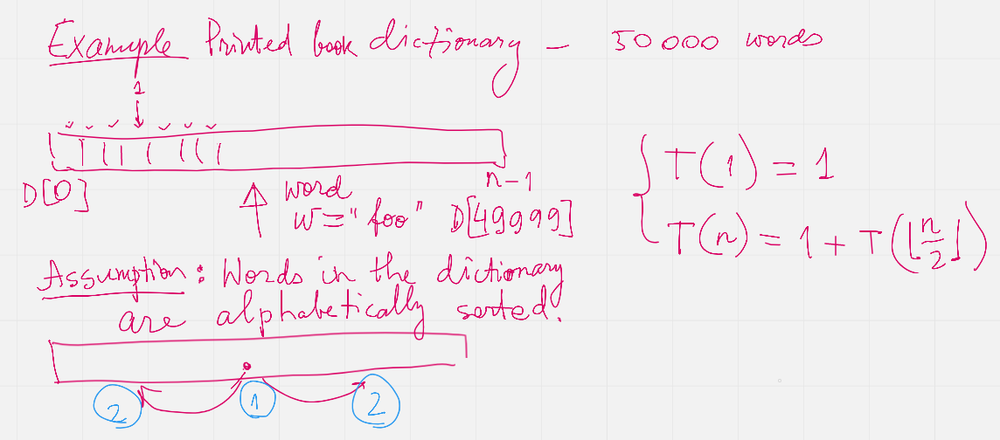

Worksheet Week 01: Asymptotic Bounds
======================================

Introduction
--------------

Goals of this Course
^^^^^^^^^^^^^^^^^^^^^^

Programming courses where we solve problems using language like C++ can have different focus.

* The programming language itself and its expressive power (for example, could have entire semester on various advanced features of C++).
* Object Oriented Programming and design. This could include creating the most appropriate OO design at the level of UML diagrams and Design patterns.
* Software engineering process -- approaches to insure optimum quality and testability of the software.
* Efficiency of the algorithms being used -- their time and space complexity.

The focus of this course is obviously the efficiency; namely -- creating algorithms that can work on
large input data sets or handle complex mathematical structures sufficiently fast.
All the other aspects of programming serve the purpose of learning about algorithms and their efficiency.

* C++ language features being used -- console applications (plaintext files for input and output).
  STL and C++ template classes are used to implement data structures.
* Object orientation serves to isolate concerns by separating data structure code from the remaining algorithms.
  Design patterns and other advanced OO stuff can be used, if students find it useful -- but algorithm learning
  is largely independent from it.
* Ability to test our software (including unit tests) and also to measure the speed of our code is essential.

Formal Requirements
^^^^^^^^^^^^^^^^^^^^^

The maximum overall grade is 100% (100 percentage points).
Your numeric grade will be obtained by dividing your actual percentage points by :math:`10` and by
rounding to the nearest integer.
For example, the minimum number of percentage points to get the grade "10" is 95% (and the minimum number of
percentage points to get the grade "4" is 35%).

All the percentage points in this section are relative to the overall maximum grade.

1. Four programming tasks (40% total; 10% per task). These problems ask you to solve some problem using algorithms and data structures
   covered in the class. (The first tasks let you use any data structures you want, but
   tasks #3 and #4 may ask you to refrain from using the built-in STL libraries and similar data structure implementations
   and to use your own.)
2. One design and solution description (20% total): Algorithm analysis, class design, test creation and finally -- test-driven development.
   Half of the credit -- 10 percentage points are given for the submitted analysis paper. Another 10 percentage points are given for the implementation.
3. Midterm (20%) -- algorithmic tasks done on paper (writing pseudocode, drawing pictures of data structures and running
   some algorithmic steps there).
4. Final (20%) -- similar to the midterm, but refers to the second half of the course.

Midterm and final will not ask you to implement any code.
To prepare for these exams we will solve problems (especially on Wednesday 14:30 lab sessions) that resemble midterms and finals.
Such training tasks will not affect your grade, but you are encouraged to practice them.

Office Hours
^^^^^^^^^^^^^

Use a link to register -- `<https://calendly.com/kalvis-apsitis/office-hours?month=2022-02>`_;
instructor will send a Zoom link. You are encouraged to come in groups as well.

There will be strongly suggested office hours (about one 30 minute session) **before** the first programming task is due.
This would help to ensure that your directory layout, compilation and testing approach is the same as that used
by the instructor.

How to Determine Algorithm Efficiency?
----------------------------------------

Looking Up an Item in a List
^^^^^^^^^^^^^^^^^^^^^^^^^^^^^^

**Problem:**
  There is a dictionary (the traditional printed book variety) with :math:`50\,000` words written in the
  English alphabet (26 letters; assume that all of them are lowercase).
  The words in the dictionary are sorted alphabetically.
  The task is to find a given word :math:`w` (such as :math:`w = \mathtt{efficiency}`) in this
  dictionary or to report that there is no such word.

.. note::
  There is also a data structure named *dictionary* (storing keys and values);
  here we use the everyday notion of a dictionary -- an alphabetically arranged
  list of words.

**Linear (Brute Force) Solution:**

Let us have a zero-based dictionary :math:`D` with :math:`n` items
from :math:`D[0]` to :math:`D[n-1]`.

| :math:`\text{\sc LinearSearch}(D,w)`
| 1. :math:`\;\;\;\;\;` **for** :math:`i` **in** :math:`\text{\sc range}(0,n)`:
| 2. :math:`\;\;\;\;\;\;\;\;\;\;` **if** :math:`w` ``==`` :math:`D[i]`:
| 3. :math:`\;\;\;\;\;\;\;\;\;\;\;\;\;\;\;` **return** :math:`\text{\sc found}` :math:`w` at location :math:`i`
| 4. :math:`\;\;\;\;\;` **return** :math:`\text{\sc not found}`

This method in the real life would mean somebody scanning through all the words in a dictionary
and searching for the match with the given word :math:`w`.
This would be very inefficient. The only advantage for this approach -- we do not need any assumptions
about the word order in the dictionary -- the algorithm would work equally well even for
totally unordered list of words.

**Binary Search Solution:**

Binary search is a different algorithm that relies on the alphabetical sorting of the
dictionary :math:`D[0]<D[1]<\ldots<D[n-2]<D[n-1]`.
At every point we maintain a closed interval :math:`[\ell, r]` so that the index :math:`D[i]=w` we want to
find satisfies the inequalities :math:`\ell \leq i \leq r`.

The initial call is :math:`\text{\sc BinarySearch}(D,\ell, r,w)`, where :math:`\ell = 0` and :math:`r = n-1`.
After that the binary search may call itself recursively on shorter intervals.

| :math:`\text{\sc BinarySearch}(D,\ell, r, w)`
| 1. :math:`\;\;\;\;\;` **if** :math:`\ell > r`:
| 2. :math:`\;\;\;\;\;\;\;\;\;\;` **return** :math:`\text{\sc not found}` :math:`w`
| 3. :math:`\;\;\;\;\;` :math:`{\displaystyle m = \left\lfloor \frac{\ell + r}{2} \right\rfloor}`
| 4. :math:`\;\;\;\;\;` **if** :math:`w` ``==`` :math:`D[m]`:
| 5. :math:`\;\;\;\;\;\;\;\;\;\;` **return** :math:`\text{\sc found}` :math:`w` at location :math:`m`
| 6. :math:`\;\;\;\;\;` **else** **if** :math:`w < D[m]`:
| 7. :math:`\;\;\;\;\;\;\;\;\;\;` **return** :math:`\text{\sc BinarySearch}(D,\ell, m-1, w)`
| 8. :math:`\;\;\;\;\;` **else**:
| 9. :math:`\;\;\;\;\;\;\;\;\;\;` **return** :math:`\text{\sc BinarySearch}(D,m+1, r, w)`

Finding a Peak in a Numeric Sequence
^^^^^^^^^^^^^^^^^^^^^^^^^^^^^^^^^^^^^^

**Definition:**
  Given a sequence :math:`a_i` (:math:`i = 0,\ldots,n-1`) we call its element :math:`a_i` a *peak*
  iff it is a local maximum (not smaller than any of its neighbors):

  .. math::

    a_i \geq a_{i-1}\;\;\text{\bf and}\;\; a_i \geq a_{i+1}

  In case if :math:`i=0` or :math:`i = n-1`, one of these neighbors does not exist; and in such cases we
  only compare :math:`a_i` with neighbors that do exist.

**Brute Force Algorithm:**

.. note::
  Observe that in every nonempty numeric sequence :math:`a_i` there exist at least one peak (for example,
  the global maximum is always a peak). On the other hand, peaks are not necessarily unique.
  In particular, if the sequence is constant (all members are equal), then any member there is a peak.

.. image:: figs-asymptotic-bounds/peak-finding.png
   :width: 5in

Big-O-Notation
^^^^^^^^^^^^^^^

**Definition:**
  Let :math:g \colon \mathbb{N} \rightarrow \mathbb{R}_{0+}` be a function from natural numbers (non-negative integers)
  to non-negative real numbers.
  Then :math:`O(g)` is the set of all functions :math:`f \colon \mathbb{N} \rightarrow \mathbb{R}`
  such that there exist real constants :math:`c>0` and :math:`n_0 \in \mathbb{N}` such that

  .. math::

    \forall n \in \mathbb{N}\ \big( n \geq n_0 \rightarrow | f(n) | \leq c \cdot g(n) \big).

**Examples:**
  Show using the above definition of :math:`O(g)` the following facts:

  **(A)**
    :math:`f(n) = 13n + 7` is in :math:`O(n)`. (Formally, :math:`f \in O(g)`, where :math:`g(n) = n`.)

  **(B)**
    :math:`f(n) = 3n^2 - 100n + 6` is in :math:`O(n^2)`.

  **(C)**
    :math:`f(n) = 3n^2 - 100n + 6` is in :math:`O(n^3)`.

  **(D)**
    :math:`f(n) = 3n^2 - 100n + 6` is **not** in :math:`O(n)`.

For every example (every pair of functions :math:`g(n)` and :math:`f(n)`)
either find :math:`c>0` and :math:`n_0 \in \mathbb{N}` such that the definition is satisfied,
or demonstrate that such :math:`c>0` and :math:`n_0` cannot exist.

Here are the definitions of three asymptotic concepts.

**Definition:**
  Let :math:`g \colon \mathbb{N} \rightarrow \mathbb{R}_{0+}` be a function from natural numbers (non-negative integers)
  to non-negative real numbers.
  Then :math:`O(g)` is the set of all functions :math:`f \colon \mathbb{N} \rightarrow \mathbb{R}`
  such that there exist real constants :math:`c>0` and :math:`n_0 \in \mathbb{N}` satisfying
  :math:`{\displaystyle \forall n \in \mathbb{N}\ \big( n \geq n_0 \rightarrow | f(n) | \leq c \cdot g(n) \big).}`

**Definition:**
  Let :math:`g \colon \mathbb{N} \rightarrow \mathbb{R}_{0+}` be a function.
  Then :math:`\Omega(g)` is the set of all functions :math:`f \colon \mathbb{N} \rightarrow \mathbb{R}`
  such that there exist real constants :math:`c>0` and :math:`n_0 \in \mathbb{N}` satisfying
  :math:`{\displaystyle  \forall n \in \mathbb{N}\ \big( n \geq n_0 \rightarrow | f(n) | \geq c \cdot g(n) \big).}`

**Definition:**
  Define :math:`\Theta(g)` to be the intersection of :math:`O(g)` and :math:`\Omega(g)`.

  Formally, let :math:`g \colon \mathbb{N} \rightarrow \mathbb{R}_{0+}` be a function.
  Then :math:`\Theta(g)` is the set of all functions :math:`f: \mathbb{N} \to \mathbb{R}`
  such that there exist real constants :math:`c_1, c_2 > 0` and :math:`n_0 \in \mathbb{N}` satisfying

  .. math::

    \forall n \in \mathbb{N}\ \big( n \geq n_0 \rightarrow   c_1 \cdot g(n) \leq  | f(n) | \leq c_2 \cdot g(n) \big).

In spoken language we often use descriptive concepts:

* If :math:`f \in O(g)`, then :math:`g(n)` is called *asymptotic upper bound* of :math:`f(n)`.
* If :math:`f \in \Omega(g)`, then :math:`g(n)` is called *asymptotic lower bound* of :math:`f(n)`.
* If :math:`f \in \Theta(g)`, then :math:`g(n)` is called *asymptotic growth order* of :math:`f(n)`.

**Definition:**
  The *time complexity* of an algorithm is described by a function :math:`f(n)`,
  if for **any** input of length :math:`n` bytes, the time spent running the algorithm is bound
  from above by :math:`f(n)` (starting from some natural :math:`n_0`).

**Intuition about these definitions:**

1. Why do we need asymptotic behavior (namely, :math:`\forall n \geq n_0`)?
   What about small values :math:`n`?

   Asymptotic behavior ignores :math:`n < n_0` for some :math:`n_0`, since
   algorithmic complexity on short inputs does not matter very much.
   Theoretically, you could even "cheat" -- remember a large lookup table containing
   all sorts of inputs of length :math:`n < n_0` (with precomputed correct answers).
   Clearly, this does not tell us anything about the performance of this algorithm --
   algorithms differ on how they behave on long inputs.

   Another reason is the simplicity of the functional behavior as :math:`n \rightarrow \infty`.
   Even though we would love to predict the
   speed of an algorithm for short input lengths :math:`n`, the dependence on :math:`n` is likely
   quite complex (and we cannot ignore "lower order"  terms). As :math:`n` becomes very large,
   only the "dominant parts" in the expression :math:`f(n)` matter.

2. Why do we allow arbitrary constant :math:`c` in the inequalities like
   :math:`| f(n) | \leq c \cdot g(n)`?

   Trying to measure computation costs with explicit constants would make
   the cost model more complicated -- it would matter how many CPU commands and
   machine-words are involved. Also, the meaning of constants change as soon as
   you obtain a faster computer -- a constant speedup is not hard to achieve.

Properties of Big-O, Big-Omega, Big-Theta
--------------------------------------------

**Big-O and Limit of the Ratio:**
  If the following limit exists and is finite:

  .. math::

    \lim\limits_{n \rightarrow \infty} \frac{f(n)}{g(n)} = C < + \infty,

  then :math:`f(n)` is in :math:`O(g(n))`.

**Big-O is transitive:**
  If :math:`f(n) \in O(g(n))` and :math:`g(n) \in O(h(n))`, then :math:`f(n) \in O(h(n))`.

**Sum of two functions:**
  If :math:`f(n) \in O(h(n))` and :math:`g(n) \in O(h(n))`, then :math:`f(n) + g(n) = O(h(n))`.

**All polynomials:**
  Any :math:`k`-th degree polynomial :math:`P(n) = a_k n^k + a_{k-1} n^{k-1} + \ldots + a_1 n + a_0` is in :math:`O(n^k)`.

**Logarithms of any base:**
  If :math:`a,b > 1` are any real numbers, then :math:`\log_a n = O(log_b n)`. Typically use just one base (usually, it is base :math:`2` or
  base :math:`e` of the natural logarithm, if you prefer that), and write just :math:`O(\log n)` without specifying base at all.

The last result directly follows from the formula to change the base of a logarithm: :math:`{\displaystyle \forall a,b,m > 1 \left( \log_a b = \frac{ \log_m b }{ \log_m a } \right)}`.

Examples with Big-O, Big-Omega, Big-Theta
------------------------------------------

The Complexity of Combined Algorithms
^^^^^^^^^^^^^^^^^^^^^^^^^^^^^^^^^^^^^^^

Once the the complexity of constituent parts of an algorithm is known, these
complexities can be combined to find the time complexity of the overall algorithm.

**Example1:**
  :math:`\text{\sc AlgorithmA(input)}` has time complexity in :math:`O(n^a)`, but :math:`\text{\sc AlgorithmB(input)}`
  has time complexity in :math:`O(n^b)`.
  What is the complexity of :math:`AlgorithmC` that first calls
  :math:`\text{\sc AlgorithmA(input)}`, then calls :math:`\text{\sc AlgorithmB(input)}`,
  and finally somehow combines the results in :math:`O(1)` time.

  | :math:`\text{\sc AlgorithmC}(\text{\em input})`
  | :math:`\;\;\;\;\;` :math:`\text{\em resultA} = \text{\sc AlgorithmA}(\text{\em input})`
  | :math:`\;\;\;\;\;` :math:`\text{\em resultB} = \text{\sc AlgorithmB}(\text{\em input})`
  | :math:`\;\;\;\;\;` **return** :math:`\text{\sc combine}(\text{\em resultA},\text{\em resultB})`

**Example2:**
  :math:`\text{\sc AlgorithmA(input)}` has time complexity in :math:`O(n^a)`, but :math:`\text{\sc AlgorithmB(input)}`
  has time complexity in :math:`O(n^b)`.
  What is the complexity of :math:`AlgorithmD` that first calls
  :math:`\text{\sc AlgorithmA(input)}`, then calls :math:`\text{\sc AlgorithmB(input)}` in a long loop :math:`n` times
  and returns the Boolean conjunction of all the results.

  | :math:`\text{\sc AlgorithmD}(\text{\em input})`
  | :math:`\;\;\;\;\;` *result* = :math:`\text{\sc AlgorithmA}(\text{\em input})`
  | :math:`\;\;\;\;\;` **for** :math:`i` **from** :math:`1` **to** :math:`n`:
  | :math:`\;\;\;\;\;\;\;\;\;\;` *result* = :math:`\text{\em result} \wedge \text{\sc AlgorithmB}(\text{\em input})`
  | :math:`\;\;\;\;\;` **return** *result*

**Example3:**
  Define a function :math:`f \colon \mathbb{N} \rightarrow \mathbb{R}_{0+}` which infinitely often takes
  both values :math:`n^2` and also :math:`n^3`.

**Solution:**
  One could define a function with a condition (:math:`n^2` for even :math:`n` and :math:`n^3` for odd :math:`n`):

  .. math::
    f(n) = \left\{ \begin{array}{l}
    n^3,\;\;\mbox{if $n$ is even}\\
    n^2,\;\;\mbox{if $n$ is odd}\\
    \end{array} \right.

  This function with two branches is defined just for natural numbers :math:`n \in \mathbb{N}`
  (which is enough for Big-O notation concept).
  If you wish, this function can also be defined for all real numbers :math:`x \in \mathbb{R}`:
  :math:`{\displaystyle f(x) = x^2 + \frac{1}{2} \left(1 + cos(\pi x) \right)\left( x^3 - x^2 \right)}`.

  .. image:: figs-asymptotic-bounds/cosine-function.png
   :width: 3in

.. note::
  This example shows a function :math:`f` which is in :math:`O(n^3)` and also in :math:`\Omega(n^2)`, but
  it does not belong to any :math:`\Theta(g)` for some simple function :math:`g` (except
  to its own class :math:`f \in \Theta(f)`).
  One could come up with an algorithmic task which is considerably faster for odd-length inputs.
  And also vice versa: Some algorithmic task may be   faster for even-length inputs.
  Hence, there is no total order among the asymptotic growth rates -- sometimes asymptotic
  growth rates are incomparable.

Slowly growing functions
^^^^^^^^^^^^^^^^^^^^^^^^^^^^^

**Example4:**
  Show that :math:`f(n) = 0` is not in :math:`\Omega(1)`.

**Solution:**
  Apply the definition of :math:`f \in \Omega(g)`, where :math:`f(n) = 0`, but
  :math:`g(n) = 1`. The required inequality :math:`| f(n) | \geq c \cdot g(n)`
  which is, in fact, :math:`0 \geq c \cdot 1` is never true, if :math:`c > 0`.

Let us have a less trivial example -- a strictly positive function which does not have :math:`g(n) = 1`
as its asymptotic lower bound. In fact, any infinite sequence having a subsequence converging to :math:`0`
is fine.

**Example5:**
  Show that :math:`f(n) = \frac{1}{n}` is not in :math:`\Omega(1)`.

**Solution:**
  Let us pick some :math:`c > 0` and some :math:`n_0` first.
  We have to show that there must exist a number :math:`n > n_0` that violates the inequality
  from the definition of :math:`f \in O(g)`.

  Let us pick :math:`n` such that :math:`n > n_0` and :math:`n > 1/c`. Then
  :math:`|f(n)| = 1/n < c \cdot 1`, which means that
  the required inequality :math:`|f(n)| = 1/n \geq c \cdot 1` does not hold.

**Example6:**
  Use the Big-O definition to show that :math:`f(n) = 3^n` is not in :math:`O(e^n)`.

**Hint for Example3:**
  Let us use the formal definition of Big-O notation, and show that its negation is true.

We see that picking sufficiently large :math:`n` makes the inequality from the
Big-O definition false. Meanwhile :math:`e^n \in O(3^n)`, since :math:`3^n` is
always larger; so one can pick :math:`n_0 = 0` and :math:`c = 1`.

.. note::
  We observe that :math:`f(n) = e^n` is in :math:`O(3^n)`, but :math:`3^n` is not in
  :math:`O(e^n)`.
  Unlike logarithms (which only differ by a constant factor -- and are all in the Big-O relation
  with each other), any two different bases for exponent functions
  (such as :math:`e \approx 2.71` and :math:`3`) create different asymptotic
  growth rates.

**Example7:**
  If a function :math:`f(n) = C` is constant, then it is :math:`O(1)`.
  Is the converse also true -- does the statement :math:`f \in O(1)`
  imply that :math:`f` is a constant function.

**Hint for Example4:**
  Can define function by cases so that it is *bounded* (see `<https://bit.ly/3Bdv1aR>`_),
  but not equal to the (same) constant.

**Solution:**
  The function that is not constant, but still in :math:`O(1)` is shown in the image below.

  .. image:: figs-asymptotic-bounds/example4-function.png
     :width: 2.5in

**Example8:**
  Define functions :math:`g(n) = n` and :math:`h(n) = n^{0.9} \cdot \log_2 n`
  Just as in the above example we can show that the limit :math:`h(n)/g(n) = 0`
  as :math:`n \rightarrow \infty`.

  Draw graphs of the functions :math:`f_1(x) = x` and :math:`f_2(x) = x^{0.9} \cdot \log_2 x` and
  observe, for what values :math:`n` :math:`f_2(n)`

  This example shows that establishing the Big-O properties using
  a graphing calculator could be difficult and misleading -- sometimes
  the asymptotic behavior becomes evident only for huge values of :math:`n_0`.

.. image:: figs-asymptotic-bounds/function-graphs.png
   :width: 6in

Fast Growing Functions and Slow Algorithms
^^^^^^^^^^^^^^^^^^^^^^^^^^^^^^^^^^^^^^^^^^^^^

**Definition:**
  Binomial coefficients show in how many ways an unordered selection of :math:`k`
  elements out of :math:`n` elements can be made:

  .. math::

    {n \choose k} = \frac{n!}{(n-k)!k!}.

Certain algorithms rely on trying out all possible combinations
of some data. In such cases the amount of work
may grow exponentially in terms of the input length :math:`n`.
One such problem is *Traveling Salesman* -- currently there is no
known efficient algorithm for this problem.

Among the many functions that grow very fast (and are time complexities
of algorithms that are very slow) some are much faster than the others.
In particular, if :math:`\lim_{n \rightarrow \infty} \frac{f(n)}{g(n)} = 0` then
function :math:`g(n)` grows much faster than :math:`f(n)`
and :math:`f \in O(g)`, but :math:`g \not\in O(f)`

**Example9:**
  Order these functions in increasing order with respect to their Big-O growth rate:

  * :math:`f_1(n) = 2^{2^{10000}}`
  * :math:`f_2(n) = 2^{10000n}`
  * :math:`f_3(n) = \binom{n}{2} = C_n^2`
  * :math:`f_4(n) = \binom{n}{\lfloor n/2 \rfloor}`
  * :math:`f_5(n) = \binom{n}{n-2}`
  * :math:`f_6(n) = n!`
  * :math:`f_7(n) = n\sqrt{n}`

**Solution:**
  Eliminate a few functions which do not exceed polynomials
  (polynomial-time algorithms are not considered exceptionally slow).
  :math:`f_1` is just :math:`O(1)`, :math:`f_7` is in :math:`O(n^{1.5})`,
  but functions :math:`f_3(n) = f_5(n) = \frac{n(n-1)}{2}` which is in :math:`O(n^2)`.

  It remains to order the remaining functions (all of them grow fast - they are exponential in
  terms of :math:`n`).
  We will prove that their order is the following: :math:`f_4, f_2, f_6` -- see the two following examples.

**Lemma:**
  We have the following estimate:

  .. math::

    \binom{n}{\lfloor n/2 \rfloor} \sim \frac{4^n}{\sqrt{\pi n}}

  To prove this, apply Stirling's formula: :math:`{\displaystyle n! \sim \sqrt{2 \pi n}\left(\frac{n}{e}\right)^n}`.

.. note::
  Very similar expression describes Catalan numbers. The :math:`n`-th Catalan number
  is defined by the following equality:
  :math:`{\displaystyle C_n = \frac{1}{n+1}{2n\choose n}}`. They arise in various combinatorial problems.
  See `<https://bit.ly/3stVNIk>`_ for details.
  (For example, some computer algorithm that would process every valid way how to parenthesize an expression
  consisting of :math:`n` terms will require :math:`C_n` steps.)

**Example10:**
  Show that :math:`{\displaystyle f_4(n) = \binom{n}{\lfloor n/2 \rfloor}}` is in :math:`O(f_2)` where
  :math:`{\displaystyle f_2(n) = 2^{10000n}}`.

**Solution:**
  From the Lemma we immediately see that :math:`f_4(n)`
  is in :math:`O(n^4)`. And in turn :math:`n^4` is in :math:`O(2^{10000n})`.
  Note that :math:`2^{10000n} = (2^{10000})^n` -- it is also an exponential function,
  but the exponent base :math:`2^{10000}` is larger than :math:`4`.

**Lemma:**
  Let :math:`g(n) = n!` and :math:`f(n) = a^n` for some constant :math:`a`.
  Then :math:`f \in O(n!)` and also :math:`\lim_{n \rightarrow \infty} \frac{a^n}{n!} = 0`.
  In other words, factorial grows faster than any exponential function.

**Proof:**
  Define the constant :math:`N = 2a`. Denote :math:`\frac{a^N}{N!} = C`.
  Initially set :math:`n = N`.
  Every time you increment :math:`n`, the numerator increases exactly :math:`a` times,
  but denominator increases at least :math:`N = 2a` times.
  Therefore every time you increment :math:`n` to :math:`n+1` the fraction will decrease at least twice.
  The only number that can be a limit of such a sequence is :math:`0`.

**Example11:**
  Show that :math:`{\displaystyle f_2(n) = 2^{10000n}}` is in :math:`O(f_6)` where
  :math:`{\displaystyle f_6(n) = n!}`.

**Solution:**
  This immediately follows from the previous Lemma, where :math:`a = 2^{10000}`.
  The values of :math:`n` for which :math:`n!` grows faster than :math:`2^{10000n}`
  are very large; they start at :math:`2^{10000}`.

Master Theorem
^^^^^^^^^^^^^^^^

Let :math:`f(n)` be an increasing theorem that satisfies the recurrence relation:

.. math::

  f(n) = a \cdot f \left( \frac{n}{b} \right) + cn^d

Here we assume that :math:`n = b^k`, where :math:`k` is a positive integer, :math:`a \geq 1`,
:math:`b>1` is an integer, :math:`c,d` are real numbers (where :math:`c>0` and :math:`d \geq 0`).
Then the asymptotic growth for :math:`f(n)` can be found like this:

.. math::

  f(n)\ \mbox{is in}\ \left\{ \begin{array}{ll}
  O(n^d), & \mbox{if $a < b^d$,}\\
  O(n^d \log n), & \mbox{if $a = b^d$,}\\
  O(n^{\log_b a}), & \mbox{if $a > b^d$.}\\
  \end{array} \right.

Questions
------------

**Question 1 (Warm up):**

  * Every function :math:`f(n)` is both :math:`\Omega(1)` and :math:`O(e^n)`.
  * If a function is :math:`O(1)`, then it must be a constant function: :math:`f(n) = C` for some :math:`C \in \mathbb{R}`.
  * Define a function :math:`f \colon \mathbb{N} \rightarrow \mathbb{R}_{0+}` which equals :math:`n^2` for infinitely many :math:`n`
    and equals :math:`n^3` for infinitely many :math:`n`.

**Question 2:**
  You are given Algorithm1, which is :math:`O(n^a)`, and Algorithm2, which is :math:`O(n^b)`,
  for :math:`a,b \in \mathbb{N}`.

  * Give another function :math:`f(n) \neq n^a`, so that Algorithm1 is in :math:`O(f(n))`.
  * What is asymptotic upper bound of the runtime, if a program first executes Algorithm1, then Algorithm2?
  * What is the closest upper bound on the algorithm that runs Algorithm1, which calls
    Algorithm2 :math:`n` times?

**Question 3:**
  Suppose that Algorithm3 has asymptotic time complexity in :math:`O(2^{n+1})`
  and Algorithm4 has asymptotic time complexity in :math:`O(2^{2n})`.
  Are any of these algorithms (Algorithm3 or Algorithm4) in :math:`O(2^n)`?

**Question 4:**
  Prove or disprove the following statement:
  If :math:`f(n)` is in :math:`O(g(n))` and also :math:`g(n)` is in :math:`O(f(n))`,
  then :math:`f(n)` is also in :math:`\Theta(g(n))` (and :math:`g(n)` is in :math:`\Theta(f(n))`.
  (You can assume that :math:`f(n)` and :math:`g(n)` always take positive values.)

**Question 5:**
  Order these functions in increasing order regarding Big-O complexity
  (:math:`f_i` is considered "not larger" than :math:`f_j` iff :math:`f_i \in O(f_j)`.

  * :math:`f_1(n) = n^{0.9999} \log_2 n`
  * :math:`f_2(n) = 10000n`
  * :math:`f_3(n) = 1.0001^n`
  * :math:`f_4(n) = n^2`

**Question 6:**
  Order these functions in increasing order regarding Big-O complexity:

  * :math:`f_1(n) = 2^{2^{10000}}`
  * :math:`f_2(n) = 2^{10000n}`
  * :math:`f_3(n) = \binom{n}{2} = C_n^2`
  * :math:`f_4(n) = \binom{n}{\lfloor n/2 \rfloor}`
  * :math:`f_5(n) = \binom{n}{n-2}`
  * :math:`f_6(n) = n!`
  * :math:`f_7(n) = n\sqrt{n}`

**Question 7:**
  Order these functions in increasing order regarding Big-O complexity:

  * :math:`f_1(n) = n^{\sqrt{n}}`
  * :math:`f_2(n) = 2^n`
  * :math:`f_3(n) = n^{10} \cdot 2^{n/2}`
  * :math:`{\displaystyle \sum\limits_{i = 1}^{n} (i + 1)}`.

**Question 8:**
  Select the correct asymptotic complexity of an algorithm with runtime
  :math:`T(n, n)` where

  .. math::

    \left\{ \begin{array}{l}
    T(x, c) = \Theta(x)\;\mbox{for $c \leq 2$},\\
    T(c, y) = \Theta(y)\;\mbox{for $c \leq 2$, and},\\
    T(x, y) = \Theta(x + y) + T(\lfloor x/2 \rfloor, \lfloor y/2 \rfloor)\;\mbox{otherwise}.\\
    \end{array} \right.

  a. :math:`\Theta(\log n)`.
  b. :math:`\Theta(n)`.
  c. :math:`\Theta(n \log n)`.
  d. :math:`\Theta(n log^2 n)`.
  e. :math:`\Theta(n^2)`.
  f. :math:`\Theta(2^n)`.
