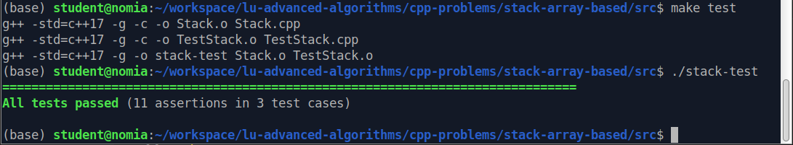

Worksheet, Week 04: Build and Debug on Linux
=============================================

Building with Makefile
------------------------

This is a minimalistic Makefile that builds ``myprogram`` from 
a single source file ``myprogram.cpp``. 

.. code-block:: makefile

	CC=g++
	CFLAGS=-std=c++17
	
	all: myprogram
	
	myprogram: myprogram.cpp
		$(CC) $(CFLAGS) -o myprogram myprogram.cpp
		
	.PHONY: clean
	clean:
		rm -f myprogram

Utility `make` was invented in 1976. Analyzes dependencies (which file was 
updated when), target names are typically same as file names. 
In the above example 

* In a `Makefile` each line should be either non-indented (a variable definition
  or a target) or be indented by exactly one `TAB` character. 
  Preceding that `TAB` by an (invisible) whitespace would break it. 
* `.PHONY clean` declaration says that the target name has nothing to do with 
  any filename. (If we do not use it, then `clean` would not run provided
  there is a file `clean`. 

A more complicated testfile using multiple sources (and even multiple executables -- 
one for software itself, another for unit-tests) is shown in the Catch2 subsection (see below).
	

**Use Makefile to Run Testfiles:** 

.. code-block:: makefile

	# Define variables
	PROGRAM = myprogram
	INPUT_FILES = $(wildcard test*.txt)
	OUTPUT_FILES = $(patsubst test%.txt,output.test%.txt,$(INPUT_FILES))

	.PHONY: test
	test: $(OUTPUT_FILES)

	output.test%.txt: $(PROGRAM) test%.txt
		./$(PROGRAM) < $< > $@ || true
	
	# Clean up target
	clean:
		rm -f $(OUTPUT_FILES)
	
The snippet `|| true` prevents stopping the ``make`` task, 
if some of the program execution returns non-zero return code or crashes.

.. note:: 
  Currently C++ developers use mostly `CMake` -- a "meta-build" tool 
  that creates makefiles or other build artefacts from a description 
  of the project and its dependencies described in the 
  ``CMakeLists.txt`` file. CMake can participate 
  in other build chains -- such as Gradle 
  build tasks, where Android app written in Java or Kotlin
  needs some native code in C++.
  
  In other cases custom Bash shell, Python or Groovy can be 
  used instead of Makefile or ``CMakeLists.txt``. 
  Build tools are often part of larger build infrastructures using 
  ``crontab`` time-scheduling, Continuous Integration tools such as 
  Jenkins, 
	

**CMakeLists.txt Example:** 

.. code-block:: 

  cmake_minimum_required(VERSION 3.10)
  project(myprogram)
  add_executable(myprogram myprogram.cpp)

Here is how to use it: 

.. code-block:: 

  cmake .
  make
	

Unit-tests with Catch2
-----------------------

To run a project with Catch2 tests we need 
two different build goals in `Makefile`. One of them is builds the
executable you can run; another one builds the test harness
(executable that can be used to run the unit tests). 

The following things are commonly used with Catch2 tests: 

* No dependencies on additional libraries; but tests should include header file 
  ``catch.hpp`` containing various assert definitions and macros.
* Testcases can check normal execution -- for example, ``REQUIRE(...)`` verifies that 
  the expression is true. 
* Testcases can check abnormal cases when the expected behaviour is throwing an exception. 
  For example, ``REQUIRE_THROWS_AS(...)`` means that the expression throws an exception of the 
  specified type. 
* It is possible to have common initialization section in a testcase, which is then used 
  by multiple "sections" (each section receives the same initial state, but does something different). 
* Using Catch2 means that you produce one more executable (see the next subsection for an example 
  of a Makefile to build two different executables in the same directory). 
  

.. code-block:: cpp

  #define CATCH_CONFIG_MAIN

  #include "catch.hpp"
  #include "Stack.h"

  TEST_CASE("Exceptions on empty stack", "[stack]") 
  {
    Stack stack(3);
    REQUIRE_THROWS_AS(stack.top(), std::out_of_range);
    REQUIRE_THROWS_AS(stack.pop(), std::out_of_range);
    stack.push(17);
    stack.pop();
    REQUIRE_THROWS_AS(stack.top(), std::out_of_range);
  }

  TEST_CASE("Lifo order", "[stack]")
  {
    Stack stack(3);
    stack.push(1);
    stack.push(2);
    REQUIRE(stack.top() == 2);
    REQUIRE(stack.pop() == 2);
    REQUIRE(stack.top() == 1);
    REQUIRE(stack.pop() == 1);
    REQUIRE_THROWS_AS(stack.top(), std::out_of_range);
  }

  TEST_CASE("3-element stack", "[stack]")
  {
    // common initialization part
    Stack stack(3);
    stack.push(11);
    stack.push(12);
    stack.push(13);
  
    SECTION("Stack is full") {
      REQUIRE_THROWS_AS(stack.push(14), std::out_of_range);
    };
  
    SECTION("Multiple top calls") {
      REQUIRE(stack.top() == 13);
      REQUIRE(stack.top() == 13);
    };
  }

A Makefile to build Catch2 test executable
^^^^^^^^^^^^^^^^^^^^^^^^^^^^^^^^^^^^^^^^^^^^

In this example we assume that the unit-testing executable is built 
from these sources: 

``TestStack.cpp``:
    Catch2 testcases; its source is shown above. 

``catch.hpp``:
  Catch2 header file, which you do not need to change.
    
``Stack.h``:
  Stack ADT methods. 
  
``Stack.cpp``:
  Stack implementation. 
  

Meanwhile, there is also the source file ``StackMain.cpp`` (a program doing something useful 
and using our stack). In this case the main program can be built with ``make all``, but 
the testcases can be built with ``make test``. 

The Makefile to compile such project is shown below: 

.. code-block:: 

  CC=g++
  CFLAGS=-std=c++17 -g
  SRCDIR=.
  OBJDIR=.
  SRC=$(wildcard $(SCRCDIR)/*.cpp)
  OBJ1=$(OBJDIR)/Stack.o $(OBJDIR)/StackMain.o
  OBJ2=$(OBJDIR)/Stack.o $(OBJDIR)/TestStack.o
  EXECMAIN=$(SRCDIR)/stack-main
  EXECTEST=$(SRCDIR)/stack-test

  all: $(EXECMAIN)
  test: $(EXECTEST)

  $(EXECMAIN): $(OBJ1)
    $(CC) $(CFLAGS) -o $@ $^
  
  %.o: %.cpp
    $(CC) $(CFLAGS) -c -o $@ $<
  
  $(EXECTEST): $(OBJ2)
    $(CC) $(CFLAGS) -o $@ $^
  

  .PHONY: clean
  clean:
    rm -f $(SRCDIR)/*.o $(EXEC1) $(EXEC2)

    
   Sample Output from Catch2 testcases.

Debugging with gdb
--------------------

``gdb myprogram``: 
  Start gdb and load the myprogram executable.
  
``run``: 
  Start the program.

``break <line_number>``: 
  Set a breakpoint at the specified line number.

``info break``: 
  Show all defined breakpoints.

``delete <breakpoint_number>``: 
  Delete the specified breakpoint.

``next``: 
  Step over the current line.

``step``: 
  Step into the function called on the current line.

``finish``: 
  Continue execution until the current function returns.

``backtrace``: 
  Show the current call stack.

``list``: 
  Show the current source code around the current line.

``print <variable_name>``: 
  Print the value of the specified variable.
  
``display <variable_name>``: 
  Display the value of the specified variable after each step.

``watch <variable_name>``: 
  Set a watchpoint on the specified variable.

``info registers``: 
  Show the current state of all CPU registers.

``x/<length><format><address>``: 
  Examine memory at the specified address, with the specified format and length.

``layout src:`` 
  Display the source code and assembly code in separate windows.

``layout regs:`` 
  Display the CPU registers and the source code in separate windows.

``layout split:`` 
  Display the source code and the program output in separate windows.

``layout next:`` 
  Switch to the next layout.

The Lifecycle of Data Structures
----------------------------------

* Constructors for empty data structures and initializer lists. 
* Copy constructors during assignments or function calls. 
* When are the destructors called. 
* When is a proper time to release memory?

Valgrind
----------

**Memory leak detection:**
  Valgrind can detect memory leaks by identifying when memory 
  is allocated but not freed. Use ``--leak-check`` option. 

  .. code-block:: bash 
	
	  valgrind --leak-check=yes ./myprogram
	  # (or write directly to a file)
	  valgrind --leak-check=yes --log-file=leak_report.txt ./myprogram

  .. figure:: figs-build-debug-on-linux/valgrind-output.png
     :width: 5in
     :alt: Valgrind output
    
     Sample Output from Valgrind for memory leak check.

**Memory error detection:** 
  Valgrind can detect memory errors: accessing memory that has already been freed,
  accessing uninitialized memory, and writing to read-only memory. 
  Use ``--tool=memcheck`` option.
	
  .. code-block:: bash 
	
	valgrind --tool=memcheck ./myprogram

**Performance profiling:** 
  Valgrind can help identify performance bottlenecks by profiling 
  CPU usage, memory usage, and other metrics. Use ``--tool=callgrind`` option

  .. code-block:: bash
	
    valgrind --tool=callgrind ./myprogram

  This generates a file called callgrind.out.<pid>. 
  Can use a tool like ``kcachegrind`` to visualize the profiling data.
	

    

Problems
---------

Some questions here are open-ended; they are interview-style questions for 
C++ developers on Linux platforms.

**Problem 1:** 
  Answer some questions about ``Makefile`` builds: 

  **(A)**
    What is a dependency in a Makefile, and how is it specified?

  **(B)**
    How does Makefile determine whether a target needs to be rebuilt or not?

  **(C)**
    What is the purpose of the ``.PHONY`` target in a Makefile, and when should it be used?

  **(D)**
	What is a pattern rule in a Makefile, and how is it used?
	
  **(E)**
	What is the meaning of variables ``$@`` and ``$<`` in a Makefile ?
	
  **(F)**
	How can you specify conditional dependencies in a Makefile, 
	and why would you want to do this? (stuff like ``ifeq``, ``else``, ``endif``)

**Problem 2:**
  Answer some questions about ``gdb`` build. 

  **(A)**
    How would you compile a C++ program (source files ``A.cpp``, ``B.cpp``, ``B.h``). 
    on Linux using the g++ compiler? What flags ensure that it is debuggable?
  
  **(B)**
    Which command can be used to set a breakpoint in the program?
    
  **(C)** 
    Which command can be used to see a value of a variable (or an expression?) 
    in a C++ program while it's running?

  **(D)** 
    How can we use the core file generated by gdb? 
    How would you use it debug a program that has crashed?
  
  **(E)** 
    What is the purpose of the core file generated by gdb? 
    How to use it to debug a program that has crashed?

  **(F)**
    Can you explain the difference between a stack overflow error 
    and a segmentation fault error? How would you debug 
    each of these types of errors using gdb?
    
  **(G)** 
    Which command can examine the contents of memory at a particular address in a C++ program?
    
  **(H)**
   Which command can show the call stack of a C++ program during debugging?
    
  **(I)** 
    Can you explain what the watch command in gdb does? 
    How to use it to monitor a variable in your C++ program?
    
  **(J)** 
    How would you use ``gdb`` to examine the assembly code generated by the 
    ``g++`` compiler?
    
**Problem 3:** 
  Consider the following C++ code to store custom objects of type ``Pair`` in an STL 
  ``vector`` data structure. 
  Explain which constructors and destructors are invoked -- how many and at which locations 
  of the code.
  

  .. code-block:: cpp
  
    #include <vector>
    #include <iostream>
  
    using namespace std;
  
    class Pair { 
      public:
        int nX,nY;
      private:
    
    };
  
    int main(int argc, char** argv) {
  
      vector<Pair> myVector;
      for(int i=0 ; i<10 ; i++) { 
        int x, y; 
        cin >> x >> y; 
        Pair p; 
        p.nX = x; p.nY = y; 
        myVector.push_back(p);
      }
      
      for (auto it = myVector.begin(); it != myVector.end(); ++it) {
        cout << "(" << (*it).nX << "," << (*it).nY << ")" << endl;
      }
      return 0; 
    }