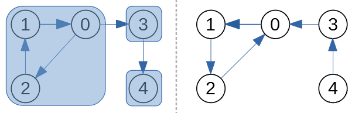
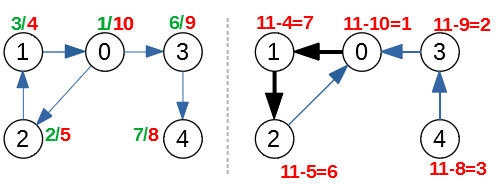

Worksheet 09: Graph Traversals
====================================

DFS in Oriented Graphs 
-------------------------

Discovery/Finishing times
  DFS traversal algorithm can mark each vertex 
  with two numbers ``d/f``, where the first number ``d`` is the 
  discovery time, and the second number ``f`` is the finishing time.
  All these numbers should be different and all of them belong to the 
  interval :math:`[1,2N]`, where :math:`N = |V|` is 
  the number of vertices.

*Discovery/Finishing times can be stored in the graph 
nodes (augmented nodes); 
they are useful in various derived algorithms.*

Edges after a DFS traversal
  DFS traversal turns all edges into four groups: 
    
  **Tree edges** 
    Edges in the depth-first forest :math:`G_{DFS}`. Edge :math:`(u,v)` is a tree edge iff
    :math:`(u,v)` was first discovered when :math:`u` was gray (visited, not finished) and :math:`v` was white (not yet visited).
    
  **Back edges**
    Edges :math:`(u,v)` connecting a vertex :math:`u` to an ancestor :math:`v`
    in a depth-first tree. Edge is a back edge iff it was first discovered when :math:`u` was gray and also :math:`v` was gray 
    (in process of DFS processing, not finished).       
    Also self-loops, which may occur in directed graphs are considered to be back edges.
      
  **Forward edges**
    Edges :math:`(u,v)` that connect a vertex :math:`u` to a descendant :math:`v` in a depth-first tree (but they 
    did not become tree edges -- since :math:`v` was first discovered through another path.
      
  **Cross edges**
    All other edges -- they can go between vertices in the same DFS tree 
    as long as one vertex is not an ancestor of the other. Or they can
    go between vertices in different depth-first trees.

Topological Sorting
--------------------------

Definition
  Given an acyclic directed graph, a sequence of all its vertices 
  :math:`v_1,v_2,\ldots,v_N` is called a *topological sorting* if 
  for each edge :math:`(v_i,v_j)` in this graph, vertex 
  :math:`v_i` precedes the vertex :math:`v_j`. 
  

**Problem 1 (Topological Sorting)**
  Consider the following graph:

  .. figure:: figs-graph-traversals/dag-graph.png
     :width: 3in
     :alt: Directed Graph
	 
     Directed graph to run DFS and Topological Sorting

  **(A)**
    Run the DFS traversal algorithm on the graph shown in the figure, mark each vertex 
    with two numbers ``d/f``, where the first number ``d`` is the 
    discovery time, and the second number ``f`` is the finishing time.
    Separate both numbers with a slash.
    All these numbers should be different and all of them belong to the 
    interval :math:`[1,28]`, since the graph has 14 vertices.
  
    If there are multiple ways how to pick a vertex to visit next in the DFS order, always
    pick the vertex with the alphabetically smallest label. 
    Namely, your DFS traversal should 
    start from the vertex :math:`A`; every time there is a choice where to go deeper -- 
    pick the alphabetically first label not visited. Whenever the DFS traversal
    runs out of vertices to visit in a given discovery tree (but some nodes are still unvisited), pick the alphabetically 
    smallest node as the root for the next DFS tree, and so on.
  
  **(B)**
    In case if the graph shown in the Figure is not a DAG (directed acyclic graph), 
    explain why it is not a DAG and remove some edge so that it becomes a DAG. 
    On the other hand, if the graph in the Figure is already a DAG, explain why it is the case and do not remove any edges.

  **(C)**
    Produce a topological sorting of the graph obtained in **(B)** -- list 
    the vertices in their topological sorting order. 

.. only:: Internal

  **Answer:**

  **(A)** 
    The image shows the directed graph with DFS discovery/finishing times.    

    .. image:: figs-graph-traversals/dag-graph-solution.png
       :width: 3in
	 
       

  **(B)** 
    DFS traversal turns all edges into four groups: 
    
    **Tree edges** 
      Edges in the depth-first forest :math:`G_{DFS}`. Edge :math:`(u,v)` is a tree edge iff
      :math:`(u,v)` was first discovered when :math:`u` was gray (visited, not finished) and :math:`v` was white (not yet visited).
    
    **Back edges**
      Edges :math:`(u,v)` connecting a vertex :math:`u` to an ancestor :math:`v`
      in a depth-first tree. Edge is a back edge iff it was first discovered when :math:`u` was gray and also :math:`v` was gray 
      (in process of DFS processing, not finished).       
      Also self-loops, which may occur in directed graphs are considered to be back edges.
      
    **Forward edges**
      Edges :math:`(u,v)` that connect a vertex :math:`u` to a descendant :math:`v` in a depth-first tree (but they 
      did not become tree edges -- since :math:`v` was first discovered through another path.
      
    **Cross edges**
      All other edges -- they can go between vertices in the same DFS tree 
      as long as one vertex is not an ancestor of the other. Or they can
      go between vertices in different depth-first trees.

    The image shows the same directed graph with edges classified into 
    these four groups (tree edges are shown in bold; all the other
    edges are dashed -- all of them turn out to be cross edges: Some go 
    from one subtree to another; some others go from one tree to 
    another tree).

    .. image:: figs-graph-traversals/dag-graph-edges.png
       :width: 3in
       
    
    **Statement:** If some graph contains a cycle, then it must contain 
    some back edge. 
    
    **Proof:** Let :math:`v_0,v_1,\ldots,v_n = v_0` be a cycle in the graph. 
    DFS traversal eventually visits some vertex in this cycle 
    (say, :math:`v_i` where :math:`i \in [0,\ldots,n]`). Since this 
    vertex is the first vertex in this cycle to be visited, it starts
    the DFS discovery -- and it will not finish processing :math:`v_i`
    until it has visited all the vertices reachable from it. 
    They include all the other  vertices in the cycle. 
    At some point (maybe, when discovering :math:`v_{i-1}` or, 
    maybe, even earlier) there will be an edge pointing back 
    to :math:`v_i`. This is a back edge by its definition 
    (as it points back from the subtree to the root
    of this subtree :math:`v_i`). 
        
    Our graph has no back edges, so it does not have any loops.
    Such graphs are called *directed acyclic graphs* (DAGs) and
    their vertices can be topologically sorted.
    
    

  **(C)**
    The topological sorting can be obtained by listing the vertices
    in the reverse order of their finishing times. 
    The largest finishing time is for the vertex :math:`L` (:math:`f = 28`), 
    the smallest one is for vertex :math:`A` (:math:`f = 2`). 
    Here is the full list topologically sorted:
    
    .. math::
      
      L, N, D, J, H, B, F, G, K, I, M, C, E, A.

  
  :math:`\square`

Strongly Connected Components
--------------------------------

DFS traversal of a directed graph can be used 
to find strongly connected components --
Kosaraju's algorithm.
`<https://bit.ly/3lI20ec>`_, `<https://bit.ly/3mNU2la>`_.

Definition:
  A subset of vertices in a directed graph :math:`S \subseteq G.V` makes a strongly
  connected component, iff for any two distinct vertices :math:`u,v` there is
  a path :math:`u \leadsto v` (one or more  and also another path :math:`v \leadsto u` that goes
  back from :math:`v` to :math:`u`.

If you can travel only in one direction (say, from :math:`u` to :math:`v`), but cannot return,
then :math:`u,v` should be in different strongly connected components.
(Same thing, if :math:`u` and :math:`v` are mutually unreachable.) Every
vertex is strongly connected to itself -- in 
a graph with :math:`n` vertices there are 
at most :math:`n` strongly connected components.

Figure shows an example of a graph with :math:`n=5` vertices
having :math:`3` strongly connected components. Next to that graph is the
*transposed graph* :math:`G^T`
where all the edges are reversed.

Kosaraju's algorithm to find strongly connected components in an
arbitrary graph by
running DFS twice (i.e. it works in linear time :math:`O(n+m)`).

.. math::

  \begin{array}{rl}
    & \text{\sc Strongly\textunderscore{}Connected}(G)\\
    & \textcolor{teal}{\text{\em (compute all finishing times $u.f$)}}\\
  1 & \text{call}\;\text{\sc DFS}(G)\\
    & \textcolor{teal}{\text{\em ($G^T$ is transposed $G$, all edges reversed)}}\\
  2 & \text{compute}\;G^{T}\\
    & \textcolor{teal}{\text{\em (visit vertices in decreasing $u.f$ order)}}\\
  3 & \text{call}\;\text{\sc DFS}(G^T)\\
  4 & \text{\bf for each}\;\text{tree $T$ in the forest}\;\text{\sc DFS}(G^T)\\
  5 & \hspace{0.5cm} \text{Output $T$ as a component}\\
  \end{array}

To see how this works, we can run it on the example graph shown earlier.
After the DFS on graph :math:`G` is run, we get the finishing times
for the vertices :math:`0,1,2,3,4` (all shown in red on the left side
of Figure below).
After that we replace :math:`G` by :math:`G^T` (to the right side of
the same figure), and assign priorities in the decreasing sequence
of :math:`u.f` (the finishing times when running :math:`\text{\sc DFS}(G)`).

To make this reverse order obvious, we assign new priorities to
the vertices in :math:`G^T`. The new priorities in :math:`G^T` are the following:

* Vertex ``0`` has priority :math:`11 - 10 = 1`.
* Vertex ``1`` has priority :math:`11 - 4 = 7`.
* Vertex ``2`` has priority :math:`11 - 5 = 6`.
* Vertex ``3`` has priority :math:`11 - 9 = 2`.
* Vertex ``4`` has priority :math:`11 - 8 = 3`.

Now run :math:`\text{\sc DFS}(G^T)`. It turns out that the DFS algorithm starts
in the vertex ``"0"`` once again (since it was finished last in :math:`\text{\sc DFS}(G)`).
But unlike the DFS algorithm in :math:`G` itself (it produced just one DFS tree),
we get a DFS forest with 3 components (tree/discovery edges shown bold and black in
the previous Figure).

* :math:`\{ 0,1,2 \}` (DFS tree has root :math:`\mathtt{"0"}`).
* :math:`\{ 3 \}` (DFS tree has root :math:`\mathtt{"3"}`).
* :math:`\{ 4 \}` (DFS tree has root :math:`\mathtt{"4"}`).

They represent the strongly connected components in :math:`G` (they are also
strongly connected in :math:`G^T`).

**Problem 2(Kosaraju's algorithm)**
  We start with the graph shown in Figure below.

  .. image:: figs-graph-traversals/problem-graph.png
     :width: 3in

  **(A)**
    Run the DFS traversal algorithm on the graph :math:`G`.
    Mark each vertex
    with the pair of numbers ``d/f``, where the first number ``d`` is the
    discovery time, and the second number ``f`` is the finishing time.

  **(B)**
    Draw the transposed directed graph (same vertices, but each arrow points
    in the opposite direction).
    Run the DFS traversal algorithm on :math:`G^T`. Make sure that the DFS
    outer loop visits the vertices in the reverse order by :math:`u.f`
    (the finishing time for the DFS algorithm in step **(A)**).
    In this case you do not produce the discovery/finishing times once again,
    just draw the discovery edges used by the DFS on :math:`G^T` --
    you can highlight them (show them in bold or use a different color).

  **(C)**
    List all the strongly connected components (they are
    the separate pieces in the forest obtained by running DFS
    on :math:`G^T`).

Single-Source Shortest Paths
------------------------------

Definition 
  Let :math:`G(V,E)` be an (undirected or directed) graph, where each 
  edge is assigned a weight -- some real number. 
  One of the vertices :math:`v \in V` is selected as the source. 
  The Single-Source Shortest Path problem finds the shortest paths between 
  the given vertex :math:`v` and all other vertices in the graph.  

Examples: 
  There are some well-known solutions to the single-source shortest paths problem
  in special cases: 
  
  * BFS (Breath-First-Search) by itself finds the shortest distances from the root 
    to all the other vertices, if every edge has weight :math:`1`. 
    Every time we discover a new vertex :math:`w` (not visited by the BFS earlier)
    we assign its distance to the root :math:`d_v(w)` to be :math:`d_v(u)+1`, where 
    :math:`d_v(u)` denotes the distance of its parent :math:`u`. 
  * Dijkstra's algorithm can be used to find the shortest distances from the root 
    to all the other vertices, if every edge has a positive weight. 
  

Positive Edge Weights
^^^^^^^^^^^^^^^^^^^^^^^^^^^

Dijkstra's algorithm requires :math:`O((m+n)\log_2 n)` time, if 
we use priority queues; here :math:`m = |E|` is the number of edges and :math:`n = |V|` is the number 
of vertices in a graph.
 
In this example we do not implement a priority queue; 
assume that you can always pick the vertex with the smallest distance and 
add it to the set :math:`S` of visited vertexes (those having distances already computed).

Example (Dijkstra's Algorithm):
  We start with the graph shown in Figure below:

  .. figure:: figs-graph-traversals/dijkstra-graph.png
     :width: 1.5in
     :alt: Graph diagram
   
     Graph Diagram for Dijkstra's Algorithm

  Vertex :math:`A` will be your source vertex. (You can assume that the distance 
  from :math:`A` to itself is :math:`0`; initially all the other distances are infinite, but 
  then Dijkstra's algorithm relaxes them). 

  **(A)**
    Run the Dijkstra's algorithm: 
    At every phase write the current vertex :math:`v`; the set of finished vertices
    and also a table showing the new distances to all :math:`A,B,C,D,E` (and their parents)
    after the relaxations from :math:`v` are performed.
    At the end of every phase highlight which vertex (among those not yet finished) 
    has the minimum distance. This will become the current vertex in the next phase.
	
  **(B)**	
    After the algorithm finishes, summarize the answer: 
    For each of the five vertices 
    tell what is its minimum distance from the source.
    Also show what is the shortest path how to achieve that minimum distance.

Solution
  Draw Dijkstra's algorithm step by step; show results in tables. 

  **(A)**
    At every phase we select the minimum-distance vertex in the priority queue of vertices
    (not yet added to the set of finished vertices :math:`S`). This becomes the
    current vertex :math:`v`. After that we relax all the edges that go out from the
    current vertex :math:`v` (if some distance decreases, we change the parent of this new vertex
    to become :math:`v`). 

    .. figure:: figs-graph-traversals/dijkstra-solution.png
       :width: 4in
       :alt: 5 Phases of Dijkstra's Algorithm
   
       **(A)** -- Five Phases of Dijkstra's Algorithm

  **(B)** 
    The result of Dijkstra's algorithm can be summarized as shown below. For each vertex 
    we specify the distance from :math:`A` to that vertex (and also what is the shortest path to achieve it).
  
    ==============  =================  ======================================
    Vertex          Distance           Path
    :math:`A`       :math:`d(A,A)=0`   :math:`A`
    :math:`B`       :math:`d(A,B)=8`   :math:`A\rightarrow{}B`
    :math:`C`       :math:`d(A,C)=9`   :math:`A\rightarrow{}B\rightarrow{}C`	
    :math:`D`       :math:`d(A,D)=7`   :math:`A\rightarrow{}E\rightarrow{}D`		
    :math:`E`       :math:`d(A,E)=5`   :math:`A\rightarrow{}E`	
    ==============  =================  ======================================
  

Negative Edge Weights
^^^^^^^^^^^^^^^^^^^^^^

The Bellman-Ford algorithm solves the single source shortest paths problem in
the case in which edge weights may be negative. It can work with directed graphs
(and also undirected graphs; not discussed in this exercise).  
The algorithm initializes the distances to all the vertices 
:math:`u` by :math:`u.d = +\infty`. 
The only exception is the *source vertex*) which 
gets distance :math:`s.d = 0` (the distance to itself is :math:`0`). 

After this initialization 
in a graph with :math:`n` vertices it will perform :math:`n-1` identical iterations. 
In every iteration it considers all the edges in some order, 
and "relaxes" all the edges.
After that you can perform one last iteration with Bellman-Ford algorithm:
If there are still relaxations that reduce distances even after :math:`n` steps, 
this means that there is a negative loop in the original graph 
(and the shortest paths are not possible to compute as the distances can 
be reduced infinitely). 

Let :math:`G(V,E)` be a directed graph. Let :math:`w:E\rightarrow{}\mathbf{Z}` 
be a function assigning integer weights to all the graph's edges and let :math:`s \in V` be
the source vertex.
Every vertex :math:`v \in V` stores :math:`v.d` -- the current estimate of 
the distance from the source. A vertex also stores :math:`v.p` --
its "parent" (the last vertex on the shortest path before reaching :math:`v`). 
Bellman-Ford algorithm to find the minimum distance from :math:`s` to all the other 
vertices is given by the following pseudocode: 

| :math:`\text{\sc BellmanFord}(G,w,s)`:
|     **for** **each** vertex :math:`v \in V`: :math:`\;\;\;\;\;` *(initialize vertices to run shortest paths)*
|         :math:`v.d = \infty`
|         :math:`v.p = \text{\sc Null}`
|     :math:`s.d = 0` :math:`\;\;\;\;\;` *(the distance from source vertex to itself is 0)*
|     **for** :math:`i=1` **to** :math:`|V|-1` :math:`\;\;\;\;\;` *(repeat* :math:`|V|-1` *times)*
|         **for** **each** edge :math:`(u,v) \in E`
|             **if** :math:`v.d > u.d + w(u,v)`: :math:`\;\;\;\;\;` *(relax an edge, if necessary)*
|                 :math:`v.d = u.d + w(u,v)`
|                 :math:`v.p = u`

Example (Bellman-Ford):
  Consider the graph in Figure:

  .. figure:: figs-graph-traversals/bellman-ford-example.png
     :width: 1.5in
     :alt: Graph diagram
   
     Graph Diagram for Bellman Ford Algorithm

  Let us pick vertex :math:`B` as the *source vertex* 
  for Bellman-Ford algorithm. (You could pick the source vertex
  differently, but then all the distance computations would 
  be different as well.)

  **(A)**
    Create a table showing all the changes
    to all the distances to :math:`A,B,C,D,E` as the relaxations are performed. 
    In a single iteration the same distance can be relaxed/improved multiple times
    (and you can use distances computed in the current phase to relax further edges).
    The table should display all :math:`n-1` iterations (where :math:`n=5` is the number of vertices). 
    (*Sometimes it is worth running one more iteration to find possible
    negative loops*).

    .. note::
      Please make sure to release the edges in the alphabetical/lexicographical order: 
      Regardless of which is your source, in every iteration the edges are always relaxed in this order: 
  
      .. math::

        AB, AE, BD, BE, CB, DA, DC, EC, ED.
	
      In fact, any order can work; the only thing that matters is that you consider 
      all the edges. But alphabetical ordering of edges makes the solution 
      deterministic.

  **(B)**
    Summarize the result: For each of the :math:`5` vertices 
    tell what is its minimum distance from the source. 
    Also tell what is the shortest path how to get there. 
    For example, if your source is :math:`E` then you
    could claim that the shortest path :math:`E \leadsto B` is 
    of length :math:`-5` and it consists of two edges :math:`(E,C), (C,B)`. 

Solution
  Show the Bellman-Ford algorithm in stages; results are shown in tables. 

  **(A)**
    In this case we only need to run three phases (not :math:`n-1=4` phases), 
    since all the distances become stable and do not change anymore 
    after Phase 3. 
    The tables show only those relaxed edges that lead to decreased
    distances.

    .. figure:: figs-graph-traversals/bellman-ford-example-solution.png
       :width: 4in
       :alt: Phases of Bellman-Ford's Algorithm
   
       **(A)** -- Phases of Bellman-Ford's Algorithm

  **(B)**
    The result of Bellman-Ford's algorithm can be summarized as shown below. For each vertex 
    we specify the distance from :math:`A` to that vertex (and also what is the shortest path to achieve it).
  
    ==============  =================  ==================================================================
    Vertex          Distance           Path
    :math:`A`       :math:`d(A,A)=0`   :math:`A`
    :math:`B`       :math:`d(A,B)=2`   :math:`A\rightarrow{}E\rightarrow{}C\rightarrow{}B`
    :math:`C`       :math:`d(A,C)=4`   :math:`A\rightarrow{}E\rightarrow{}C`	
    :math:`D`       :math:`d(A,D)=-2`  :math:`A\rightarrow{}E\rightarrow{}C\rightarrow{}B\rightarrow{}D`
    :math:`E`       :math:`d(A,E)=7`   :math:`A\rightarrow{}E`
    ==============  =================  ==================================================================
  

Problem 3 (Bellman-Ford)
  Consider the input graph shown in Fig.1. 

  .. figure:: figs-graph-traversals/bellman-ford-graph.png
     :width: 2.5in
     :alt: Directed Graph
	 
     A directed graph for Bellman-Ford Algorithm

  **(A)**
    In your graph use the vertex :math:`s=v_0` as the *source vertex* 
    for Bellman-Ford algorithm.
    Create a table showing the changes
    to all the distances to the vertices of the given graph every time a successful edge
    relaxing happens and some distance is reduced.
    You should run :math:`n-1` phases of the Bellman-Ford algorithm
    (where :math:`n` is the number of vertices). You can also stop earlier, if 
    no further edge relaxations can happen.
  
    .. note::
      Please make sure to release the edges in the lexicographical order. 
      For example, in a single phase the edge :math:`(v_1,v_4)` is
      relaxed before the edge :math:`(v_2,v_1)`, since 
      :math:`v_1` precedes :math:`v_2`. 
	
	
  **(B)**
    Summarize the result: For each vertex
    tell what is its minimum distance from the source. 
    Also tell what is the shortest path how to get there. 
  
  **(C)**
    Does the input graph contain negative cycles?
    Justify your answer.

.. only:: Internal

  **Answer:**

  **(A)**    
    Phase 1:
    
    =======================  ==============  ==============  ==============  ==============  ==============  ==============  
    Vertices                    :math:`v_0`     :math:`v_1`     :math:`v_2`     :math:`v_3`     :math:`v_4`     :math:`v_5`
    Initial distances                     0  :math:`\infty`  :math:`\infty`  :math:`\infty`  :math:`\infty`  :math:`\infty`
    Relax :math:`(v_0,v_1)`               0               0  :math:`\infty`  :math:`\infty`  :math:`\infty`  :math:`\infty`
    Relax :math:`(v_0,v_2)`               0               0               0  :math:`\infty`  :math:`\infty`  :math:`\infty`
    Relax :math:`(v_0,v_3)`               0               0               0               0  :math:`\infty`  :math:`\infty`
    Relax :math:`(v_0,v_4)`               0               0               0               0               0  :math:`\infty`
    Relax :math:`(v_0,v_5)`               0               0               0               0               0               0
    Relax :math:`(v_3,v_5)`               0               0               0               0               0              -4
    Relax :math:`(v_4,v_2)`               0               0              -5               0               0              -4
    Relax :math:`(v_4,v_5)`               0               0              -5               0               0              -8
    Relax :math:`(v_5,v_1)`               0              -3              -5               0               0              -8
    =======================  ==============  ==============  ==============  ==============  ==============  ==============  

    Phase 2:

    =======================  ==============  ==============  ==============  ==============  ==============  ==============  
    Vertices                    :math:`v_0`     :math:`v_1`     :math:`v_2`     :math:`v_3`     :math:`v_4`     :math:`v_5`
    Relax :math:`(v_2,v_3)`               0              -3              -5              -4               0              -8
    =======================  ==============  ==============  ==============  ==============  ==============  ==============  

    Further phases cannot relax any new edges, so these distances are considered final.

    
  **(B)**
    We list the shortest paths from :math:`v_0` to all the vertices.
    
    * Distance :math:`d(v_0,v_0) = 0`, path :math:`(v_0)` has 0 edges and weight :math:`0`.
    * Distance :math:`d(v_0,v_1) = -3`, path :math:`(v_0 \rightarrow v_4 \rightarrow v_5 \rightarrow v_1)` has 3 edges and weight :math:`0 + (-8) + 5 = -3`. 
    * Distance :math:`d(v_0,v_2) = -5`, path :math:`(v_0 \rightarrow v_4 \rightarrow v_2)` has 2 edges and weight :math:`0 + (-5) = 5`. 
    * Distance :math:`d(v_0,v_3) = -4`, path :math:`(v_0 \rightarrow v_4 \rightarrow v_2 \rightarrow v_3)` has 3 edges and weight  :math:`0 + (-5) + 1 = -4`. 
    * Distance :math:`d(v_0,v_4) = 0`, path :math:`(v_0 \rightarrow v_4)` has 1 edge and weight  :math:`0`. 
    * Distance :math:`d(v_0,v_5) = -8`, path :math:`(v_0 \rightarrow v_4 \rightarrow v_5)` has 2 edges and weight  :math:`0 + (-8) = -8`. 
    
  **(C)**
    Graph :math:`G` does not contain negative cycles -- otherwise the edge relaxation would continue in Phases 2, 3, and so on.

  .. note::
    Just a little modification: :math:`w(v_4,v_2)=-6` (instead of -5) yields a negative loop:
    :math:`v_4 \rightarrow v_2 \rightarrow v_3 \rightarrow v_5 \rightarrow v_1 \rightarrow v_4` 
    or :math:`(-6) + (1) + (-4) + (5) + (3)`. 
    If we run Bellman-Ford algorithm on such a graph, then relaxing edges does not end after 
    :math:`|V|-1` iterations, the minimum distances decrease further and can become negative numbers
    with arbitrarily large absolute values.

  :math:`\square`

Minimum Spanning Trees 
-------------------------

Definition
  Let :math:`G(V,E)` be a connected undirected graph where each edge is assigned a non-negative weight. 
  A *minimum spanning tree* is a subset of edges :math:`MST \subseteq E` 
  that keeps graph connected, and the total weight of all the edges in MST is the smallest possible. 

Prim's Algorithm
  Let :math:`G(V,E)` be an *undirected* graph. Let :math:`w:E\rightarrow{}\mathbf{Z}` 
  be a function assigning integer weights to all the graph's edges and
  let :math:`r` be the root vertex that will start to grow the minimum spanning tree (MST).
  Every vertex :math:`v \in V` stores :math:`v.key` -- the key for a priority queue (initially containing
  all the vertices). 
  A vertex also stores :math:`v.p` -- 
  its "parent" (the parent vertex in the ultimate MST; it is assigned only once). 
  Prim's algorithm to find the minimum spanning tree in :math:`G`
  is given by the following pseudocode: 

  | :math:`\text{\sc MstPrim}(G,w,r)`:
  |     **for** **each** vertex :math:`u \in V`: 
  |         :math:`u.key = \infty`
  |         :math:`u.p = \text{\sc Null}`
  |     :math:`r.d = 0`
  |     :math:`Q = \text{\sc MinimumHeap(V)}` :math:`\;\;\;\;\;` *(Insert all vertices in a priority queue)*
  |     **while** :math:`Q \neq \emptyset`:
  |         :math:`u=\text{\sc ExtractMin}(Q)` :math:`\;\;\;\;\;` *(pick a vertex closest to the MST built so far)*
  |         **for** **each** :math:`v \in \text{\sc Adj}(G,u)`:
  |             **if** :math:`v \in Q` **and** :math:`w(u,v) < v.key`
  |                 :math:`v.p = u`
  |                 :math:`v.key = w(u,v)`

  It is an efficient algorithm; it requires :math:`O((m+n)\log_2 n)` time, if 
  we use priority queues as heaps.
  

Kruskal's Algorithm
  You start out with a bunch of one-node isolated components. 
  At each step you pick the cheapest edge between any two components 
  and join them together. 
  Let :math:`F` denote the *forest* containing the little trees used
  to build the MST. 
  Here is the pseudocode: 
  
  | :math:`\text{\sc Kruskal}(G)`
  |     :math:`F=\emptyset`
  |     **for each** :math:`v \in G.V`:
  |         :math:`\text{makeSet}(v)`
  |     **for each** :math:`(u, v) \in G.E` ordered by :math:`weight(u, v)` increasing:
  |         **if** :math:`\text{\sc findSet}(u) \neq \text{\sc findSet}(v)`:
  |             :math:`F = F \cup \{(u, v)\} \cup \{(v, u)\}`
  |             :math:`\text{\sc union}(\text{\sc findSet}(u), \text{\sc findSet}(v))`
  |     **return** :math:`F`
  
  

Example for MSTs
  We start with the graph shown in Figure:

  .. figure:: figs-graph-traversals/problem-graph.png
     :width: 3in
     :alt: Graph diagram
   
     Graph Diagram for Prim's Algorithm.

  **(A)** 
    Vertex :math:`A` will be your source vertex. 
    It is the first vertex added to the MST vertice set :math:`S`. 
    At every step you find the lightest edge that connects
    some vertex in :math:`S` to some vertex not in :math:`S`. 
    Add this new vertex to a graph and remember the edge you added. 
    Show how the Prim's MST (Minimum Spanning Tree grows) one edge at a time. 

    .. note::
      In cases when there is a choice between multiple lightest edges of the same 
      weight, pick the edge :math:`(v,w)` with :math:`v \in S` and 
      :math:`w \not\in S` such that :math:`(v,w)` lexicographically precedes
      any other lightest edge.	

  **(B)** 
    Redraw the graph, 
    highlight the edges selected for MST (make them bold or color them differently).
    Add up the total weight of the obtained MST and 
    write this in your answer (it should be the minimum value among all the
    possible spanning trees in this graph). 

Solution
  We show the subsequent steps of Prim's algorithm.

  **(A)**
    At each step we show the current set of vertices in MST (denoted by :math:`S`) and which 
    edge is being added. 
  
    1. :math:`S = \{ A \}`, adding edge :math:`AB`
    2. :math:`S = \{ A,B \}`, adding edge :math:`BH`
    3. :math:`S = \{ A,B,H \}`, adding edge :math:`HG`
    4. :math:`S = \{ A,B,G,H \}`, adding edge :math:`GF`
    5. :math:`S = \{ A,B,F,G,H \}`, adding edge :math:`FC`
    6. :math:`S = \{ A,B,C,F,G,H \}`, adding edge :math:`CI`
    7. :math:`S = \{ A,B,C,F,G,H,I \}`, adding edge :math:`FE`
    8. :math:`S = \{ A,B,C,E,F,G,H,I \}`, adding edge :math:`CD`
  
  **(B)**
    Solution shows the MST edges added in previous step colored blue:
  
    .. figure:: figs-graph-traversals/prim-solution.png
       :width: 3in
       :alt: Graph diagram
   
       MST obtained by Prim's Algorithm.
	 
    The total weight of this MST is :math:`4+7+1+2+4+2+6+7 = 33`. 
    (*In this case the MST is unique. 
    In general case there is no guarantee that there are no other MSTs of the same weight, 
    but the one we found with Prim's algorithm is among the lightest ones.*)
  
  
Example Continued
  Run Kruskal's algorithm on the same graph as before. 

  **(A)**
    After each step when there is an edge connecting two sets of vertices, 
    write that edge and show the partition where that edge connects two previously disjoined pieces 
    in the forest of trees.
  
    .. note:: 
      If there are multiple lightest edges that can be used to connect two disjoined pieces, pick edge :math:`(v,w)` 
	  which lexicographically precedes any other.
  
  **(B)**
    Redraw the given graph (show the order how you added the edges in parentheses).
    Also compute the total weight of this MST.
  

Solution 
  Here is the Kruskal's algorithm showing node clusters: 

  **(A)**
    We list the steps that add edges and join two previously disconnected pieces:
  
    1. Add edge :math:`GH`, the partition becomes :math:`\{ A,B,C,D,E,F,GH,I \}`. 
    2. Add edge :math:`CI`, the partition becomes :math:`\{ A,B,CI,D,E,F,GH \}`. 
    3. Add edge :math:`FG`, the partition becomes :math:`\{ A,B,CI,D,E,FGH \}`. 
    4. Add edge :math:`AB`, the partition becomes :math:`\{ AB,CI,D,E,FGH \}`. 
    5. Add edge :math:`CF`, the partition becomes :math:`\{ AB,CFGHI,D,E\}`. 
    6. Add edge :math:`FE`, the partition becomes :math:`\{ AB,CEFGHI,D\}`. 
    7. Add edge :math:`BH`, the partition becomes :math:`\{ ABCEFGHI,D\}`. 
    8. Add edge :math:`CD`, the partition becomes :math:`\{ ABCEFGHID\}`. 
  
  **(B)**
    Solution shows the MST edges added in previous step colored blue. 
    The total weight is :math:`33`.
    The order of their addition is shown in red in parentheses.
  
    .. figure:: figs-graph-traversals/kruskal-solution.png
       :width: 3in
       :alt: Graph diagram
   
       MST obtained by Kruskal's Algorithm. 

    .. note::
      In some cases Prim's and Kruskal's algorithm can yield different MSTs even for the 
      same input graph, but they are both optimal in such cases.

Problem 4 (Prim's Algorithm):
  Denote the last three digits of your Student ID by :math:`a,b,c`.
  Student ID often looks like this: :math:`\mathtt{201RDBabc}`, where
  :math:`a,b,c` are digits. 
  Compute three more digits :math:`x,y,z`:

  .. math::

    \left\{ \begin{array}{l}
    x = (b + 4)\ \text{mod}\ 10\\
    y = (c + 4)\ \text{mod}\ 10\\
    z = (a + b + c)\ \text{mod}\ 10\\
    \end{array} \right.

  In this task the input graph :math:`G = (V,E)` is given by its adjacency matrix: 

  .. math::

    M_G = \left( \begin{array}{cccccccc}
    0 & 0 & 5 & 8 & y & 0 & 0 & 0 \\
    0 & 0 & 3 & 7 & 0 & z & 0 & 0 \\
    5 & 3 & 0 & 3 & 0 & 0 & 0 & 0 \\
    8 & 7 & 3 & 0 & 1 & 7 & 0 & 0 \\
    y & 0 & 0 & 1 & 0 & 6 & 9 & 6 \\
    0 & z & 0 & 7 & 6 & 0 & x & 2 \\
    0 & 0 & 0 & 0 & 9 & x & 0 & 7 \\
    0 & 0 & 0 & 0 & 6 & 2 & 7 & 0 \\
    \end{array} \right). 

  **(A)**
    Draw the graph as a diagram with nodes and edges.
    Replace :math:`x,y,z` with values
    calculated from your Student ID.
    Label the vertices with letters
    :math:`A,B,C,D,E,F,G,H` (they correspond 
    to the consecutive rows and columns in the matrix).
  
    If you wish, you can use the following layout
    (edges are not shown, but the vertice positions allow
    to draw the edges without much intersection). 
    But you can use any other layout as well. 
  
    .. image:: figs-graph-traversals/mst-vertices.png
       :width: 3in

  **(B)**
    Run Prim's algorithm to find MST using
    :math:`r = A` as the root.
    If you do not have time to redraw the graph many times, 
    just show the table with :math:`v.key` 
    values after each phase. 
    (No need to show :math:`v.p`, as the parents do not change
    and they are easy to find once you have the final rooted tree drawn.)
    The top of the table would look like this (it shows Phase 0 -- 
    the initial state before any edges have been added).
  
    =====================  ==============  ==============  ==============  ==============  ==============  ==============  ==============  ==============
    Phase                               A               B               C               D               E               F               G               H
    0 (initial state)           :math:`0`  :math:`\infty`  :math:`\infty`  :math:`\infty`  :math:`\infty`  :math:`\infty`  :math:`\infty`  :math:`\infty`
    =====================  ==============  ==============  ==============  ==============  ==============  ==============  ==============  ==============
  

  **(C)**
    Summarize the result: Draw the MST obtained as the 
    result of Prim's algorithm, find its total weight. 
  

.. only:: Internal

  **Answer:**

  **(A)**
    As an example, consider Student ID with these last 3 digits: :math:`(a,b,c) = (7,8,9)`.
    Compute the values of :math:`x,y,z`:
    
    .. math::
    
      \left\{ \begin{array}{l}
      x = (b + 4)\ \text{mod}\ 10 = 2,\\
      y = (c + 4)\ \text{mod}\ 10 = 3,\\
      z = (a + b + c)\ \text{mod}\ 10 = 4.\\
      \end{array} \right.

    Let us draw the graph with edges (including those labeled by :math:`x = 2`, :math:`y=3`, :math:`z = 4`). 
        
    .. image:: figs-graph-traversals/mst-original-graph.png
       :width: 3in
  

  **(B)**
    We show the values of vertices in the priority queue (the value shows the minimum distance to some vertex in the tree built so 
    far using Prim's algorithm). The vertices that have been extracted (removed) from the queue show :math:`-` instead of the key value.
  
    =====================  ==============  ==============  ==============  ==============  ==============  ==============  ==============  ==============
    Phase                               A               B               C               D               E               F               G               H
    0 (initial state)           :math:`0`  :math:`\infty`  :math:`\infty`  :math:`\infty`  :math:`\infty`  :math:`\infty`  :math:`\infty`  :math:`\infty`
    1 (extract :math:`A`)       :math:`-`  :math:`\infty`       :math:`5`       :math:`8`       :math:`3`  :math:`\infty`  :math:`\infty`  :math:`\infty`
    2 (extract :math:`E`)       :math:`-`  :math:`\infty`       :math:`5`       :math:`1`       :math:`-`       :math:`6`       :math:`9`       :math:`6`
    3 (extract :math:`D`)       :math:`-`       :math:`7`       :math:`3`       :math:`-`       :math:`-`       :math:`6`       :math:`9`       :math:`6`
    4 (extract :math:`C`)       :math:`-`       :math:`3`       :math:`-`       :math:`-`       :math:`-`       :math:`6`       :math:`9`       :math:`6`
    5 (extract :math:`B`)       :math:`-`       :math:`-`       :math:`-`       :math:`-`       :math:`-`       :math:`4`       :math:`9`       :math:`6`
    6 (extract :math:`F`)       :math:`-`       :math:`-`       :math:`-`       :math:`-`       :math:`-`       :math:`-`       :math:`2`       :math:`2`
    7 (extract :math:`G`)       :math:`-`       :math:`-`       :math:`-`       :math:`-`       :math:`-`       :math:`-`       :math:`-`       :math:`2`
    8 (extract :math:`H`)       :math:`-`       :math:`-`       :math:`-`       :math:`-`       :math:`-`       :math:`-`       :math:`-`       :math:`-`
    =====================  ==============  ==============  ==============  ==============  ==============  ==============  ==============  ==============

    .. note::
      During Phase 7 there are two vertices of the same priority value (:math:`G` and :math:`H`). We select :math:`G` which is alphabetically earlier
      and add the edge :math:`(F,G)` to the MST. In this situation the order how edges :math:`(F,G)` and  :math:`(F,H)` does not matter much. 
      In some other graphs the choice of edges (for equal keys in the priority queue) can lead to major differences in subsequent steps -- and 
      there may exist multiple MSTs. 

  **(C)**
    Every time we extract a vertex from the priority queue in (B), we set its parent to the other end of the edge that was safe to add at this step. 
    Below is the picture of the resulting MST (tree edges shown bold and light-gray, all the other edges are shown as dashed).
  
    .. image:: figs-graph-traversals/mst-tree.png
       :width: 3in
    
  :math:`\square`

