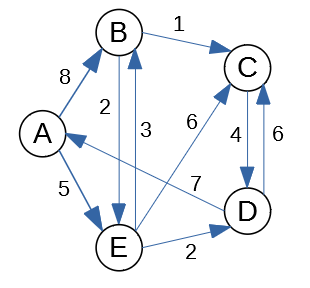

Worksheet 10: Shortest Paths and MSTs
===========================================

Shortest Paths: Dijkstra
---------------------------

(Drozdek2013, p.400) and
(Goodrich2011, p.640) both define Dijkstra's algorithm.
See also `<https://bit.ly/2JSXqMU>`_.
It is an efficient algorithm; it requires :math:`O((m+n)\log_2 n)` time, if
we use priority queues; here :math:`m = |E|` is the number of edges and :math:`n = |V|` is the number
of vertices in a graph.

In this exercise you do not need to implement a priority queue;
assume that you can always pick the vertex with the smallest distance and
add it to the set :math:`S` of visited vertexes (those having distances already computed).

Problem
^^^^^^^^^

We start with the graph shown in Figure below:

   Graph Diagram for Dijkstra's Algorithm

Vertex :math:`A` will be your source vertex. (You can assume that the distance
from :math:`A` to itself is :math:`0`; initially all the other distances are infinite, but
then Dijkstra's algorithm relaxes them).

**(A)**
  Run the Dijkstra's algorithm:
  At every phase write the current vertex :math:`v`; the set of finished vertices
  and also a table showing the new distances to all :math:`A,B,C,D,E` (and their parents)
  after the relaxations from :math:`v` are performed.
  At the end of every phase highlight which vertex (among those not yet finished)
  has the minimum distance. This will become the current vertex in the next phase.

**(B)**
  After the algorithm finishes, summarize the answer:
  For each of the five vertices
  tell what is its minimum distance from the source.
  Also show what is the shortest path how to achieve that minimum distance.

Shortest Paths: Bellman-Ford
------------------------------

Let :math:`G(V,E)` be a directed graph. Let :math:`w:E\rightarrow{}\mathbf{Z}`
be a function assigning integer weights to all the graph's edges and let :math:`s \in V` be
the source vertex.
Every vertex :math:`v \in V` stores :math:`v.d` -- the current estimate of
the distance from the source. A vertex also stores :math:`v.p` --
its "parent" (the last vertex on the shortest path before reaching :math:`v`).
Bellman-Ford algorithm to find the minimum distance from :math:`s` to all the other
vertices is given by the following pseudocode:

| :math:`\text{\sc BellmanFord}(G,w,s)`:
|     **for** **each** vertex :math:`v \in V`: :math:`\;\;\;\;\;` *(initialize vertices to run shortest paths)*
|         :math:`v.d = \infty`
|         :math:`v.p = \text{\sc Null}`
|     :math:`s.d = 0` :math:`\;\;\;\;\;` *(the distance from source vertex to itself is 0)*
|     **for** :math:`i=1` **to** :math:`|V|-1` :math:`\;\;\;\;\;` *(repeat* :math:`|V|-1` *times)*
|         **for** **each** edge :math:`(u,v) \in E`
|             **if** :math:`v.d > u.d + w(u,v)`: :math:`\;\;\;\;\;` *(relax an edge, if necessary)*
|                 :math:`v.d = u.d + w(u,v)`
|                 :math:`v.p = u`

**Question 2:**
  Consider the graph in Figure:

  .. figure:: figs-shortest-paths-and-mst/bellman-ford-graph.png
     :width: 1.5in
     :alt: Graph diagram

     Graph Diagram for Bellman Ford Algorithm

  Let us pick vertex :math:`B` as the *source vertex*
  for Bellman-Ford algorithm. (You could pick the source vertex
  differently, but then all the distance computations would
  be different as well.)

  **(A)**
    Create a table showing all the changes
    to all the distances to :math:`A,B,C,D,E` as the relaxations are performed.
    In a single iteration the same distance can be relaxed/improved multiple times
    (and you can use distances computed in the current phase to relax further edges).
    The table should display all :math:`n-1` iterations (where :math:`n=5` is the number of vertices).
    (*Sometimes it is worth running one more iteration to find possible
    negative loops*).

    .. note::
      Please make sure to release the edges in the alphabetical/lexicographical order:
      Regardless of which is your source, in every iteration the edges are always relaxed in this order:

      .. math::

        AB, AE, BD, BE, CB, DA, DC, EC, ED.

      In fact, any order can work; the only thing that matters is that you consider
      all the edges. But alphabetical ordering of edges makes the solution
      deterministic.

  **(B)**
    Summarize the result: For each of the :math:`5` vertices
    tell what is its minimum distance from the source.
    Also tell what is the shortest path how to get there.
    For example, if your source is :math:`E` then you
    could claim that the shortest path :math:`E \leadsto B` is
    of length :math:`-5` and it consists of two edges :math:`(E,C), (C,B)`.

**Question 3:**
  In this task the input graph is shown in the figure below.

  .. figure:: figs-shortest-paths-and-mst/bellman-ford-graph2.png
     :width: 2.5in
     :alt: Directed Graph

     A directed graph for Bellman-Ford Algorithm

  **(A)**
    In your graph use the vertex :math:`s=v_0` as the *source vertex*
    for Bellman-Ford algorithm.
    Create a table showing the changes
    to all the distances to the vertices of the given graph every time a successful edge
    relaxing happens and some distance is reduced.
    You should run :math:`n-1` phases of the Bellman-Ford algorithm
    (where :math:`n` is the number of vertices). You can also stop earlier, if
    no further edge relaxations can happen.

    .. note::
      Please make sure to release the edges in the lexicographical order.
      For example, in a single phase the edge :math:`(v_1,v_4)` is
      relaxed before the edge :math:`(v_2,v_1)`, since
      :math:`v_1` precedes :math:`v_2`.

  **(B)**
    Summarize the result: For each vertex
    tell what is its minimum distance from the source.
    Also tell what is the shortest path how to get there.

  **(C)**
    Does the input graph contain negative cycles?
    Justify your answer.

Minimum Spanning Trees
-----------------------

(Goodrich2011, p.651) defines Prim's algorithm. It finds a minimum spanning
tree in an undirected graph with given edge weights.
See also `<https://bit.ly/2VLz3DK>`_.
It is an efficient algorithm; it requires :math:`O((m+n)\log_2 n)` time, if
we use priority queues.
In this exercise you do not need to implement a priority queue;
assume that you can always compute the minimums in your head and
grow the MST accordingly.

Problem
^^^^^^^^^

**Question 4 (Prim's algorithm):**
  Prim's algorithm for the graph shown in Figure:

  .. figure:: figs-shortest-paths-and-mst/problem-graph.png
     :width: 3in
     :alt: Graph diagram

     Graph Diagram for Prim's Algorithm.

  **(A)**
    Vertex :math:`A` will be your source vertex.
    It is the first vertex added to the MST vertice set :math:`S`.
    At every step you find the lightest edge that connects
    some vertex in :math:`S` to some vertex not in :math:`S`.
    Add this new vertex to a graph and remember the edge you added.
    Show how the Prim's MST (Minimum Spanning Tree grows) one edge at a time.

    .. note::
      In cases when there is a choice between multiple lightest edges of the same
      weight, pick the edge :math:`(v,w)` with :math:`v \in S` and
      :math:`w \not\in S` such that :math:`(v,w)` lexicographically precedes
      any other lightest edge.

  **(B)**
    Redraw the graph,
    highlight the edges selected for MST (make them bold or color them differently).
    Add up the total weight of the obtained MST and
    write this in your answer (it should be the minimum value among all the
    possible spanning trees in this graph).

**Question 5 (Prim's algorithm):**
  Denote the last three digits of your Student ID by :math:`a,b,c`.
  Student ID often looks like this: :math:`\mathtt{201RDBabc}`, where
  :math:`a,b,c` are digits.
  Compute three more digits :math:`x,y,z`:

  .. math::

    \left\{ \begin{array}{l}
    x = (b + 4)\ \text{mod}\ 10\\
    y = (c + 4)\ \text{mod}\ 10\\
    z = (a + b + c)\ \text{mod}\ 10\\
    \end{array} \right.

  In this task the input graph :math:`G = (V,E)` is given by its adjacency matrix:

  .. math::

    M_G = \left( \begin{array}{cccccccc}
    0 & 0 & 5 & 8 & y & 0 & 0 & 0 \\
    0 & 0 & 3 & 7 & 0 & z & 0 & 0 \\
    5 & 3 & 0 & 3 & 0 & 0 & 0 & 0 \\
    8 & 7 & 3 & 0 & 1 & 7 & 0 & 0 \\
    y & 0 & 0 & 1 & 0 & 6 & 9 & 6 \\
    0 & z & 0 & 7 & 6 & 0 & x & 2 \\
    0 & 0 & 0 & 0 & 9 & x & 0 & 7 \\
    0 & 0 & 0 & 0 & 6 & 2 & 7 & 0 \\
    \end{array} \right).

  **(A)**
    Draw the graph as a diagram with nodes and edges.
    Replace :math:`x,y,z` with values
    calculated from your Student ID.
    Label the vertices with letters
    :math:`A,B,C,D,E,F,G,H` (they correspond
    to the consecutive rows and columns in the matrix).

    If you wish, you can use the following layout
    (edges are not shown, but the vertice positions allow
    to draw the edges without much intersection).
    But you can use any other layout as well.

    .. image:: figs-shortest-paths-and-mst/mst-vertices.png
       :width: 3in

  **(B)**
    Run Prim's algorithm to find MST using
    :math:`r = A` as the root.
    If you do not have time to redraw the graph many times,
    just show the table with :math:`v.key`
    values after each phase.
    (No need to show :math:`v.p`, as the parents do not change
    and they are easy to find once you have the final rooted tree drawn.)
    The top of the table would look like this (it shows Phase 0 --
    the initial state before any edges have been added).

    =====================  ==============  ==============  ==============  ==============  ==============  ==============  ==============  ==============
    Phase                               A               B               C               D               E               F               G               H
    0 (initial state)           :math:`0`  :math:`\infty`  :math:`\infty`  :math:`\infty`  :math:`\infty`  :math:`\infty`  :math:`\infty`  :math:`\infty`
    =====================  ==============  ==============  ==============  ==============  ==============  ==============  ==============  ==============

  **(C)**
    Summarize the result: Draw the MST obtained as the
    result of Prim's algorithm, find its total weight.

**Question 6:**
  Run Kruskal's algorithm on the same graph as in the Question 4.

  **(A)**
    After each step when there is an edge connecting two sets of vertices,
    write that edge and show the partition where that edge connects two previously disjoined pieces
    in the forest of trees.

    .. note::
      If there are multiple lightest edges that can be used to connect two disjoined pieces, pick edge :math:`(v,w)`
      which lexicographically precedes any other.

  **(B)**
    Redraw the given graph (show the order how you added the edges in parentheses).
    Also compute the total weight of this MST.

.. All pairs shortest paths... Transitive closures...

.. MST. Prim, Kruskal.

.. Set Union ADT. Ackerman function and its inverse. log star function(?)
