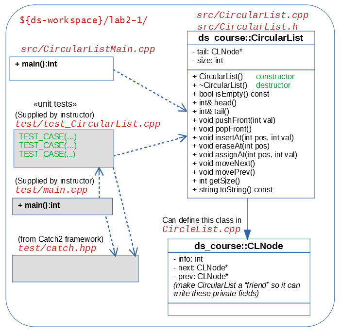

Programming Task 2, Part 1
============================

Place your files in the directory ``ds-workspace-YourName/lab2-1``, 
push it to your GitHub repository.

Circularly Linked Lists
------------------------

Develop a software that receives a list of integers
and adds them to a circular linked list (implemented 
as pointers). See Section 3.3 in (Drozdek, 2013) textbook.

The first line contains number :math:`N` (the number of integers to add
into the initial circularly linked list).
After that the input contains exactly :math:`N` integers.
After that we can execute different commands that modify the circular list
(or print out its current content). 
See the Figure *UML diagram* (all the commands in your input file are
identical to that diagram). 

In particular, the input files may contain these commands: 

.. code-block:: text
  
  pushFront val
  popFront
  insertAt pos val
  eraseAt pos
  assignAt pos val
  moveNext
  movePrev
  toString

Implementation Details
------------------------

1. Create two files ``CircularList.cpp`` and ``CircularList.h``
   that implements a *circular list* class to store integers.    
   Class members that are preceded by "+" in this diagram should be public; 
   class members that are preceded by "-" should be private.
2. ``CircularList.cpp`` should also define a structure ``CLNode`` 
   (a node in a doubly-linked list with ``next`` and ``prev`` pointers
   to other ``CLNode`` objects). 
3. Also implement ``CircularListMain.cpp`` to read input and write to 
   output. 
4. Attempt to insert/push integer values that are negative or larger than :math:`10^9`
   should cause ``invalid_argument`` exception with nonempty message:
   ``"InvalidArgument: Number not inserted"``
   (See `<https://www.cplusplus.com/reference/stdexcept/>`_).    
5. Attempt to use ``head``, ``tail``, ``deleteAt()`` or ``pop_front()`` function 
   on an empty list should throw an ``out_of_range`` exception with nonempty 
   message ``"OutOfRange: List is empty"`` 
6. Attempt to call ``insertAt()`` or ``eraseAt()`` with impossible position 
   that does not exist in the list (or is not adjacent to an existing one for ``insertAt``) 
   should throw an ``out_of_range`` exception a different 
   message ``"OutOfRange: Non-existent position"`` 
7. Ensure that your code has destructors for all the data 
   structures that you create that free the allocated memory. 

.. .. image:: figs/uml-diagram.png
..   :width: 4in

   UML Diagram

Constraints
------------

  * Every integer stored in this list :math:`k` satisfies :math:`0 \leq k \leq 10^9`.
  * The initial length of the input list :math:`N` satisfies :math:`0 \leq N \leq 1000`.
  * If :math:`N=0`, then the initial list is empty and all the subsequent commands are 
    applied to it.
  * Input file will contain no more than :math:`1000` commands applied to the initial list.

**Sample input** ``test01.txt``:

  .. code-block:: text

    6
    11 12 13 14 15 16
    insertAt 2 1000
    toString

**Expected output** ``expected01.txt``:
  
  .. code-block:: text

    [11, 12, 1000, 13, 14, 15, 16]

**Sample input** ``test02.txt``:

  .. code-block:: text

    6
    11 12 13 14 15 16
    eraseAt 2
    toString

**Expected output** ``expected02.txt``:
  
  .. code-block:: text

    [11, 12, 14, 15, 16]

**Sample input** ``test03.txt``:

  .. code-block:: text

    6
    11 12 13 14 15 16
    insertAt 0 100
    eraseAt 2
    toString

**Expected output** ``expected03.txt``:
  
  .. code-block:: text

    [100, 11, 13, 14, 15, 16]

**Sample input** ``test04.txt``:

  .. code-block:: text

    6
    11 12 13 14 15 16
    eraseAt 6
    toString	

**Expected output** ``expected04.txt``:
  
  .. code-block:: text

    OutOfRange: Non-existent position
    [11, 12, 13, 14, 15, 16]

**Sample input** ``test05.txt``:

  .. code-block:: text

    6
    11 12 13 14 15 16
    eraseAt 6 101
    toString	

**Expected output** ``expected05.txt``:
  
  .. code-block:: text

    [11, 12, 13, 14, 15, 16, 101]

**Sample input** ``test06.txt``:

  .. code-block:: text

    6
    11 12 13 14 15 16
    insertAt 7 101
    toString	

**Expected output** ``expected06.txt``:
  
  .. code-block:: text

    OutOfRange: Non-existent position
    [11, 12, 13, 14, 15, 16]

**Sample input** ``test07.txt``:

  .. code-block:: text

    0
    pushFront 11
    pushFront 12
    pushFront 13
    pushFront 14
    toString
    assignAt 0 21
    assignAt 3 24
    toString
    popFront
    toString
    moveNext
    toString
    movePrev
    movePrev
    toString
    pushFront 1000000001
    popFront
    popFront
    popFront
    toString
    popFront
    toString
	

**Expected output** ``expected07.txt``:
  
  .. code-block:: text

    [14, 13, 12, 11]
    [21, 13, 12, 24]
    [13, 12, 24]
    [12, 24, 13]
    [24, 13, 12]
    InvalidArgument: Number not inserted
    []
    OutOfRange: List is empty
    []
	

More notes about the behavior of ``CircularList`` methods: 

1. The function ``head()`` returns integer value (``CLNote::info`` field) following the
   ``tail`` pointer of the circular list.
   The function ``tail()`` returns integer value that is pointed 
   to by the ``tail`` pointer.
   Both ``head()`` and ``tail()`` functions return modifiable integer values: You can 
   assign something like this: 
   
   .. code-block:: cpp
   
     CircularList myList; 
     // initialize with at least 2 elements
     myList.pushFront(2);
     myList.pushFront(3);
     myList.pushFront(4);
     myList.pushFront(5);
     myList.head() = 17;
     myList.tail() = 18;
     // The following line should return "[17, 4, 3, 18]": 
     myList.toString();

2. In order to throw ``OutOfRange`` exception whenever
   the specified position is not valid, we need to know the current size 
   of the circularly linked list. Therefore the ``getSize()`` method
   in the UML diagram (Figure with UML diagram). 
3. Immediate ``pushFront()`` and ``popFront()`` can happen at the ``tail`` pointer only. 
   For all the ``insertAt()`` or ``eraseAt`` you would need to rotate the
   circular list with ``moveNext()`` or ``movePrev()`` certain number of times. 
   And after the operation you need to rotate it back to its original position. 
4. Our Unit tests are implemented using Catch2 framework; 
   see `<https://github.com/catchorg/Catch2>`_.
   It means that you download ``catch.hpp`` and place
   it in your project directory. Tests are
   organized into testcases and sections. 
   Each of testcases (or sections therein) can 
   call your ``CircularList`` implementation.
5. Building the project would create two executables -- 
   ``circlist_main.exe`` is used to read plaintext input and 
   produce plaintext output. 
   Another executable ``circlist_tests.exe`` is used to 
   run all the unit tests. 

