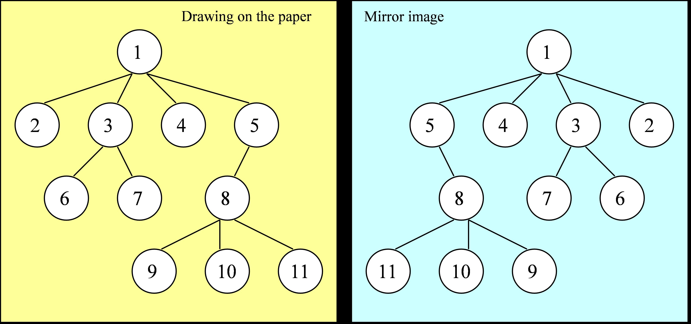

Programming Task 2, Part 2
============================

Place your files in the directory ``ds-workspace-YourName/lab2-2``, push it to your GitHub repository.
The following files should be present in your repository: 

* ``lab2-2\src\CircularList.cpp`` (updated data structure as a template class)
* ``lab2-2\src\CircularList.h`` (the header file with declarations for this data structure)
* ``lab2-2\src\CircularListMain.cpp`` (a client class to demo this data structure)
* ``lab2-2\test\TestCircularList.cpp`` (your Catch2 unit tests)

The names of the files are identical to Lab2-1, but their implementation will be different 
and applicable to more datatypes.

.. warning:: 
  The C++ classes in this lab have same names as before and they 
  still belong to the ``ds_course`` namespace.
  Attempt to compile them together with any unchanged classes from Lab2-1 will cause naming
  conflicts.
   

Polymorphic CircularList Requirements
---------------------------------------

**Requirements on the Data Structure**

In this lab the ``CircularList`` should support all the same methods as in Lab2-1, but 
the following behaviors should be added.

1. ``CircularList`` in Lab2-2 supports various data types (including class types). 
   (Previously it supported only integers).   
2. Initialize a circular list with ``n`` elements all 
   set to the same initial value. For example, a list of 1000 zeroes:

   .. code-block:: text
   
     CircularList<int> intList(1000,0);
   
3. Initialize a circular list by specifying the list of its original elements.
   For example a list of 4 strings:

   .. code-block:: text
   
     CircularList<string> stringList { "aa", "ab", "ba", "bb" };

4. Support deep copy of a circular list using copy constructor.
5. Enable appending two circular lists obtaining one circular list 
   (the ``tail_`` of the second list  becomes the ``tail_`` of the resulting list).
6. Enable a function that reverses the list -- rewrites it from the other end (so that the 
   tail of the old list becomes the head of the new list and vice versa).
7. Preserve the existing ``CircularList`` object, but remove all existing elements from it. 
8. Ensure that the CircularList has all memory leaks fixed, if there were any 
   in Lab2-1. 

All these requirements should be tested by unit-tests. 
You will develop your own unit-tests in Catch2 
(create a new file ``lab2-2\test\TestCircularList.cpp``)
to verify that the above requirements work. 
You will use these tests to check your own implementation.

**Requirements on the Main Function**

Your ``CircularListMain.cpp`` method would use the ``CircularList<T>`` data structure
to do something remotely useful -- it converts a rooted ordered tree into
its mirror image (and outputs it into another representation). 

   
   Rooted, ordered tree and its mirror image
   
Mirror image of a tree reverses the order of the children in all subtrees, but the
parent-child relationships are preserved. 
Input tree is given in the *parenthesized notation*. In this notation
:math:`(p\;\;c_1\;\;c_2\;\;\ldots\;\;c_n)` means that a parent 
node :math:`p` has :math:`n` children.
If any of these children :math:`c_i` are parents for other nodes,
:math:`c_i` is replaced by parenthesized expression 
:math:`(c_i\;\;c_{i1}\;\;c_{i2}\;\;\ldots\;\;c_{im})`. 

**Input representation:** 
  Input reads a tree in the *parenthesized notation*. 
  The first line of the input is ``intTree`` (indication that the
  info fields of all tree nodes are ``unsigned int`` values). 
  Another possible value is ``stringTree`` (the info fields are strings in this case). 

  .. code-block:: text
  
    intTree
    (1 
      2 
      (3 6 7)
      4
      (5 
        (8 9 10 11)
      )
    )

**Output representation:** 
  Output is the mirror image of the input tree. Moreover, it *adjacency-lists notation*. 
  The tree is printed row by row: 
  the first element in each row is some internal node followed by all its 
  children in their new, reversed order. 
  The internal nodes are visited in the *preorder* sequence: The 1st line of the 
  output shows the root of the tree followed by all its direct children, 
  the 2nd line shows the first child of the root, which has children of its own, etc.

  .. code-block:: text
  
    1 5 4 3 2
    5 8
    8 11 10 9
    3 7 6
    0

Implementation Details
-----------------------

Requirements from the previous subsection are implemented as follows:

1. Instead of storing only integers in the ``info`` field of each ``CLNode``, 
   allow arbitrary type (including class types), defining ``CLNode`` and ``CircularList``
   as template classes with "parameter" ``<T>``.
2. ``CircularList`` should have one more constructor (in addition to the no-arguments 
   default constructor). Namely, ``CircularList(int n, T val)``  would create 
   a ``CircularList`` object with ``n`` values -- all copies of value ``val`` having type ``T``.
3. ``CircularList`` should have one more constructor using the ``initialization list`` 
   (listing all the elements in curly braces).
4. ``CircularList`` has a copy constructor that performs a deep cop in an assignment.
5. Appending of two ``CircularLists`` is done by overloading the operator "+". 
6. Implement ``CircularList::reverse()`` to reverse the order of list's elements.
7. Implement ``CircularList::clear()`` to empty a list without destroying it.
8. Run the testcases with ``CircularListMain`` using Valgrind memory leaks report -- ensure that there are 
   no messages about memory leaks.

**How to implement CircleListMain:** In order to output the mirror-image of a given tree as adjacency lists, you 
can use the pseudocode shown below. Or you can create your own algorithm as 
long as it does not use any other data structures besides the ``CircularList``.
Here *token* means one lexical unit from the input -- an opening parenthesis, 
a closing parenthesis, an integer or string value, 
a whitespace or ``EOF`` (the End-of-File marker). 
Implementing ``readToken`` is up to you. The grading process does not care, if 
whether you read tokens or use this pseudocode at all. 
	

| `level` := 0
| `nodeLists` := ``CircularList<CircularList<string>>`` . `empty`
| **do**
|     `token` := `readToken`
|     **if** `token` == ``'('``:
|         `siblings` := ``CircularList<string>`` . `empty`
|         `nodeLists` . `push_front` (`siblings`)
|         `level` := :math:`\text{\em level} + 1`
|     **else if** `token` is alphanumeric:
|         `nodeLists.head.push(token)`
|     **else if** `token` == ``')'``:
|         `siblings` := `nodeLists.pop_front()`
|         **print** `complete_siblings.reverse()`
|         **if** :math:`\text{\em level}` == 0 **then**
|             Parse error: Too many closing parentheses
|         **else**:
|             `level` := :math:`\text{\em level} - 1`
|     **else if** `token` is whitespace: 
|         *// do nothing, skip whitespace*
|     **else if** `token` == ``EOF`` **and** :math:`\text{\em level} > 0`
|         Parse error: Some node lists were not complete
| **while** :math:`\text{\em level} > 0`

If we have ``intTree`` instead of ``stringTree`` the pseudocode is almost identical.

Constraints
------------

Constraints for the unit tests (your own in 
``lab2-2\test\TestCircularList.cpp`` as well as any other provided by the instructors)
and also for the ``main()`` method:

* Circular lists may contain types ``int``, ``string`` or other circular lists (other types will not be tested).
* String values stored in circular lists have length up to :math:`100` characters.
* String values stored in circular lists contain printable ASCII characters (uppercase
  or lowercase letters, digits, special symbols) or whitespace symbols. 
  They do not contain control characters. 
* Integer values are nonnegative and do not exceed :math:`2^{32}-1`. 
* Circular list during its lifetime never grows longer than :math:`1000` elements. 
  (If a circular list consists of other circular lists, they do not grow beyond this limit either.)

Input Data Samples
--------------------

On the first line there is a single word ``intTree`` (info nodes are ``int`` variables) or 
``stringTree`` (info nodes are ``string`` variables). 
On the second line there is an open parenthesis followed by the root of the tree and
all its subtrees (each subtree is itself a parenthesized expression). 

You can assume that whitespace always separates every two nodes, but extra whitespace 
may be inserted to improve the readability of the input expression.
(Whitespace characters are ``Space`` (``" "`` or byte ``0x20``), 
``TAB`` (``"\t"`` or byte ``0x09``), 
``LF`` (``"\n"`` or byte ``0x0A``), 
and ``CR`` (``"\r"`` or byte or byte ``0x0D``). 

**Sample input** ``test01.txt``:

.. code-block:: text
  
  intTree
  ( 1 
    2 
    ( 3 6 7 )
    4
    ( 5 
      ( 8 9 10 11 )
    )
  )

**Expected output** ``expected01.txt``:
  

.. code-block:: text
  
  1 5 4 3 2
  5 8
  8 11 10 9
  3 7 6
  0

**Sample input** ``test02.txt``:

.. code-block:: text   

  stringTree  
  (Hotel 
    (Lima (Mike (Oscar November)) (Juliett India)) 
    (Echo (Foxtrot Golf) (Bravo Delta)))
  
  
  

**Expected output** ``expected02.txt``:

.. code-block:: text   

  Hotel Echo Lima
  Lima Juliett Mike
  Juliett India
  Mike Oscar
  Oscar November
  Echo Bravo Foxtrot
  Bravo Delta
  Foxtrot Golf
  0

