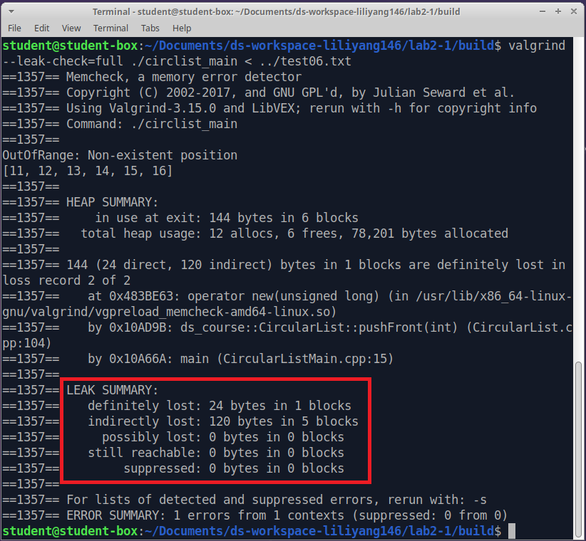

Programming Task 2, Part 2
============================

Place your files in the directory ``ds-workspace-YourName/lab2-2``, push it to your GitHub repository.
The following files should be present in your repository: 

* ``lab2-2\src\CircularList.h`` (the header file with declarations for this data structure)
* ``lab2-2\src\CircularList.cpp`` -- probably not needed for this lab (and therefore optional).
  This is because template code is typically implemented in header file only. 
  See `<https://bit.ly/3lsjYUY>`_. 
* ``lab2-2\src\CircularListMain.cpp`` (a client class to demo this data structure)
* ``lab2-2\test\TestCircularList.cpp`` (your Catch2 unit tests)

The names of the files are identical to Lab2-1, but their implementation will be different 
and applicable to more datatypes.

.. warning:: 
  The C++ classes in this lab have same names as before and they 
  still belong to the ``ds_course`` namespace.
  An attempt to compile them together with any unchanged classes from Lab2-1 will cause naming
  conflicts.
  

Polymorphic CircularList Requirements
---------------------------------------

**Requirements on the Data Structure**

In this lab the ``CircularList`` should support all the same methods as in Lab2-1, but 
the following behaviors should be added.

1. ``CircularList`` in Lab2-2 supports various data types (including class types). 
   (Previously it supported only integers).   
2. Initialize a circular list with ``n`` elements all 
   set to the same initial value. For example, a list of 1000 zeroes:

   .. code-block:: text
   
     CircularList<int> intList(1000,0);
   
3. Initialize a circular list by specifying the list of its original elements.
   For example a list of 4 strings:

   .. code-block:: text
   
     CircularList<string> stringList { "aa", "ab", "ba", "bb" };

4. Support deep copy of a circular list using copy constructor.
   Overload assignment operator (``=``) to do the same deep copy upon assignment.
5. Overload plus operator (``+``) to concatenate two circular lists into a new circular list 
   (the ``tail_`` of the second list  becomes the ``tail_`` of the resulting list).
6. Enable a function that reverses the list -- rewrites it from the other end (so that the 
   tail of the old list becomes the head of the new list and vice versa).
7. Implement a function to remove all existing elements from the current ``CircularList`` object.
8. Ensure that the CircularList has all memory leaks fixed, if there are any. 
   (Use Valgrind for diagnostics, if necessary.)

All these requirements should be tested by unit-tests. 
You will develop your own unit-tests in Catch2 
(create a new file ``lab2-2\test\TestCircularList.cpp``)
to verify that the above requirements work. 
You will use these tests to check your own implementation.

**Requirements on the Main Function**

Your ``CircularListMain.cpp`` method would use the ``CircularList<T>`` data structure
to do something remotely useful -- it converts a rooted ordered tree into
its mirror image (and outputs it into another representation). 

.. figure:: figs/mirrored-trees.png
   :width: 4in
   :alt: Mirrored tree
   
   Rooted, ordered tree and its mirror image
   
Mirror image of a tree reverses the order of the children in all subtrees, but the
parent-child relationships are preserved. 
Input tree is given in the *parenthesized notation*. In this notation
:math:`(p\;\;c_1\;\;c_2\;\;\ldots\;\;c_n)` means that a parent 
node :math:`p` has :math:`n` children.
If any of these children :math:`c_i` are parents for other nodes,
:math:`c_i` is replaced by parenthesized expression 
:math:`(c_i\;\;c_{i1}\;\;c_{i2}\;\;\ldots\;\;c_{im})`. 

**Input representation:** 
  Input reads a tree in the *parenthesized notation*. 
  The first line of the input is ``intTree`` (indication that the
  info fields of all tree nodes are ``unsigned int`` values). 
  Another possible value is ``stringTree`` (the info fields are strings in this case). 

  .. code-block:: text
  
    intTree
    (1 
      2 
      (3 6 7)
      4
      (5 
        (8 9 10 11)
      )
    )

**Output representation:** 
  Output is the mirror image of the input tree. Moreover, it *adjacency-lists notation*. 
  The tree is printed row by row: 
  the first element in each row is some internal node followed by all its 
  children in their new, reversed order. 
  The internal nodes are visited in the *preorder* sequence: The 1st line of the 
  output shows the root of the tree followed by all its direct children, 
  the 2nd line shows the first child of the root, which has children of its own, etc.

  .. code-block:: text
  
    1 5 4 3 2
    5 8
    8 11 10 9
    3 7 6
    0

Implementation Details
-----------------------

Requirements from the previous subsection are implemented as follows:

1. Instead of storing only integers in the ``info`` field of each ``CLNode``, 
   allow arbitrary type (including class types), defining ``CLNode`` and ``CircularList``
   as template classes with "parameter" ``<T>``.
2. ``CircularList`` should have one more constructor (in addition to the no-arguments 
   default constructor). Namely, ``CircularList<T>(int n, T val)``  would create 
   a ``CircularList`` object with ``n`` values -- all copies of value ``val`` having type ``T``.
3. ``CircularList`` should have one more constructor using the ``initialization list`` 
   (listing all the elements in curly braces).
4. ``CircularList`` has a copy constructor that performs a deep copy in an assignment.
   It also overloads the assignment operator to do the deep copy.
5. Concatenation of two ``CircularLists`` is done by overloading the operator "+". 
6. Implement ``CircularList<T>::reverse()``, it returns ``CircularList<T>`` where the 
   current object's elements are deep-copied in reverse order (and does not modify the current object).
7. Implement ``void CircularList<T>::clear()`` to empty a list without destroying it (this modifies the current object).
8. Run the testcases with ``CircularListMain`` using Valgrind memory leaks report -- ensure that there are 
   no messages about memory leaks.

**How to implement CircleListMain:** In order to output the mirror-image of a given tree as adjacency lists, you 
can use the pseudocode shown below. Or you can create your own algorithm as 
long as it does not use any other data structures besides the ``CircularList``.
Here *token* means one lexical unit from the input -- an opening parenthesis, 
a closing parenthesis, an integer or string value, 
a whitespace or ``EOF`` (the End-of-File marker). 
Implementing ``readToken`` is up to you. The grading process does not care, if 
whether you read tokens or use this pseudocode at all. 
	

| `level` := 0
| `nodeLists` := ``CircularList<CircularList<string>>`` . `empty`
| `outputLines` := ``CircularList<string>`` . `empty`
| **do**
|     `token` := `readToken`
|     **if** `token` == ``'('``:
|         `isFirst` := ``true``
|         `level` := :math:`\text{\em level} + 1`
|     **else if** `token` is alphanumeric:
|         **if** :math:`\text{\em nodeLists.size} > 0`: 
|             *// if we are not the root of the tree*
|             rotate back "siblingCount" positions (which child is this to its parent)
|             *// append oneself as a child to the parent*
|             `nodeLists.head.pushFront(token)`
|             rotate forward "siblingCount" positions (get back to the original position)
|         **if** `isFirst`                
|             *// process the parent: put it at the front of children list "siblings"*
|             `siblings` := ``CircularList<string>`` . `empty`
|             `siblings` . `pushFront(token)`
|             `nodeLists` . `pushFront(siblings)`
|             `isFirst` := ``false``
|     **else if** `token` == ``')'``:
|         `siblings` := `nodeLists` . `head`
|         `nodeLists` . `popFront`
|         *// move root node to the front of reversed child list*
|         `siblings` . `movePrev`
|         `outputLines` . `pushFront(siblings.toString)`
|         **if** :math:`\text{\em level}` == 0 **then**
|             Parse error: Too many closing parentheses
|         **else**:
|             `level` := :math:`\text{\em level} - 1`
|     **else if** `token` is whitespace: 
|         *// do nothing, skip whitespace*
|     **else if** `token` == ``EOF`` **and** :math:`\text{\em level} > 0`
|         Parse error: Some node lists were not complete
| **while** :math:`\text{\em level} > 0`
| **while** **not** `outputLines` . `isEmpty`: 
|     **print** `outputLines` . `head`
|     `outputLines` . `popFront`

If we have ``intTree`` instead of ``stringTree`` the pseudocode is almost identical.

Constraints
------------

Constraints for the unit tests (your own in 
``lab2-2\test\TestCircularList.cpp`` as well as any other provided by the instructors)
and also for the ``main()`` method:

* Circular lists may contain types ``int``, ``string`` or other circular lists (other types will not be tested).
* String values stored in circular lists have length up to :math:`100` characters.
* String values stored in circular lists contain printable ASCII characters (uppercase
  or lowercase letters, digits, special symbols) or whitespace symbols. 
  They do not contain control characters. 
* Integer values are nonnegative and do not exceed :math:`2^{32}-1`. 
* Circular list during its lifetime never grows longer than :math:`1000` elements. 
  (If a circular list consists of other circular lists, they do not grow beyond this limit either.)

Input Data Samples
--------------------

On the first line there is a single word ``intTree`` (info nodes are ``int`` variables) or 
``stringTree`` (info nodes are ``string`` variables). 
On the second line there is an open parenthesis followed by the root of the tree and
all its subtrees (each subtree is itself a parenthesized expression). 

You can assume that whitespace always separates every two nodes, but extra whitespace 
may be inserted to improve the readability of the input expression.
(Whitespace characters are ``Space`` (``" "`` or byte ``0x20``), 
``TAB`` (``"\t"`` or byte ``0x09``), 
``LF`` (``"\n"`` or byte ``0x0A``), 
and ``CR`` (``"\r"`` or byte or byte ``0x0D``). 

**Sample input** ``test01.txt``:

.. code-block:: text
  
  intTree
  ( 1 
    2 
    ( 3 6 7 )
    4
    ( 5 
      ( 8 9 10 11 )
    )
  )

**Expected output** ``expected01.txt``:
  

.. code-block:: text
  
  1 5 4 3 2
  5 8
  8 11 10 9
  3 7 6
  0

**Sample input** ``test02.txt``:

.. code-block:: text   

  stringTree  
  ( Hotel 
    ( Lima ( Mike ( Oscar November ) ) ( Juliett India ) ) 
    ( Echo ( Foxtrot Golf ) ( Bravo Delta ) ) )
  
  
  

**Expected output** ``expected02.txt``:

.. code-block:: text   

  Hotel Echo Lima
  Echo Bravo Foxtrot
  Bravo Delta
  Foxtrot Golf
  Lima Juliett Mike
  Juliett India
  Mike Oscar
  Oscar November
  0

Behaviors to Test with Catch2 
-------------------------------

Your file ``lab2-2\test\TestCircularList.cpp`` should test various behaviors 
of the polymorphic data structure ``TestCircular<T>`` (including those which are 
not needed for your application program ``TestCircularMain``. 
Here is an overview of things to test (the unit tests themselves is
something you can program as you see fit). 

1. Can create an empty ``CircularList`` of types ``int`` and ``string`` (using default constructor).
2. Can create a ``CircularList<T>`` with a non-default constructor initialized with `n` identical elements.
3. Can create a ``CircularList<T>`` initialized with elements from an initialization list. 
4. Can create a ``CircularList<T>`` using a copy constructor (it causes deep copy). 
5. Can assign a ``CircularList<T>`` object to another one with overloaded ``=`` operator (and all elements are deep copied). To verify 
   that a deep copy took place, modify (with ``assignAt`` or similar) one of the circular list objects. 
   The second one should not change.
6. Can concatenate two ``CircularList<T>`` objects with overloaded ``+`` operator. The result 
   contains copies of the elements of the original list.
7. Function ``reverse()`` works (returns a reversed list of the original list). 
8. Function ``clear()`` works (the original list is purged from all the elements).
9. Any illegal access of an empty list (head, tail, popFront) causes ``out_of_range`` exception. 
10. Any illegal access of a list beyond its position causes ``out_of_range`` exception. 

Appendix: Declaring Friends of Template Classes
-------------------------------------------------

Assume that you need a template class ``A<T>`` to use another template
class ``B<T>`` (just as our ``CircularList<T>`` is using ``CLNode<T>`` class. 
Moreover, you also need the class ``A<T>`` to access private fields
of ``B<T>`` (so ``A<T>`` should be declared friend of ``B<T>``). 

This is tricky to achieve in your header file. If you define ``B<T>`` above the class ``A<T>``, 
then class ``A<T>`` turns out to be declared as a friend (inside ``B<T>``) -- but it 
is not a template class at that point (yet). 

On the other hand, if you define ``B<T>`` below the class ``A<T>``, 
then ``A<T>`` cannot reference class ``B<T>`` -- as it is not visible at that point yet. 
We have therefore a typical problem when two classes need to refer to each other. 

The only reasonable way to break this dependence loop is to introduce a forward declaration: 
At first you just declare ``class B`` (but do not define anything in it; no member functions, friends etc.). 
Then define ``class A`` referring to ``class B``. Finally define ``class B`` referring to ``class A``.
See the discussion here -- `<https://bit.ly/3mJxsLo>`_.

.. code-block:: cpp

  template <class T> class B; // forward decl.
 
  template <class T>
  class A {
    T t;
    public:
      void Test(const B<T> &b) {t = b.t;}
  }; //A
 
  template <class T>
  class B {
    friend class A<T>; // friend decl.
    T t;
  };//B
  

Appendix: Checking the Memory Leaks
------------------------------------

1. Make sure that Lab2-2 code compiles and runs on Linux. 
2. Install Valgrind (``sudo apt-get install valgrind``)
3. Run Valgrind with a flag ``--leak-check=full`` and executable as a parameter. 
   For example, if you have already implemented Lab2-1, it is possible to run Valgrind
   and display all the existing leaks.
   
.. code-block:: text

  cd lab2-1/build  
  valgrind --leak-check=full ./circlist_main < ../test06.txt
  
  

   
   Running Valgrind

The objective is to make these memory leaks to become zero. Memory leaks are created every time 
when new memory is reserved (with commands like ``new`` or ``malloc``), but not freed with ``delete``, 
``delete[]`` or ``free`` commands. 

See `<https://bit.ly/3oPDFrX>`_ for details and more options of Valgrind to debug the memory leaks.

